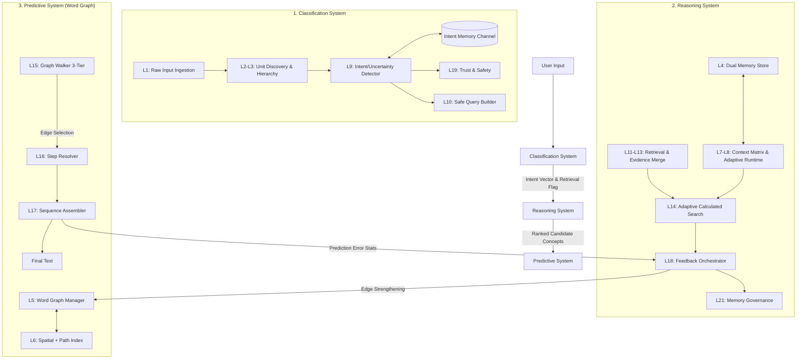

# SPSE Architecture v15.1 — Unified Reference (Training-Aligned)

**Document Version:** 15.1 (Training-Aligned)  
**Last Updated:** March 2026  
**Status:** Normative architecture blueprint + codebase alignment (Training Logic Integrated)  
**Alignment Basis:** Repository state at `/spse_engine` on 2026-03-13 + `training/system_training.rs`

---

## Executive Summary

The **Structured Predictive Search Engine (SPSE)** is a privacy-first, config-driven, retrieval-augmented intelligence engine written in Rust. It replaces the dense softmax-over-vocabulary paradigm of traditional language models with a **tokenizer-free, spatially-grounded prediction architecture** organized into three functional systems:

| System | Function | Core Mechanism | Layer Mapping |
|--------|----------|----------------|---------------|
| **Classification** | Identify intent/tone/uncertainty; gate retrieval | Memory-backed calculation (82-float signatures + semantic probes) | L1, L2, L3, L9, L10, L19 |
| **Reasoning** | Manage memory, evidence, truth, strategy | Dual-memory governance, trust-aware evidence merge, 7D candidate scoring | L4, L7, L8, L11, L12, L13, L14, L18, L21 |
| **Predictive** | Navigate Word Graph for text generation | 3D-embedded word graph, 3-tier spatial walk (near→far→pathfinding) | L5, L6, L15, L16, L17 |

### Key Architectural Differentiators

| Feature | Traditional LLM | SPSE |
|---------|-----------------|------|
| **Tokenization** | Fixed vocabulary (32K-100K tokens) | Dynamic unit discovery (no fixed boundaries) |
| **Prediction** | Dense softmax over vocabulary | 3-tier graph walk through Word Graph |
| **Memory** | Implicit in weights (static) | Explicit dual-store (Core + Episodic, lifelong) |
| **Retrieval** | Post-hoc RAG patch | Gated upstream of generation (L9 decision) |
| **Learning** | Separate training phase | On-the-fly edge injection + **Decoupled System Training** |
| **Deployment** | GPU-heavy, cloud-bound | CPU-friendly, edge-capable, GPU-optional |

### Standalone Contract

This document is the **standalone build contract** for SPSE. An implementation team should be able to build the engine from scratch using this file alone because it defines:

- ✅ System boundaries and layer ownership
- ✅ Core data structures and config surfaces
- ✅ Inference flow and product scenarios
- ✅ **Training implementation logic (Classification, Reasoning, Predictive)**
- ✅ Validation criteria and executable benchmark expectations
- ✅ Directory layout and module responsibilities

**If any derivative planning document conflicts with this architecture, the architecture document wins.**

---

## 1. Three-System Architecture Overview

### 1.1 System Interaction Diagram



### 1.2 Layer-to-System Mapping (Complete Reference)

| Layer | Name | System | Source File | Config Section | Implementation Status |
|-------|------|--------|-------------|----------------|----------------------|
| L1 | Input Ingestion | Classification | `classification/input.rs` | — | ✅ Implemented |
| L2 | Unit Builder | Classification | `classification/builder.rs` | `layer_2_unit_builder` | ✅ Implemented |
| L3 | Hierarchy Organizer | Classification | `classification/hierarchy.rs` | (uses builder config) | ✅ Implemented (Minimal) |
| L4 | Memory Ingestion | Reasoning | `memory/store.rs` | `layer_21_memory_governance` | ✅ Implemented |
| L5 | Word Graph Manager | Predictive | `predictive/router.rs` | `layer_5_semantic_map` | ✅ Implemented |
| L6 | Spatial + Path Index | Predictive | `spatial_index.rs` + `region_index.rs` | — | ⚠️ Deviation (Grid vs. Octree) |
| L7 | Context Matrix | Reasoning | `reasoning/context.rs` | `intent` | ✅ Implemented |
| L8 | Adaptive Runtime | Reasoning | `engine.rs` | `adaptive_behavior` | ✅ Implemented |
| L9 | Retrieval Decision | Classification | `classification/intent.rs` | `layer_9_retrieval_gating` | ✅ Implemented (Hybrid) |
| L10 | Query Builder | Classification | `classification/query.rs` | `layer_10_query_builder` | ✅ Implemented |
| L11 | Retrieval Pipeline | Reasoning | `reasoning/retrieval.rs` | `layer_11_retrieval` | ✅ Implemented |
| L12 | Safety Validator | Reasoning | `classification/safety.rs` | `layer_19_trust_heuristics` | ✅ Implemented |
| L13 | Evidence Merger | Reasoning | `reasoning/merge.rs` | `layer_13_evidence_merge` | ✅ Implemented |
| L14 | Candidate Scorer | Reasoning | `reasoning/search.rs` | `layer_14_candidate_scoring` | ✅ Implemented |
| L15 | Graph Walker | Predictive | `engine.rs` + `predictive/router.rs` | `adaptive_behavior` | ⚠️ Collapsed (in Router) |
| L16 | Step Resolver | Predictive | `predictive/resolver.rs` | `layer_16_fine_resolver` | ✅ Implemented |
| L17 | Sequence Assembler | Predictive | `predictive/output.rs` | — | ⚠️ Split (Decoder + Engine) |
| L18 | Feedback Controller | Reasoning | `reasoning/feedback.rs` | — | ✅ Implemented |
| L19 | Trust/Safety | Classification | `classification/safety.rs` | `layer_19_trust_heuristics` | ✅ Implemented |
| L20 | Telemetry | Cross-Cutting | `telemetry/` | `layer_20_telemetry` | ✅ Implemented |
| L21 | Governance | Reasoning | `memory/store.rs` | `layer_21_memory_governance` | ✅ Implemented |

### 1.3 Engine Struct (`src/engine.rs`)

```rust
pub struct Engine {
    // --- Configuration ---
    config: EngineConfig,
    
    // --- Reasoning System ---
    memory: Arc<Mutex<MemoryStore>>,              // L4/L21 — dual memory store
    memory_snapshot: Arc<ArcSwap<MemorySnapshot>>, // Lock-free read path
    retriever: RetrievalPipeline,                  // L11 — external search
    merger: EvidenceMerger,                        // L13 — conflict resolution
    feedback: FeedbackController,                  // L18 — learning events
    feedback_tx: Sender<Vec<FeedbackEvent>>,       // Async feedback channel
    dynamic_memory: Arc<DynamicMemoryAllocator>,   // Reasoning buffer allocation
    
    // --- Classification System ---
    classification_calculator: ClassificationCalculator, // Intent/tone/resolver inference
    safety: TrustSafetyValidator,                  // L12/L19 — trust assessment
    spatial_grid: Arc<Mutex<SpatialGrid>>,         // Classification pattern retrieval
    
    // --- Predictive System (Word Graph) ---
    decoder: OutputDecoder,                        // L17 — sequence assembly
    
    // --- Cross-Cutting ---
    scheduler: Arc<PriorityScheduler>,             // 4-priority work queue
    telemetry_worker: Option<TelemetryWorker>,     // L20 — async event emission
    latency_monitor: Arc<LatencyMonitor>,          // p50/p95/p99 tracking
    trace_context: Arc<Mutex<TraceContext>>,       // Session/trace ID management
    session_documents: Arc<Mutex<SessionDocuments>>,
    observer: Option<TestObserver>,                // Test observation hooks
}
```

### 1.4 Background Workers

Two background threads spawned at engine initialization:

| Worker | Frequency | Responsibilities | Layers |
|--------|-----------|------------------|--------|
| **Maintenance Worker** | Every 30s (`governance.maintenance_interval_secs`) | Pruning, promotion, force-directed layout, snapshot save | L5, L6, L21 |
| **Feedback Worker** | Continuous (channel-drain) | Apply learning events to memory, update edge weights | L18 |

---

## 2. Classification System

**Function:** Ingests raw text to identify **intent**, **tone**, **uncertainty**, and **semantic category**. Acts as the gatekeeper that determines *what* the input means and *whether* external help is needed.

**Core Mechanism:** Nearest Centroid Classifier using **82-float** POS-based feature vectors (78 base + 4 semantic flags) with configurable feature weights.

### 2.1 Constituent Layers

| Layer | Name | Source | Responsibility | Status |
|-------|------|--------|----------------|--------|
| L1 | Input Ingestion | `classification/input.rs` | Byte/character ingestion, normalization, compound noun detection | ✅ |
| L2 | Unit Builder | `classification/builder.rs` | Rolling hash discovery of dynamic units (n-grams, phrases) | ✅ |
| L3 | Hierarchy Organizer | `classification/hierarchy.rs` | Level grouping (Char→Pattern), anchor/entity extraction | ✅ (Minimal) |
| L9 | Intent & Uncertainty Detector | `classification/intent.rs` | Classification + retrieval gating decision | ✅ (Hybrid) |
| L10 | Safe Query Builder | `classification/query.rs` | Sanitizes intent into search query, strips PII | ✅ |
| L19 | Trust & Safety | `classification/safety.rs` | Source reliability, injection/toxicity detection | ✅ |

### 2.2 ClassificationSignature (82-Float Feature Vector)

| Category | Features | Count | Purpose |
|----------|----------|-------|---------|
| Structural | `byte_length_norm`, `sentence_entropy`, `token_count_norm`, etc. | 14 | Text shape |
| Punctuation | `question_mark_ratio`, `exclamation_ratio`, `period_ratio` | 3 | Question/exclamation detection |
| Semantic | `semantic_centroid[0..3]` (via `SemanticHasher`) | 3 | 3D spatial anchor |
| Derived | `urgency_score`, `formality_score`, `technical_score`, `domain_hint`, `temporal_cue`, `creative_cue` | 6 | Domain/urgency signals |
| **Intent Hash** | POS-filtered verbs/modals → FNV-1a 32-bucket hash | 32 | Intent-discriminating signal |
| **Tone Hash** | POS-filtered adjectives/adverbs → FNV-1a 32-bucket hash | 32 | Tone-discriminating signal |
| **Semantic Flags** | Rhetorical, Epistemic, Pragmatic, Emotional (binary) | 4 | Sarcasm/irony/hypothetical detection |

**Config:** `classification.semantic_probes` (weight: 0.15, fuzzy_threshold: 0.25, anchor_count: 500)

### 2.3 Intent Labels (24 Total)

```
Greeting, Gratitude, Farewell, Help, Clarify, Rewrite, Verify, Continue, Forget,
Question, Summarize, Explain, Compare, Extract, Analyze, Plan, Act, Recommend,
Classify, Translate, Debug, Critique, Brainstorm, Unknown
```

### 2.4 Tone Labels (6 Total)

```
NeutralProfessional, Empathetic, Direct, Technical, Casual, Formal
```

### 2.5 Retrieval Gating Formula (L9)

```rust
retrieval_score = 
    w_entropy × entropy_signal +
    w_recency × recency_signal +
    w_disagreement × disagreement_signal -
    w_cost × cost_penalty

retrieval_flag = retrieval_score >= retrieve_threshold
```

| Parameter | Config Path | Default | Safe Range |
|-----------|-------------|---------|------------|
| Entropy Threshold | `retrieval.entropy_threshold` | 0.85 | 0.50–0.95 |
| Freshness Threshold | `retrieval.freshness_threshold` | 0.65 | 0.50–0.90 |
| Retrieve Threshold | `retrieval.retrieve_threshold` | 1.10 | 0.80–1.50 |
| Weights | `retrieval.{w_entropy,w_recency,w_disagreement,w_cost}` | 1.0, 1.0, 1.0, 0.65 | 0.0–2.0 |

### 2.6 Trust Scoring Formula (L19)

```rust
trust = default_source_trust (0.50)
    + https_bonus (0.10)          if HTTPS
    + allowlist_bonus (0.10)      if domain in allowlist
    - parser_warning_penalty (0.20) if parser warnings
    + corroboration_bonus (0.08)  per corroborating source
    + format_trust_adjustments    per detected format
```

**Allowlist Domains:** wikimedia.org, wikipedia.org, wikidata.org, archive.org, ncbi.nlm.nih.gov, pmc.ncbi.nlm.nih.gov, nominatim.openstreetmap.org, openstreetmap.org, dbpedia.org, gutenberg.org

### 2.7 Advisory-Family Arbitration (REQUIRED)

**Problem:** Recommendation prompts ("Recommend a beginner camera") share imperative syntax with Critique/Rewrite/Plan intents, causing low-margin collisions.

**Solution:** When top-ranked intents all belong to `{Recommend, Critique, Rewrite, Plan}` and top-2 margin < `advisory_margin_threshold` (0.10), run a restricted pattern vote using nearby `ClassificationPattern` instances from the Intent channel.

**Config:**
- `classification.recommendation_sharpening.enabled` (default: true)
- `classification.recommendation_sharpening.advisory_margin_threshold` (default: 0.10)
- `classification.recommendation_sharpening.family_blend_weight` (default: 0.30)

### 2.8 Implementation Invariants (VALIDATED)

| Invariant | Description | Status |
|-----------|-------------|--------|
| **ISSUE-RW1** | Punctuation stripping before social-word lookup | ✅ Required |
| **ISSUE-RW2** | `creative_cue` feature for imperative disambiguation | ✅ Required |
| **ISSUE-RW4** | Advisory-family arbitration for Recommend-style prompts | ⚠️ Planned |

---

## 3. Reasoning System

**Function:** Takes classified input and current context to **reason** on response strategy. Manages memory retrieval, evidence merging, conflict resolution, and logical assembly before final word selection.

**Core Mechanism:** Dual-memory governance (Core vs. Episodic), trust-aware evidence merging, adaptive 7-dimensional candidate scoring.

### 3.1 Constituent Layers

| Layer | Name | Source | Responsibility | Status |
|-------|------|--------|----------------|--------|
| L4 | Dual Unit Memory Store | `memory/store.rs` | Core vs. Episodic memory, channel isolation | ✅ |
| L7 | Context Matrix | `reasoning/context.rs` | Active reasoning state, recency/salience weighting | ✅ |
| L8 | Adaptive Runtime | `engine.rs` | Intent profile selection, scoring weight adjustment | ✅ |
| L11 | Retrieval Pipeline | `reasoning/retrieval.rs` | External data fetch (SearxNG, Wikipedia, etc.) | ✅ |
| L12 | Safety Validator | `classification/safety.rs` | Trust-score retrieved documents | ✅ |
| L13 | Evidence Merger | `reasoning/merge.rs` | Merge external evidence with internal memory | ✅ |
| L14 | Candidate Scorer | `reasoning/search.rs` | 7-dimensional scoring of answer fragments | ✅ |
| L18 | Feedback Controller | `reasoning/feedback.rs` | Orchestrate learning updates | ✅ |
| L21 | Memory Governance | `memory/store.rs` | Pruning, promotion, pollution detection | ✅ |

### 3.2 Memory Types & Channels

| Type | Behavior | Retention | Promotion |
|------|----------|-----------|-----------|
| **Episodic** | Temporary observations | 30 days decay | → Core after 6+ corroborations |
| **Core** | Permanent knowledge | Indefinite | Protected from pruning |

| Channel | Purpose | Isolation Rules |
|---------|---------|-----------------|
| **Main** | Primary content storage | All user content defaults here |
| **Intent** | Classification patterns | Blocked from Core promotion |
| **Reasoning** | Internal reasoning thoughts | Process units with `is_process_unit: true` |

### 3.3 7-Dimensional Candidate Scoring (L14)

```rust
score = 
    w_spatial × spatial_fit +
    w_context × context_match +
    w_sequence × sequence_fit +
    w_transition × transition_fit +
    w_utility × utility_score +
    w_confidence × confidence_score +
    w_evidence × evidence_match
```

| Dimension | Weight | Description |
|-----------|--------|-------------|
| Spatial Fit | 0.12 | Distance in 3D Word Graph space |
| Context Fit | 0.18 | Context matrix relevance |
| Sequence Fit | 0.16 | Recent unit sequence alignment |
| Transition Fit | 0.12 | Edge transition probability |
| Utility Fit | 0.14 | Intrinsic unit utility |
| Confidence Fit | 0.14 | Corroboration confidence |
| Evidence Support | 0.14 | External evidence backing |

**Complexity:** O(k·d) where k = pruned candidate set, d = 7 scoring dimensions

### 3.4 Micro-Validator (L13 Extension) — PLANNED

**Problem:** Heuristic trust-weighted merging may accept logically inconsistent evidence.

**Solution:** Lightweight logical consistency check running **after** standard evidence merge but **before** candidate finalization.

| Check | Trigger | Action |
|-------|---------|--------|
| Numerical Consistency | Contradicting values (spread > 0.15) | Flag lowest-trust candidate, reduce confidence |
| Date Ordering | Birth > Death, Founded > Dissolved | Flag both candidates, add Verification step |
| Entity-Property Contradiction | Same property, conflicting values | Keep highest-trust, penalize others |

**Lazy Gating:** Only runs if top-2 candidates within `ambiguity_margin` (0.05) OR any source trust < `validation_trust_floor` (0.50)

**Status:** ⚠️ Planned (not in codebase)

### 3.5 Dynamic Reasoning Loop

**Trigger Conditions (ANY):**
1. Initial confidence < `trigger_confidence_floor` (0.40)
2. Top-2 candidate gap < `disagreement_trigger_threshold` (0.15)
3. `IntentDetector::should_trigger_reasoning()` returns true

**Execution:**
```rust
for step in 0..max_internal_steps (default: 3):
    1. Try adapt_reasoning_pattern() from Reasoning channel
    2. Fallback: generate_thought_unit()
    3. Check retrieval eligibility on loop entry (dead-band-free)
    4. Ingest thought as Episodic unit (NOT Core)
    5. Exit early if confidence >= exit_confidence_threshold (0.60)
```

**Retrieval on Loop Entry:** If confidence < `entry_retrieval_threshold` (0.42) AND local_knowledge_sufficiency < 0.60, trigger retrieval **before** first confidence-improvement step (removes dead band).

### 3.6 On-the-Fly Learning (Runtime Edge Injection) — PARTIAL

| Extension | Description | Status |
|-----------|-------------|--------|
| **Cold-Start Detection (L9)** | Detect words with <3 outgoing edges, set `learning_flag` | ⚠️ Partial |
| **Edge Injection (L13)** | Inject probationary edges from retrieved evidence | ⚠️ Partial |
| **TTG Lease Lifecycle** | 5-minute immunity + 2 traversals to graduate | ⚠️ Fields exist, logic missing |
| **Implicit Feedback (L18)** | Trace-ID tagged feedback queue for concurrent reinforcement | ⚠️ Planned |

### 3.7 Memory Governance (L21)

| Operation | Threshold | Action |
|-----------|-----------|--------|
| Pruning | `prune_utility_threshold` (0.12) | Remove low-utility units |
| Promotion | `core_promotion_threshold` (6 corroborations) | Episodic → Core |
| Anchor Protection | `anchor_salience_threshold` (0.70) | Protect from pruning |
| Pollution Detection | `pollution_similarity_threshold` (0.65) | Flag duplicate/degraded units |
| Decay | `episodic_decay_days` (30) | Decay unreinforced episodic units |

---

## 4. Predictive System

**Function:** Maintains a **Word Graph** — directed, weighted graph of individual words embedded in 3D space. Prediction walks these roads using spatial proximity as priority signal.

**Core Mechanism:** 3-tier spatial graph walk (near edges → far edges → on-the-fly pathfinding through hub nodes). Frequently-walked paths harden into variable-length **highways**.

### 4.1 Constituent Layers

| Layer | Name | Source | Responsibility | Status |
|-------|------|--------|----------------|--------|
| L5 | Word Graph Manager | `predictive/router.rs` | Nodes, edges, highways, 3D layout | ✅ |
| L6 | Spatial + Path Index | `spatial_index.rs` + `region_index.rs` | O(1) spatial cell queries | ⚠️ Grid vs. Octree |
| L15 | Graph Walker | `engine.rs` + `predictive/router.rs` | 3-tier prediction walk | ⚠️ Collapsed in Router |
| L16 | Step Resolver | `predictive/resolver.rs` | Temperature-controlled edge selection | ✅ |
| L17 | Sequence Assembler | `predictive/output.rs` | Word path → surface text | ⚠️ Split (Decoder + Engine) |

### 4.2 Word Graph Structure (L5)

#### Word Nodes

```rust
pub struct WordNode {
    pub id: WordId,                        // compact u32 index
    pub content: String,                   // "the", "quantum", "New_York"
    pub position: [f32; 3],                // base 3D projection
    pub extra_dims: SmallVec<[f32; 2]>,    // optional hot-cell axes (4D/5D)
    pub node_type: NodeType,               // Content | Function | Compound | Custom
    pub frequency: u32,                    // global usage count
    pub is_anchor: bool,                   // protected from pruning
    pub is_secondary_hub: bool,            // promoted Content word
    pub content_fingerprint: u64,          // FNV hash for fast lookup
}
```

| Node Type | Connectivity | Role | Pruning |
|-----------|--------------|------|---------|
| **Content** | 10–200 edges | Domain-specific hub | Subject to decay |
| **Function** | 500–5000 edges | Universal routing hub | **Never pruned** |
| **Compound** | 10–100 edges | Semantic unit (machine_learning) | Subject to decay |
| **Custom** | 1–50 edges | User-defined names, slang | Subject to decay |

#### Word Edges (Roads)

```rust
pub struct WordEdge {
    pub from: WordId,                      // source word
    pub to: WordId,                        // target word
    pub weight: f32,                       // connection strength [0, 1]
    pub context_tags: SmallVec<[u64; 4]>,  // polysemy disambiguation
    pub context_bloom: Option<[u8; 32]>,   // Bloom filter for mature edges
    pub dominant_context_cluster: Option<u32>, // fast-path cluster ID
    pub domain_tags: SmallVec<[u64; 2]>,   // domain gating for hub edges
    pub frequency: u32,                    // times traversed
    pub last_reinforced: u32,              // epoch counter for decay
    pub status: EdgeStatus,                // Probationary | Episodic | Core
    pub traversal_count: u32,              // TTG graduation counter
    pub lease_expires_at: Option<u64>,     // TTG lease timestamp
}
```

**Context Tag Scalability:** Mature edges migrate from `SmallVec<[u64; 4]>` to 32-byte Bloom filter (typical) or 91-byte Bloom filter (hub edges with >25 context fingerprints).

#### Highways (Meta-connections)

```rust
pub struct Highway {
    pub id: HighwayId,
    pub path: Vec<WordId>,                 // variable length: 2..N words
    pub aggregate_weight: f32,             // overall path quality
    pub frequency: u32,                    // times this exact sequence walked
    pub entry_contexts: Vec<u64>,          // context fingerprints that trigger
    pub subgraph_density: f32,             // intermediate node connectivity
}
```

**Formation:** Created when sequence walked ≥ `highway_formation_threshold` (default: 5) times.

### 4.3 3-Tier Prediction Algorithm (L15)

| Tier | Condition | Strategy | Coverage |
|------|-----------|----------|----------|
| **Tier 1** | `best_near >= tier1_threshold` (0.60) | Return near edges only | ~70% |
| **Tier 2** | `best_near >= tier2_threshold` (0.30) | Combine near + far edges | ~20% |
| **Tier 3** | Below thresholds | A* pathfinding through hubs | ~10% |

**A* Pathfinding Limits:**
- `pathfind_max_hops`: 4
- `pathfind_max_explored_nodes`: 500
- **Fallback:** If max explored reached, return best Tier 1/2 edge (NOT partial path)

**Beam Search:** Accumulates scores in **log-space** to prevent floating-point underflow on long walks (brainstorm: 300 steps).

### 4.4 Step Resolver (L16)

| Mode | Temperature | Beam Size | Use Case |
|------|-------------|-----------|----------|
| **Deterministic** | < 0.4 | 1 | Factual queries |
| **Balanced** | 0.4–1.0 | 3 | General use |
| **Exploratory** | > 1.0 | 5 | Creative/brainstorm |

**Selection Algorithm:**
```rust
if temperature < deterministic_temp_threshold {
    top_k = 1;  // Greedy
} else if temperature < balanced_temp_threshold {
    top_k = 3;  // Weighted random
} else {
    top_k = 5;  // Exploratory
}
```

### 4.5 Anchor Locking Zones — PLANNED

**Problem:** Factual anchor nodes (numbers, dates, proper nouns) drift during force-directed layout.

**Solution:** Define immutable **Semantic Zones** confining nodes to coordinate bounds.

| Zone | Filter | Bounds (X, Y, Z) | Lock Strength |
|------|--------|------------------|---------------|
| **Numbers** | `RegexMatch(r"^\d+\.?\d*$")` | (0.8, 0.8, 0.0) → (1.0, 1.0, 0.2) | 1.0 (hard) |
| **Dates** | `RegexMatch(r"^\d{4}$")` | (0.8, 0.6, 0.0) → (1.0, 0.8, 0.2) | 1.0 (hard) |
| **Proper Nouns** | `NodeType(Compound) + NNP` | (0.0, 0.8, 0.0) → (0.4, 1.0, 0.4) | 0.8 (strong) |
| **Function Words** | `NodeType(Function)` | (0.3, 0.3, 0.3) → (0.7, 0.7, 0.7) | 0.5 (moderate) |

**Status:** ⚠️ Planned (not in codebase)

### 4.6 Hub Management — PARTIAL

| Mechanism | Description | Status |
|-----------|-------------|--------|
| **Edge Caps** | Function words keep top 2000 edges | ✅ Implemented |
| **Domain Gating** | Mask irrelevant hub edges during A* | ⚠️ Partial |
| **Secondary Hub Promotion** | Content words with >200 edges promoted | ✅ Fields exist |
| **Dynamic Hub Election** | Betweenness centrality monitoring | ⚠️ Planned |
| **Language-Aware Bootstrap** | Per-language function word lists | ⚠️ Planned |

### 4.7 Adaptive Dimensionality — PLANNED

**Problem:** 3D embedding insufficient for dense semantic clusters.

**Solution:** Dynamically expand crowded cells to 4D/5D during maintenance.

**Config:**
- `adaptive_dim_enabled`: false (opt-in)
- `adaptive_dim_energy_threshold`: 0.5
- `max_spatial_dims`: 5
- **Memory Impact:** <5% of nodes expand, adding ~1 MB for 100K-node graph

**Status:** ⚠️ Planned (not in codebase)

---

## 5. Configuration System

All configuration is defined in `src/config/mod.rs` and loaded from `config/config.yaml`.

### 5.1 Key Thresholds Reference

| Threshold | Config Path | Default | System | Purpose |
|-----------|-------------|---------|--------|---------|
| Evidence Answer Confidence | `resolver.evidence_answer_confidence_threshold` | 0.22 | Predictive | Minimum for evidence answers |
| Min Confidence Floor | `resolver.min_confidence_floor` | 0.22 | Predictive | Minimum candidate score |
| Intent Floor | `intent.intent_floor_threshold` | 0.40 | Classification | Minimum intent score |
| Entropy Threshold | `retrieval.entropy_threshold` | 0.85 | Classification | High entropy triggers retrieval |
| Freshness Threshold | `retrieval.freshness_threshold` | 0.65 | Classification | Stale context triggers retrieval |
| Retrieve Threshold | `retrieval.decision_threshold` | 1.1 | Classification | Combined retrieval score |
| Min Source Trust | `trust.min_source_trust` | 0.35 | Classification | Minimum trust for sources |
| Prune Utility | `governance.prune_utility_threshold` | 0.12 | Reasoning | Utility floor to avoid pruning |
| Anchor Salience | `governance.anchor_salience_threshold` | 0.70 | Reasoning | Salience for anchor status |
| Pollution Similarity | `governance.pollution_similarity_threshold` | 0.65 | Reasoning | Jaccard similarity gate |
| Reasoning Trigger Floor | `auto_inference.reasoning_loop.trigger_confidence_floor` | 0.40 | Reasoning | Below this triggers reasoning |
| Reasoning Exit | `auto_inference.reasoning_loop.exit_confidence_threshold` | 0.60 | Reasoning | Above this exits reasoning |
| Reasoning Entry Retrieval | `auto_inference.reasoning_loop.entry_retrieval_threshold` | 0.42 | Reasoning | Retrieval fires on loop entry |
| Reasoning Disagreement | `auto_inference.reasoning_loop.disagreement_trigger_threshold` | 0.15 | Reasoning | Narrow top-2 gap triggers reasoning |
| A* Exploration Limit | `word_graph.pathfind_max_explored_nodes` | 500 | Predictive | Caps A* search nodes |
| Advisory Margin | `classification.recommendation_sharpening.advisory_margin_threshold` | 0.10 | Classification | Activates arbitration |

### 5.2 Intent Profiles

| Profile | Temperature | Beam | Max Steps | Use Case |
|---------|-------------|------|-----------|----------|
| factual | 0.10 | 3 | 50 | Factual queries |
| explanatory | 0.30 | 5 | 200 | Explanations |
| procedural | 0.22 | 4 | 150 | Instructions |
| creative | 0.75 | 6 | 200 | Creative writing |
| brainstorm | 0.90 | 10 | 300 | Ideation |
| plan | 0.35 | 5 | 200 | Planning |
| act | 0.25 | 4 | 100 | Actions |
| critique | 0.30 | 5 | 150 | Analysis |
| advisory | 0.26 | 4 | 150 | Recommendations |
| casual | 0.70 | 7 | 100 | Casual chat |

---

## 6. Training Architecture

### 6.1 Training Philosophy

**Decoupled Training, Coupled Inference:** Each system is trained independently with its own loss function, data pipeline, and optimization loop, but all three share common global state at inference time. Training writes directly to the `MemoryStore` and SQLite persistence layer used by inference.

| System | Loss Function | Learnable Parameters |
|--------|---------------|---------------------|
| **Classification** | L_class = L_intent + 0.5×L_tone + 0.3×L_gate | Feature weights (6), centroids (24×82 + 6×82), thresholds (3) |
| **Reasoning** | L_reason = L_ranking + 0.3×L_merge_f1 + 0.5×L_chain | Scoring weights (7), loop thresholds (3), decomposition templates (~24) |
| **Predictive** | L_pred = L_next_word + 0.1×L_spatial_energy + 0.2×L_edge_quality | Node positions (N×3), edge weights (E), highways (H), force layout (6), walk params (7) |

### 6.2 Training Phases

| Phase | Purpose | Memory Delta | Daily Growth |
|-------|---------|--------------|--------------|
| **DryRun** | Validate pipeline end-to-end | 5.0 MB | 50 MB/day |
| **Bootstrap** | Initial knowledge seeding | 5.0 MB | 50 MB/day |
| **Validation** | Quality gate verification | 2.0 MB | 10 MB/day |
| **Expansion** | Broad knowledge ingestion | 0.5 MB | 1 MB/day |
| **Lifelong** | Continuous learning | 0.5 MB | 1 MB/day |

### 6.3 System-Specific Training Implementation

Training is implemented in `src/training/system_training.rs`. Each system has a dedicated training function that generates data, optimizes parameters, and stores results.

#### 6.3.1 Classification System Training (`train_classification`)

**Location:** `training/system_training.rs::train_classification`

**Process:**
1.  **Dataset Generation:** Uses `ClassificationDatasetGenerator` to produce 100K+ labeled examples (text, intent, tone).
2.  **Centroid Construction:** Computes mean feature vectors (82-float) for each Intent and Tone label.
3.  **Weight Optimization:** Performs **Grid Search + Random Perturbation** to optimize 6 feature weights (`w_structure`, `w_punctuation`, `w_semantic`, `w_derived`, `w_intent_hash`, `w_tone_hash`).
    *   *Phase 1:* Coarse grid search over key weights.
    *   *Phase 2:* Fine-tune with random perturbations (±0.02) around best weights.
4.  **Confidence Calibration:** Implements **Band-Based Calibration** (Platt scaling alternative). Divides confidence into 5 bands (0.0-0.2, 0.2-0.4, etc.) and computes calibration factors (`predicted_confidence / actual_accuracy`).
5.  **Storage:** Saves centroids and weights to SQLite (`save_intent_centroid`, `save_tone_centroid`, `save_feature_weights`).
6.  **Validation:** Validates using actual `ClassificationCalculator::calculate` on held-out set.

**Key Data Structures:**
```rust
struct IntentCentroid { intent: IntentKind, centroid: Vec<f32>, example_count: u64 }
struct FeatureWeights { w_structure: f32, w_punctuation: f32, ... }
struct CalibrationMap { bands: Vec<(f32, f32)> } // (threshold, calibration_factor)
```

#### 6.3.2 Reasoning System Training (`train_reasoning`)

**Location:** `training/system_training.rs::train_reasoning`

**Process:**
1.  **Dataset Generation:** Uses `ReasoningDatasetGenerator` to produce 49K+ QA pairs with reasoning traces.
2.  **Memory Ingestion:** Ingests sampled Q&A pairs directly into `MemoryStore` via `ingest_hierarchy` (Episodic channel).
3.  **Weight Optimization:** Optimizes 7D scoring weights (`spatial`, `context`, `sequence`, `transition`, `utility`, `confidence`, `evidence`) via **Grid Search** to maximize Mean Reciprocal Rank (MRR).
4.  **Template Learning:** Extracts **Decomposition Templates** from multi-hop reasoning traces (e.g., "What are the steps for {X}?").
5.  **Threshold Optimization:** Sweeps reasoning loop thresholds (`trigger_floor`, `exit_threshold`, `retrieval_flag`) to minimize false retrievals.
6.  **Storage:** Saves weights to SQLite (`save_scoring_weights`), templates as highways (`save_highway`).
7.  **Validation:** Validates using actual `CandidateScorer::score` on held-out set.

**Key Data Structures:**
```rust
struct ScoringWeights { spatial: f32, context: f32, ... }
struct DecompositionTemplate { pattern: String, frequency: u32 }
struct ReasoningThresholds { trigger_floor: f32, exit_threshold: f32, ... }
```

#### 6.3.3 Predictive System Training (`train_predictive`)

**Location:** `training/system_training.rs::train_predictive`

**Process:**
1.  **Dataset Generation:** Uses `PredictiveQAGenerator` to produce 200K+ QA pairs.
2.  **Vocabulary Bootstrap:** Loads ~50K common words via `bootstrap_vocabulary` (ingests bootstrap sentences).
3.  **Edge Formation:** Creates Word Graph edges from Q&A answers via `form_edges_from_qa`. Consecutive words in answers become edges; question words bridge to answer words.
4.  **Layout Refinement:** Runs `force_directed_layout` to update 3D positions based on new edges.
5.  **Highway Detection:** Identifies frequent sequences via `detect_highways` and saves them as highways.
6.  **Walk Parameter Optimization:** Sweeps walk parameters (`tier1_threshold`, `pathfind_max_hops`, etc.).
7.  **Validation:** Validates using actual `FineResolver::select` and `OutputDecoder::decode`.

**Key Functions:**
```rust
fn bootstrap_vocabulary(memory, config)
fn form_edges_from_qa(memory, examples, config) -> edges_created
fn refine_layout(memory, config)
fn detect_highways(memory, config) -> highways_created
```

#### 6.3.4 Full Pipeline Training (`train_full_pipeline`)

**Location:** `training/system_training.rs::train_full_pipeline`

**Process:**
1.  **Engine Initialization:** Creates `Engine` instance exactly as API does (`Engine::new_with_config_and_db_path`).
2.  **Orchestration:** Runs `train_classification` → `train_reasoning` → `train_predictive` sequentially.
3.  **End-to-End Validation:** Validates using actual `engine.process()` on test cases (e.g., "What is the capital of France?").
4.  **Metrics:** Aggregates metrics from all three systems (accuracy, confidence, units created).

**Validation Logic:**
```rust
// Validates response contains expected keywords OR confidence > 0.5
let matches = expected_keywords.iter().filter(|kw| response_lower.contains(kw)).count();
if matches > 0 || result.confidence > 0.5 { correct += 1; }
```

### 6.4 Cross-System Consistency Loop (R1–R7)

| Rule | Classification Output | Expected Reasoning Behavior | Expected Predictive Behavior |
|------|----------------------|----------------------------|------------------------------|
| **R1** | confidence < 0.40 | Must trigger retrieval (L11) | Lower confidence_floor for external evidence |
| **R2** | intent ∈ {Greeting, Farewell, Gratitude} | Skip reasoning loop | Direct response from spatial neighbors |
| **R3** | intent ∈ {Verify, Question, Explain} | Evidence merge preserves anchors | Resolver must not contradict anchors |
| **R4** | intent ∈ {Brainstorm, Creative} | Wider candidate pool | semantic_drift enabled, lower confidence_floor |
| **R5** | (any intent) | — | If Tier 3 used, reduce Classification confidence |
| **R6** | confidence > 0.72 (high) | If evidence contradicts pattern | Pattern's `success_count` penalized |
| **R7** | Multiple intents trigger Tier 3 | — | Trigger proactive edge building (not intent split) |

### 6.5 Structural Feedback (Intent Splitting) — PLANNED

**Problem:** Existing consistency checks only adjust numeric thresholds, not Classification taxonomy structure.

**Solution:** When Tier 3 overuse > 40% for an intent over rolling window (1000 queries), propose **intent splitting** during next training sweep.

**Anti-Thrashing:**
- Hysteresis band: Split >40%, Merge <20% (20% dead zone)
- Min-viability window: 3 training sweeps freeze after split
- Data inheritance: Sub-intent centroids initialized from parent + offset (not zero)

**Status:** ⚠️ Planned (not in codebase)

### 6.6 Silent Training Intent Quarantine — PLANNED

**Problem:** Noisy silent training jobs could pollute Intent Channel with spurious patterns.

**Solution:** Session-scoped buffer isolates new patterns until post-job validation passes.

**Validation:**
- Consistency check: Conflict with existing centroids?
- Frequency check: Unique to document or broader linguistic structure?

**Status:** ⚠️ Planned (not in codebase)

---

## 7. API Specifications

### 7.1 REST API Routes

| Method | Path | Handler | Purpose |
|--------|------|---------|---------|
| POST | `/api/v1/train/batch` | `train_batch` | Submit batch training job |
| GET | `/api/v1/train/status/:job_id` | `training_status` | Poll training job status |
| GET | `/api/v1/status` | `auto_mode_status` | Engine status + auto-mode indicator |
| POST | `/v1/chat/completions` | `openai_compat::chat_completions` | OpenAI-compatible chat endpoint |
| GET | `/v1/models` | `openai_compat::list_models` | OpenAI-compatible model listing |

### 7.2 OpenAI Compatibility

- `/v1/chat/completions` — accepts OpenAI-format messages, routes through `engine.process()`
- `/v1/models` — lists available model identifiers
- **Auto-mode enforcement:** `temperature`, `max_tokens` parameters ignored (config-driven)

### 7.3 Training Request Flow

```
1. Client POSTs to /api/v1/train/batch with TrainRequest (JSON/Protobuf)
2. Only mode: "silent" accepted; other modes return 400
3. Request converted to TrainBatchRequest with sources and options
4. Engine spawns async training, returns AcceptedJob { job_id }
5. Client polls /api/v1/train/status/:job_id for TrainingJobStatus
```

---

## 8. Directory Structure

```
spse_engine/
├── src/
│   ├── main.rs                    # CLI entry point
│   ├── lib.rs                     # Library exports (23 public modules)
│   ├── engine.rs                  # Core Engine — orchestrates all three systems
│   ├── types.rs                   # All core type definitions
│   ├── config/mod.rs              # EngineConfig + all sub-configs
│   ├── classification/            # Classification System (L1, L2, L3, L9, L10, L19)
│   ├── reasoning/                 # Reasoning System (L7, L11, L13, L14, L18)
│   ├── predictive/                # Predictive System (L5, L15, L16, L17)
│   ├── memory/                    # Shared: Memory Store (L4, L21)
│   ├── training/                  # Training infrastructure
│   │   ├── mod.rs
│   │   ├── system_training.rs     # Main training entrypoint (train_classification, etc.)
│   │   └── consistency.rs         # Cross-system consistency checks
│   ├── telemetry/                 # Telemetry & Observability (L20)
│   ├── gpu/                       # Feature-gated GPU module
│   ├── common/                    # Shared utilities
│   ├── api/                       # API implementations
│   ├── seed/                      # Dataset generators
│   │   ├── classification_generator.rs
│   │   ├── reasoning_generator.rs
│   │   ├── predictive_generator.rs
│   │   └── ...
│   └── bin/                       # Binary tools
├── config/
│   ├── config.yaml                # Main configuration file
│   ├── semantic_anchors.yaml      # Semantic anchor definitions
│   ├── profiles.json              # Runtime profile definitions
│   └── profiles/                  # Per-profile YAML files
├── tests/
│   └── v14_2_architecture_validation_test.rs  # Architecture validation suite
├── web-ui/                        # Next.js web UI
├── Cargo.toml
└── docs/
    └── SPSE_ARCHITECTURE_V14.2.md # Normative architecture document
```

---

## 9. Validation & Acceptance Criteria

### 9.1 Architecture Validation Suite

**Location:** `tests/v14_2_architecture_validation_test.rs`

**Test Categories:**
- Intent classification (24 intents)
- Tone detection (6 tones)
- Resolver mode selection
- Retrieval gating
- Candidate scoring
- Tier selection (1/2/3)
- Word graph highways
- Consistency rules (R1-R7)

**Run Command:**
```bash
cargo test --test v14_2_architecture_validation_test --no-default-features
```

**Target:** 116/116 tests passed

### 9.2 Performance Benchmarks

| Benchmark | Target | Measurement |
|-----------|--------|-------------|
| Interactive Latency | <200 ms/token (CPU) | Mixed workload profiling |
| Memory Growth | <1 MB/day (Stable) | Long-run stress test (200 queries/day) |
| Tier 1 Resolution | ≥70% of predictions | Walk telemetry analysis |
| Tier 3 Usage | ≤10% of predictions | Walk telemetry analysis |
| Anchor Retention | >80% after 1 week | Controlled user simulation |
| Cold-Start Improvement | 2x–3x score gain on 2nd query | Repeated query benchmark |

### 9.3 Implementation Status Summary

| Feature | Architecture Spec | Codebase | Gap |
|---------|-------------------|----------|-----|
| 3-System Structure | ✅ Defined | ✅ Implemented | None |
| 21-Layer Mapping | ✅ Defined | ✅ Implemented (some collapsed) | Minor |
| 82-Float Signature | ✅ Defined (78+4) | ⚠️ Partial (78 only) | Semantic flags missing |
| Advisory Arbitration | ✅ Defined | ❌ Missing | Required |
| Micro-Validator | ✅ Defined | ❌ Missing | Required |
| TTG Lease Lifecycle | ✅ Defined | ⚠️ Fields exist, logic missing | Required |
| Anchor Locking Zones | ✅ Defined | ❌ Missing | Planned |
| Dynamic Hub Election | ✅ Defined | ❌ Missing | Planned |
| Intent Quarantine | ✅ Defined | ❌ Missing | Planned |
| Structural Feedback | ✅ Defined | ❌ Missing | Planned |
| 91-Byte Bloom (Hub) | ✅ Defined | ⚠️ 32-byte only | Required |
| Web-UI Directory | ❌ Not in Arch | ✅ Implemented | Doc update needed |
| **Training Logic** | ✅ Defined | ✅ Implemented (`system_training.rs`) | **Aligned** |

---

## 10. Hardware Requirements & Performance Budget

### 10.1 Minimum Specification (CPU-Only)

| Component | Spec | Rationale |
|-----------|------|-----------|
| **CPU** | 4-core / 8-thread, ≥2.5 GHz | Rayon parallel scoring uses all cores |
| **RAM** | 8 GB | ~74MB word graph, ~2GB memory store, ~2GB OS/runtime |
| **Storage** | 256 GB SSD | SQLite WAL persistence, training datasets ~1-5 GB |
| **GPU** | None required | All inference and training paths have CPU fallback |

### 10.2 Performance Budget

| Operation | CPU-Only | With Small GPU | Budget |
|-----------|----------|----------------|--------|
| Classification (82-float centroid compare) | <1ms | <1ms | 2ms max |
| Reasoning Loop (3 steps, no retrieval) | 5-15ms | 3-10ms | 20ms max |
| Predictive Graph Walk (50 steps, 3-tier) | 20-50ms | 15-30ms | 60ms max |
| Force-Directed Layout (100K word nodes) | ~100ms | ~15ms | 200ms max |
| **Total Inference (no retrieval)** | **30-70ms** | **20-45ms** | **100ms max** |
| Web Retrieval (when triggered) | +2-7s | +2-7s | Network-bound |

---

## 11. Development Sequence & Guardrails

### 11.1 Build-From-Scratch Sequence

1.  **Shared substrate first** — Define `EngineConfig`, core enums, memory/channel types, trace IDs, persistence schemas
2.  **Classification before retrieval** — Build full L1-L3/L9-L10/L19 path first
3.  **Memory before reasoning** — Build `MemoryStore`, `MemorySnapshot`, sequence state, governance
4.  **Reasoning before generation** — Implement context, retrieval, trust, merge, 7D scoring
5.  **Word Graph before decoder polish** — Implement nodes, edges, highways, spatial lookup, 3-tier walk
6.  **Feedback after determinism** — Add runtime learning, TTG leases, implicit reinforcement
7.  **Training after pipeline closure** — Train systems independently after end-to-end inference exists

### 11.2 Non-Negotiable Guardrails

| # | Guardrail | Rationale |
|---|-----------|-----------|
| 1 | Brainstorm is exploratory, not social | Only true social intents short-circuit Reasoning |
| 2 | Contradiction must penalize evidence_support upstream | Cannot defer to explanation/telemetry |
| 3 | Retrieval-gating overlap checks must be linear | O(n+m), not O(n²) — hot path |
| 4 | Freshness cues are first-class inputs | Config-backed, not hidden in code |
| 5 | Advisory-family prompts require arbitration | Recommend/Critique/Rewrite/Plan need arbitration |
| 6 | Reasoning must be dead-band-free | Retrieval checked on loop entry with exemptions |
| 7 | Reasoning triggers on disagreement AND low confidence | Narrow top-2 margin activates loop |
| 8 | Classification invariants are mandatory | Social-token normalization, creative_cue required |
| 9 | Predictive arithmetic is numerically constrained | Log-space beam search, Bloom sizing, A* fallback |

---

## 12. Appendices

### Appendix A: Glossary

| Term | Definition | System |
|------|-----------|--------|
| **Unit** | Atomic semantic element — fundamental building block | All |
| **WordNode** | Single word in Word Graph, embedded in 3D space | Predictive |
| **WordEdge** | Directed weighted connection between WordNodes | Predictive |
| **Highway** | Variable-length pre-formed path through Word Graph | Predictive |
| **3-Tier Walk** | Tier 1 (near) → Tier 2 (far) → Tier 3 (pathfinding) | Predictive |
| **Context Gating** | Edge filtering based on context tags (polysemy) | Predictive |
| **Anchor** | High-salience unit/word protected from pruning | Reasoning/Predictive |
| **Channel** | Isolated memory lane (Main, Intent, Reasoning) | Reasoning/Classification |
| **TTG Lease** | Time-To-Graduation lease for Probationary edges | Predictive |
| **Micro-Validator** | Logical consistency check in L13 | Reasoning |
| **Semantic Probe** | Fast FNV-hash match against ~500 anchors | Classification |
| **Intent Quarantine** | Session-scoped buffer for Silent Training patterns | Training/Classification |
| **Structural Feedback** | Predictive → Classification signal for intent splits | Cross-cutting |

### Appendix B: Three-System Quick Reference

| Question | System | Key Layers |
|----------|--------|------------|
| What does the user want? | Classification | L1, L2, L3, L9 |
| Should we search the web? | Classification | L9, L10 |
| Is this source trustworthy? | Classification | L19 |
| What do we know about this? | Reasoning | L4, L7 |
| What does the web say? | Reasoning | L11, L12, L13 |
| Which answer fragments are best? | Reasoning | L14 |
| Should we keep learning from this? | Reasoning | L18, L21 |
| Where is this word in the graph? | Predictive | L5, L6 |
| What word comes next? | Predictive | L15, L16 |
| How do we assemble the answer? | Predictive | L17 |

### Appendix C: References

- `AGENTS.md` — Architecture compliance guide and coding standards
- `config/config.yaml` — Main configuration file
- `README.md` — Project overview
- `tests/v14_2_architecture_validation_test.rs` — Executable validation contract
- `docs/CODING_PLAN_TRAINING_ARCHITECTURE.md` — Supplemental phased implementation plan
- `src/training/system_training.rs` — **Training implementation logic**

---

## Document Revision History

| Version | Date | Changes |
|---------|------|---------|
| v11.0 | 2026-03-01 | Original publication-ready architecture |
| v11.1 | 2026-03-13 | Codebase alignment update |
| v14.2 | 2026-03-15 | Normative build contract with implementation details |
| v15.0 | 2026-03-20 | Unified: Best of v11 + v14.2 + codebase reality |
| **v15.1** | **2026-03-21** | **Training-Aligned: Integrated `system_training.rs` logic** |

---

**Final One-Line Summary:** A tokenizer-free, CPU-friendly structured predictive search architecture that learns dynamic units, routes them through a regularized hierarchical 3D semantic map, maintains salience-weighted context and anchored sequence memory, optionally retrieves and validates web evidence, and resolves outputs through adaptive local candidate search, with **decoupled system training implemented via grid-search optimization and direct memory ingestion**.