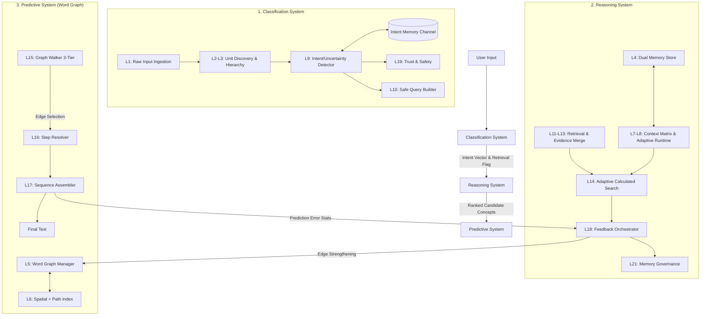

# Structured Predictive Search (SPS) Architecture

**Document Version:** 13.0  
**Last Updated:** March 2026  
**Status:** Reflects current implementation — Three-System Architecture with Word Graph Prediction

---

## Table of Contents

1. [Executive Summary](#1-executive-summary)
2. [Three-System Architecture Overview](#2-three-system-architecture-overview)
3. [Classification System](#3-classification-system)
4. [Reasoning System](#4-reasoning-system)
5. [Predictive System](#5-predictive-system)
6. [System Interaction & Engine Pipeline](#6-system-interaction--engine-pipeline)
7. [Core Data Structures](#7-core-data-structures)
8. [Configuration System](#8-configuration-system)
9. [GPU Acceleration](#9-gpu-acceleration)
10. [Telemetry & Observability](#10-telemetry--observability)
11. [Training Architecture: Decoupled Training, Coupled Inference](#11-training-architecture-decoupled-training-coupled-inference)
12. [API Specifications](#12-api-specifications)
13. [Priority Scheduler](#13-priority-scheduler)
14. [Directory Structure](#14-directory-structure)
15. [Appendices](#15-appendices)

---

## 1. Executive Summary

The SPS (Structured Predictive Search) Engine — implemented as the SPSE codebase — is a **privacy-first, config-driven, retrieval-augmented intelligence engine** written in Rust. It replaces the dense softmax-over-vocabulary paradigm of traditional language models with a **tokenizer-free, spatially-grounded prediction architecture** organized into three functional systems:

1. **Classification System** — Ingests raw text, discovers dynamic semantic units, classifies intent/tone/uncertainty, and gates downstream processing.
2. **Reasoning System** — Manages dual memory (Core vs. Episodic), retrieves and merges external evidence, scores candidate concepts, and orchestrates learning.
3. **Predictive System** — Maintains a **Word Graph** embedded in 3D space: every word is a node, training creates directed weighted edges ("roads") between words, and prediction is a 3-tier spatial graph walk (near edges → far edges → on-the-fly pathfinding through hub nodes) rather than global softmax.

These three systems consolidate the engine's 21 internal processing layers into coherent functional domains while preserving the core mechanisms: tokenizer-free units, word-level graph navigation in 3D space, dual memory governance, gated retrieval, and 7-dimensional candidate scoring.

### Key Architectural Differentiators

- **Decoupled Intent vs. Prediction** — In standard Transformers, intent is implicit in attention heads. Here, **Classification** is an explicit, memory-backed stage that gates the expensive Reasoning and Predictive stages.
- **Graph Walk vs. Dense** — The Predictive System replaces dense softmax over a vocabulary with **directed graph navigation** through a 3D-embedded word graph. Words connected by training form explicit weighted edges ("roads"); frequently-walked paths harden into variable-length highways. Prediction walks these roads with spatial proximity as the priority signal, falling back to on-the-fly pathfinding through function-word hubs for novel combinations — making it generalize like an LLM without a neural network.
- **Reasoning as Evidence Merge** — The Reasoning System explicitly manages truth (internal memory vs. external web evidence) *before* any words are predicted, preventing hallucination by resolving conflicts upstream of generation.

### Design Principles

- **No hardcoded thresholds** — every numeric value lives in `config/config.yaml` via `EngineConfig`
- **No external open sources for training** — the engine acquires factual knowledge at runtime via web retrieval; seed datasets teach *how to think* (reasoning chains, retrieval triggers, confidence gating), not factual content
- **Auto-Mode only** — engine operates exclusively in auto-intelligence mode; user toggles for temperature, reasoning depth, and creative level are ignored
- **Auto-retrieval** — web retrieval is always enabled, triggered automatically by the Classification System when confidence is low or the query is open-world
- **Calculation-based classification** — intent, tone, and resolver mode inferred via memory-backed spatial pattern matching (not heuristic detection)
- **Dynamic reasoning** — confidence-gated internal reasoning loop triggered automatically; signals retrieval when internal confidence stays low
- **Privacy-first** — PII stripping, no external telemetry, local SQLite persistence
- **GPU-optional** — `wgpu`-based acceleration behind `#[cfg(feature = "gpu")]` with transparent CPU fallback
- **Memory channels** — three isolated channels (Main, Intent, Reasoning) prevent cross-contamination
- **Pollution prevention at source** — pre-ingestion content validation rejects empty, repetitive, artifact-laden, and low-quality content before it enters memory

### Technology Stack

| Component | Technology |
|-----------|-----------|
| Language | Rust (2021 edition) |
| Persistence | SQLite via `rusqlite` |
| HTTP Server | `axum` + `tokio` |
| Serialization | `serde` (JSON, YAML), `prost` (Protobuf) |
| GPU | `wgpu` (feature-gated) |
| Config | YAML (`config/config.yaml`) |
| Concurrency | `Arc<Mutex<T>>`, `arc_swap::ArcSwap`, `crossbeam_channel` |

---

## 2. Three-System Architecture Overview

The engine's 21 internal processing layers are organized into three functional systems. Each system has a clear responsibility boundary, well-defined inputs/outputs, and communicates with the others through typed interfaces.

### System Summary

| System | Function | Core Mechanism | Layer Mapping |
|--------|----------|----------------|---------------|
| **Classification** | Identify *what* the input means and *whether* external help is needed | Hybrid heuristic classification reinforced by memory-backed intent channels | L1, L2, L3, L9, L10, L19 |
| **Reasoning** | Determine the response strategy by managing memory, evidence, and truth | Dual-memory governance (Core vs. Episodic), trust-aware evidence merging, adaptive candidate scoring | L4, L7, L8, L11, L12, L13, L14, L18, L21 |
| **Predictive** | Navigate a Word Graph to select the next word via 3-tier spatial graph walk | Directed weighted word graph in 3D space; edges (roads) + highways; near → far → pathfinding through function-word hubs | L5, L6, L15, L16, L17 |

### Cross-Cutting Concerns

| Concern | Modules | Serves |
|---------|---------|--------|
| Telemetry (L20) | `telemetry/` | All three systems |
| GPU Acceleration | `gpu/` | Classification (similarity), Reasoning (scoring, evidence merge), Predictive (force layout, distance) |
| Priority Scheduling | `scheduler.rs` | All three systems |

### Module Map (`src/lib.rs`)

```
pub mod api              // REST + OpenAI-compatible API (axum)
pub mod bloom_filter     // Probabilistic membership testing (UnitBloomFilter)
pub mod classification   // Classification System: intent/tone/resolver inference
pub mod common           // Shared utilities (scoring, matching, selection, similarity, dedup)
pub mod config           // EngineConfig and all sub-configs
pub mod document         // Document ingestion (PDF, DOCX, plain text)
pub mod drill_lib        // Drill framework for system testing
pub mod engine           // Core Engine struct — orchestrates all three systems
pub mod gpu              // GPU acceleration (feature-gated wgpu)
pub mod predictive       // Predictive System: Word Graph (L5), Step Resolver (L16), Sequence Assembler (L17)
pub mod reasoning        // Reasoning System: Context (L7), Retrieval (L11), Merge (L13), Search (L14), Feedback (L18)
pub mod memory           // Reasoning System: MemoryStore (L4/L21) + DynamicMemoryAllocator
pub mod open_sources     // Internal dataset catalog
pub mod persistence      // SQLite persistence layer
pub mod proto            // Protobuf definitions (api.proto)
pub mod region_index     // Predictive System: regional spatial index
pub mod scheduler        // Priority-based work scheduling (4 priorities)
pub mod seed             // Dataset generators (dialogue, entity, dryrun)
pub mod spatial_index    // Predictive System: SpatialGrid for O(log N) queries
pub mod stress_drill_lib // Stress testing drills
pub mod crash_drill_lib  // Crash resilience drills
pub mod telemetry        // Cross-cutting: worker, hot store, latency, trace
pub mod training         // Training pipeline orchestration
pub mod types            // All core type definitions
```

### Engine Struct (`src/engine.rs`)

The `Engine` orchestrates the three systems:

```rust
pub struct Engine {
    // --- Configuration ---
    config: EngineConfig,

    // --- Reasoning System ---
    memory: Arc<Mutex<MemoryStore>>,              // L4/L21 — dual memory store
    memory_snapshot: Arc<ArcSwap<MemorySnapshot>>, // Lock-free read path
    retriever: RetrievalPipeline,                  // L11 — external search
    merger: EvidenceMerger,                        // L13 — conflict resolution
    feedback: FeedbackController,                  // L18 — learning events
    feedback_tx: Sender<Vec<FeedbackEvent>>,       // Async feedback channel
    dynamic_memory: Arc<DynamicMemoryAllocator>,   // Reasoning buffer allocation

    // --- Classification System ---
    classification_calculator: ClassificationCalculator, // Intent/tone/resolver inference
    safety: TrustSafetyValidator,                  // L12/L19 — trust assessment
    spatial_grid: Arc<Mutex<SpatialGrid>>,         // Classification pattern retrieval

    // --- Predictive System (Word Graph) ---
    decoder: OutputDecoder,                        // L17 — sequence assembly

    // --- Cross-Cutting ---
    scheduler: Arc<PriorityScheduler>,             // 4-priority work queue
    telemetry_worker: Option<TelemetryWorker>,     // L20 — async event emission
    latency_monitor: Arc<LatencyMonitor>,          // p50/p95/p99 tracking
    trace_context: Arc<Mutex<TraceContext>>,        // Session/trace ID management
    jobs: Arc<Mutex<HashMap<String, TrainingJobStatus>>>,
    session_documents: Arc<Mutex<SessionDocuments>>,
    observer: Option<TestObserver>,                // Test observation hooks
}
```

### Background Workers

Two background threads are spawned at engine initialization:

1. **Maintenance worker** — runs every `governance.maintenance_interval_secs` (30s), performs Reasoning System governance (pruning, promotion, layout)
2. **Feedback worker** — drains the `feedback_rx` channel and applies learning events from the Reasoning System to memory

### System Interaction Diagram



### Layer-to-System Mapping (Complete Reference)

| Layer | Name | System | Source File | Config Section |
|-------|------|--------|------------|----------------|
| L1 | Input Ingestion | Classification | `classification/input.rs` | — |
| L2 | Unit Builder | Classification | `classification/builder.rs` | `layer_2_unit_builder` |
| L3 | Hierarchy Organizer | Classification | `classification/hierarchy.rs` | (uses builder config) |
| L4 | Memory Ingestion | Reasoning | `memory/store.rs` | `layer_21_memory_governance` |
| L5 | Word Graph Manager | Predictive | `predictive/router.rs` | `layer_5_semantic_map` |
| L6 | Spatial + Path Index | Predictive | `reasoning/context.rs` + `spatial_index.rs` | — |
| L7 | Intent Detector | Reasoning | `classification/intent.rs` | `intent` |
| L8 | Adaptive Runtime | Reasoning | `engine.rs` | `adaptive_behavior` |
| L9 | Retrieval Decision | Classification | `classification/intent.rs` | `layer_9_retrieval_gating` |
| L10 | Query Builder | Classification | `classification/query.rs` | `layer_10_query_builder` |
| L11 | Retrieval Pipeline | Reasoning | `reasoning/retrieval.rs` | `layer_11_retrieval` |
| L12 | Safety Validator | Reasoning | `classification/safety.rs` | `layer_19_trust_heuristics` |
| L13 | Evidence Merger | Reasoning | `reasoning/merge.rs` | `layer_13_evidence_merge` |
| L14 | Candidate Scorer | Reasoning | `reasoning/search.rs` | `layer_14_candidate_scoring` |
| L15 | Resolver Mode | Predictive | `engine.rs` | `adaptive_behavior` |
| L16 | Step Resolver | Predictive | `predictive/resolver.rs` | `layer_16_fine_resolver` |
| L17 | Sequence Assembler | Predictive | `predictive/output.rs` | — |
| L18 | Feedback Controller | Reasoning | `reasoning/feedback.rs` | — |
| L19 | Trust/Safety | Classification | `classification/safety.rs` | `layer_19_trust_heuristics` |
| L20 | Telemetry | Cross-Cutting | `telemetry/` | `layer_20_telemetry` |
| L21 | Governance | Reasoning | `memory/store.rs` | `layer_21_memory_governance` |

### Latency Instrumentation

The engine records wall-clock latency per system and feeds into `LatencyMonitor`:

```
Classification System:
  Layer 2  (Unit Building)      → latency_monitor.record(2, ms)
  Layer 9  (Retrieval Decision) → latency_monitor.record(9, ms)

Reasoning System:
  Layer 11 (Retrieval I/O)      → latency_monitor.record(11, ms)
  Layer 13 (Evidence Merge)     → latency_monitor.record(13, ms)
  Layer 14 (Candidate Scoring)  → latency_monitor.record(14, ms)

Predictive System:
  Layer 5  (Semantic Routing)   → latency_monitor.record(5, ms)
  Layer 16 (Fine Resolution)    → latency_monitor.record(16, ms)

Total:
  Layer 0  (Full Pipeline)      → TelemetryEvent::Calculation
```

---

## 3. Classification System

**Function:** Ingests raw text/sentences to identify **intent**, **tone**, **uncertainty**, and **semantic category**. Acts as the gatekeeper that determines *what* the input means and *whether* external help is needed.

**Core Mechanism:** Nearest Centroid Classifier using 78-float POS-based feature vectors (14 structural + 32 intent hash + 32 tone hash) with configurable feature weights. Training builds per-class mean centroids; inference compares query vector against ~23 centroids via weighted cosine similarity.

### Constituent Layers

| Layer | Name | Source | Responsibility |
|-------|------|--------|----------------|
| L1 | Input Ingestion | `classification/input.rs` | Byte/character ingestion without fixed tokens; normalize raw text → `InputPacket`; **compound noun detection** via POS tagger (NN+NN, NNP+NNP merge) |
| L2 | Unit Builder | `classification/builder.rs` | Rolling hash discovery of dynamic units (n-grams, phrases) that form classification features |
| L3 | Hierarchy Organizer | `classification/hierarchy.rs` | Level grouping (Char → Subword → Word → Phrase → Pattern), anchor/entity extraction |
| L9 | Intent & Uncertainty Detector | `classification/intent.rs` | Primary classification engine: weighted score based on entropy, recency, and internal disagreement; classifies query type and decides if retrieval is required |
| L10 | Safe Query Builder | `classification/query.rs` | Sanitizes classified intent into a search query if needed, stripping PII |
| L19 | Trust & Safety | `classification/safety.rs` | Classifies source reliability; detects injection attacks and toxic tone |

### Operational Flow

```
1. Raw bytes → L1 normalizes to InputPacket
2. L2 discovers dynamic units via rolling hash → BuildOutput
3. L3 organizes hierarchy (Char..Pattern levels) → UnitHierarchy
4. Units matched against Intent Memory Channel
5. Hybrid score (Heuristic + Memory) assigns:
   - Intent Label (e.g., plan, critique, fact-check)
   - Tone/Urgency Score
   - Retrieval Need flag
6. L19 validates trust/safety of any pre-existing context
7. L10 builds sanitized query if retrieval flagged
8. Output: Classification Vector → triggers Reasoning System
```

### 3.1 Unit Discovery (L1–L3)

The Classification System begins with tokenizer-free ingestion. Rather than a fixed vocabulary, the engine discovers reusable semantic elements dynamically:

- **L1 (`classification/input.rs`)** — Normalizes raw text into an `InputPacket`. No fixed tokenizer; operates on bytes/characters directly. **Compound noun merge**: after POS tagging, consecutive NN+NN and NNP+NNP sequences are merged into single tokens (e.g., "machine learning" → `machine_learning`, "New York" → `New_York`). Known compounds are cached; new compounds are added when seen ≥ `compound_noun_min_frequency` times.
- **L2 (`classification/builder.rs`)** — Uses rolling hash to discover variable-length units (n-grams, words, phrases). Each unit receives utility, salience, and confidence scores. Config: `layer_2_unit_builder`.
- **L3 (`classification/hierarchy.rs`)** — Groups discovered units into five granularity levels:

| Level | Description |
|-------|-------------|
| `Char` | Individual characters |
| `Subword` | Character n-grams |
| `Word` | Whitespace-delimited tokens |
| `Phrase` | Multi-word sequences |
| `Pattern` | Recurring structural patterns |

Anchor and entity extraction occurs at this stage — high-salience units are flagged for protection from downstream pruning.

### 3.2 Intent Classification (L9)

The primary classification engine. `IntentDetector::assess()` computes a weighted score from:

- **Entropy** — High entropy (above `retrieval.entropy_threshold`: 0.85) indicates uncertainty, triggering retrieval
- **Freshness** — Stale context (below `retrieval.freshness_threshold`: 0.65) triggers retrieval
- **Internal disagreement** — Conflicting candidate signals increase retrieval need
- **Cost** — Retrieval cost vs. expected information gain

Classification delegates to `ClassificationCalculator` (see §3.5) which produces:

```rust
ClassificationResult {
    intent: IntentKind,        // 24 intent labels
    tone: ToneKind,            // 6 tone labels
    resolver_mode: ResolverMode, // Deterministic/Balanced/Exploratory
    confidence: f32,
    method: CalculationMethod, // Always MemoryLookup
    candidate_count: usize,
}
```

**Intent Labels (24):** Greeting, Gratitude, Farewell, Help, Clarify, Rewrite, Verify, Continue, Forget, Question, Summarize, Explain, Compare, Extract, Analyze, Plan, Act, Recommend, Classify, Translate, Debug, Critique, Brainstorm, Unknown.

**Tone Labels (6):** NeutralProfessional, Empathetic, Direct, Technical, Casual, Formal.

**Fallback Modes:** When classification confidence is low, `IntentFallbackMode` activates: None, DocumentScope, ClarifyHelp, or RetrieveUnknown (forces external retrieval for unrecognized queries).

### 3.3 Safe Query Construction (L10)

When retrieval is flagged, `SafeQueryBuilder::build()` in `classification/query.rs`:

1. Strips PII (configurable aggressiveness via `query.pii_stripping_aggressiveness`: "standard")
2. Applies semantic expansion from unit hierarchy
3. Produces a `SanitizedQuery` safe for external dispatch

### 3.4 Trust & Safety Gate (L19)

`TrustSafetyValidator` in `classification/safety.rs` operates at the classification boundary:

Trust scoring formula per source:
```
trust = default_source_trust (0.50)
      + https_bonus (0.10)          if HTTPS
      + allowlist_bonus (0.10)      if domain in allowlist
      - parser_warning_penalty (0.20) if parser warnings
      + corroboration_bonus (0.08)  per corroborating source
      + format_trust_adjustments    per detected format
```

Format trust adjustments: `html_raw` (-0.30), `qa_json_schema_keys` (-0.40), `structured_entity` (+0.20), `code_syntax` (-0.10).

Content quality thresholds:

| Threshold | Default | Purpose |
|-----------|---------|---------|
| `min_readability_score` | 0.60 | Minimum readability |
| `max_boilerplate_ratio` | 0.40 | Maximum boilerplate content |
| `min_unique_words_ratio` | 0.30 | Minimum vocabulary diversity |

Allowlist domains: wikimedia.org, wikipedia.org, wikidata.org, archive.org, ncbi.nlm.nih.gov, pmc.ncbi.nlm.nih.gov, nominatim.openstreetmap.org, openstreetmap.org, dbpedia.org, gutenberg.org.

### 3.5 ClassificationCalculator (`src/classification/`)

Located in `src/classification/` with four submodules: `signature`, `pattern`, `calculator`, `trainer`.

#### ClassificationSignature (`classification/signature.rs`)

A **78-float** CPU-efficient feature vector computed from raw text in microseconds:

| Category | Features | Count | Purpose |
|----------|----------|-------|----------|
| Structural | `byte_length_norm`, `sentence_entropy`, `token_count_norm` | 3 | Text shape |
| Punctuation | `question_mark_ratio`, `exclamation_ratio`, `period_ratio` | 3 | Question/exclamation detection |
| Semantic | `semantic_centroid[0..3]` (via `SemanticHasher`) | 3 | 3D spatial anchor |
| Derived | `urgency_score`, `formality_score`, `technical_score`, `domain_hint`, `temporal_cue` | 5 | Domain/urgency signals |
| **Intent Hash** | POS-filtered verbs, wh-words, modals → FNV-1a 32-bucket hash | **32** | Intent-discriminating signal |
| **Tone Hash** | POS-filtered adjectives, adverbs → FNV-1a 32-bucket hash | **32** | Tone-discriminating signal |

POS tagging uses a pre-trained NLTK perceptron model (`postagger` crate) loaded once at startup. Intent hash keeps only verbs (VB*), question words (W*), modals (MD), and interjections (UH). Tone hash keeps only adjectives (JJ*) and adverbs (RB*). Function words (DT, IN, CC, etc.) are always excluded.

`SemanticHasher` produces a deterministic 3D position from text using trigram-frequency FNV hashing with domain anchor blending (80% hash / 20% anchor) — no embedding model needed.

#### ClassificationPattern (`classification/pattern.rs`)

Stored in Intent memory channel as a specialized Unit:

```rust
pub struct ClassificationPattern {
    pub unit_id: Uuid,
    pub signature: ClassificationSignature,
    pub intent_kind: IntentKind,
    pub tone_kind: ToneKind,
    pub resolver_mode: ResolverMode,
    pub success_count: u64,            // Feedback: successful predictions
    pub failure_count: u64,            // Feedback: failed predictions
    pub last_reinforced: DateTime<Utc>,
    pub domain: Option<String>,
    pub memory_channels: Vec<MemoryChannel>, // Always includes Intent
}
```

#### ClassificationCalculator (`classification/calculator.rs`)

Feature weights (configurable via `ClassificationConfig`):
- Intent hash: **0.35** (dominant signal)
- Tone hash: 0.20
- Semantic centroid: 0.15
- Structural: 0.10
- Punctuation: 0.10
- Derived: 0.10

**Primary path: Nearest Centroid Classifier** (~23 comparisons, not 23K patterns):
1. Compute `ClassificationSignature` (78 floats) from input text
2. Split feature vector: `structural[0:14]`, `intent_hash[14:46]`, `tone_hash[46:78]`
3. For each **intent centroid** (built during training by averaging all examples per intent):
   - `score = w_intent_hash × cosine(query_intent, centroid_intent) + (1 - w_intent_hash) × cosine(query_structural, centroid_structural)`
4. For each **tone centroid** (built similarly):
   - `score = w_tone_hash × cosine(query_tone, centroid_tone) + (1 - w_tone_hash) × cosine(query_structural, centroid_structural)`
5. Winner = argmax per dimension
6. Confidence = `(best_sim - runner_up_sim) / best_sim + best_sim`, clamped to [0, 1]
7. Confidence → resolver mode: `< 0.40 → Exploratory`, `> 0.85 → Deterministic`, else `Balanced`

**Alternative path: Spatial Vote Aggregation** (used by `calculate_intent()` / `calculate_tone()`):
1. Compute signature → query `SpatialGrid` for nearby patterns within `spatial_query_radius` (0.1)
2. Score each pattern: cosine similarity × pattern confidence (success / total)
3. Aggregate votes per intent/tone → weighted majority

#### ClassificationTrainer (`classification/trainer.rs`)

Iterative training from labeled seed dialogues (`LabeledDialogue` / `LabeledTurn`):
- Converts dialogues to `ClassificationPattern` instances
- Inserts patterns into spatial grid and memory store
- Runs validation iterations adjusting spatial positions
- Tracks per-iteration accuracy via `IterationReport`
- Final report via `FinalReport` with overall accuracy and pattern count

### 3.6 Intent Resolution in Engine

`resolve_intent_profile()` delegates entirely to `ClassificationCalculator`:

```rust
fn resolve_intent_profile(&self, raw_input, ..) -> IntentProfile {
    let result = self.classification_calculator.calculate(
        raw_input, &memory, &spatial, &self.config.classification,
    );
    IntentProfile {
        primary: result.intent,
        confidence: result.confidence,
        ambiguous: result.confidence < config.classification.low_confidence_threshold,
        reasons: vec![format!("classification_method={:?}", result.method)],
        ..
    }
}
```

### 3.7 Memory Channel: Intent

The Classification System specifically utilizes the **Intent memory channel** to refine runtime classification based on historical user patterns:

| Channel | Purpose | Isolation Rules |
|---------|---------|-----------------|
| `Intent` | Classification patterns | Blocked from Core promotion (`intent_channel_core_promotion_blocked: true`) |

Classification patterns stored here are queried via spatial grid for O(log N) retrieval. Feedback from the Reasoning System (L18) reinforces or weakens patterns by adjusting `success_count` / `failure_count`.

### 3.8 Efficiency Optimizations

| Optimization | Mechanism | Impact |
|-------------|-----------|--------|
| **Incremental centroid update** | Running mean (`new_centroid = old × (n-1)/n + new_vector / n`) instead of full recompute when new patterns are added | Avoids O(N) recompute on each training example |
| **Two-phase classification** | Phase 1: structural features only (14 dims) → if top-2 margin > 0.3, emit result immediately. Phase 2: full 78-dim comparison only for ambiguous cases | Halves inference cost for clear-cut queries (~60% of traffic) |
| **POS tag LRU cache** | Cache POS tags for recently seen phrases (128-entry LRU keyed by normalized text hash) | Avoids redundant POS tagger calls for repeated/similar queries |
| **Confidence calibration** | Track prediction accuracy per confidence band (10 bins); apply Platt scaling to raw confidence | Ensures confidence=0.8 means 80% actual accuracy |
| **Shared signature reuse** | Classification signature's `semantic_centroid` reused by Predictive System for initial spatial position; `urgency_score` and `temporal_cue` reused by Reasoning System for retrieval gating | Zero recomputation across systems |

---

## 4. Reasoning System

**Function:** Takes the classified input and current context to **reason** on the response strategy. Manages memory retrieval, evidence merging, conflict resolution, and the logical assembly of the answer before final word selection.

**Core Mechanism:** Dual-memory governance (Core vs. Episodic), trust-aware evidence merging, and adaptive candidate scoring.

### Constituent Layers

| Layer | Name | Source | Responsibility |
|-------|------|--------|----------------|
| L4 | Dual Unit Memory Store | `memory/store.rs` | Manages separation of stable facts (Core) and transient session data (Episodic) |
| L7 | Context Matrix & Anchor Memory | `reasoning/context.rs` | Maintains active reasoning state, weighing recency and salience while protecting critical long-range anchors |
| L8 | Adaptive Runtime | `engine.rs` | Profile selection (10 intent profiles), scoring weight adjustment |
| L11 | Retrieval Pipeline | `reasoning/retrieval.rs` | Fetches external data when Classification flagged a need |
| L12 | Safety Validator | `classification/safety.rs` | Normalizes and trust-scores retrieved documents |
| L13 | Evidence Merger | `reasoning/merge.rs` | Merges external evidence with internal memory using trust weights (Source Reliability + Recency + Agreement) |
| L14 | Adaptive Calculated Search | `reasoning/search.rs` | Core reasoning engine: scores potential answer fragments on spatial fit, context fit, sequence logic, and evidence support — O(k·d) complexity |
| L18 | Feedback Controller | `reasoning/feedback.rs` | Orchestrates learning updates; decides which reasoning traces become durable memory |
| L21 | Memory Governance | `memory/store.rs` | Prunes low-utility reasoning paths, compacts memory, prevents bloat |

### Operational Flow

```
1. Receive Intent Vector from Classification System
2. L4: Activate relevant memory — load Dual Memory Store
3. L7/L8: Update Context Matrix, activate Anchor Memories
         Resolve adaptive runtime settings from intent profile
         Route candidate units with escape profile
4. Query Reasoning memory channel for prior reasoning patterns:
   - top_channel_matches(Reasoning, normalized, 12) → top 8
   - Average (utility + confidence + trust) / 3
   - Contributes 20% of reasoning confidence to evidence_support
   - Reasoning unit IDs added to candidate pool
5. L14: Initial candidate scoring (GPU-accelerated, 7-dimensional)
6. If Classification flagged retrieval need:
   a. L11: Fetch from external sources via RetrievalPipeline
   b. L12: Validate trust of retrieved documents
   c. L13: Evidence Merge — resolve contradictions between
           internal memory and web results using trust heuristics
7. L14: Final candidate scoring with merged evidence
        Filter out Char-level units when higher-level exist
8. If confidence < trigger_confidence_floor:
   Execute Dynamic Reasoning Loop (confidence-gated, max 3 steps)
9. L18: Generate feedback events, enqueue for background worker
10. L21: Update sequence state, run maintenance cycle
11. Output: Ranked Candidate Concepts → Predictive System
```

### 4.1 Dual Memory Store (L4)

SQLite-backed storage (`src/memory/store.rs`) managing:
- **Units** — persistent semantic elements with full metadata
- **Candidates** — observation-stage units awaiting promotion
- **Channels** — isolated memory lanes (Main, Intent, Reasoning)
- **Sequence state** — recent unit IDs, anchors, task entities, turn index

Key operations:
- `ingest_hierarchy()` — channel-aware unit ingestion from Classification L3 output
- `ingest_hierarchy_with_channels()` — explicit channel targeting (used by reasoning)
- `update_positions()` — apply Predictive System L5 spatial routing results
- `connect_units()` — create links between neighboring units (O(1) dedup via HashSet)
- `run_maintenance()` — L21 governance cycle (prune, promote, detect pollution)
- `audit_pollution()` — scan for duplicate/degraded units
- `snapshot()` — create immutable `MemorySnapshot` for lock-free reads

#### Memory Types

| Type | Behavior |
|------|----------|
| `Episodic` | Decays after `episodic_decay_days` (30); pruned by governance |
| `Core` | Permanent; requires corroboration for promotion from Episodic |

#### Memory Channels

| Channel | Purpose | Isolation Rules |
|---------|---------|-----------------|
| `Main` | Primary content storage | All user content defaults here |
| `Intent` | Classification patterns (see §3.7) | Blocked from Core promotion |
| `Reasoning` | Internal reasoning thoughts | Process units with `is_process_unit: true` |

#### Memory Snapshot (Lock-Free Read Path)

```
Write path: memory.lock() → modify → publish_memory_snapshot() → ArcSwap::store()
Read path:  memory_snapshot.load_full() → Arc<MemorySnapshot> (no lock)
```

Provides: `all_units()`, `get_units()`, `top_units()`, `sequence_state()`, `memory_summary()`, `top_channel_matches()`

#### Candidate Lifecycle

```
Observation → Candidate → Validated → Active → (pruned or promoted to Core)
                                    → Rejected
```

Maturity-stage-dependent thresholds:

| Stage | Unit Threshold | Observation Threshold | Discovery Frequency | Discovery Utility |
|-------|---------------|----------------------|--------------------|--------------------|
| ColdStart | < 1,000 | 2 | 1 | 0.18 |
| Growth | 1,000–10,000 | 3 | 2 | 0.28 |
| Stable | > 10,000 | 4 | 3 | 0.42 |

#### Pollution Prevention (Pre-Ingestion Gate)

Content is validated **before** entering memory via `passes_content_validation()` in `ingest_activation()`:

| Gate | Check | Action |
|------|-------|--------|
| Gate 1 | Empty or whitespace-only content | Reject |
| Gate 2 | Purely numeric/punctuation content | Reject |
| Gate 3 | Excessive word repetition (uniqueness < 30%) | Reject |
| Gate 4 | Retrieval-sourced: short fragments, HTML/script artifacts | Reject |
| Gate 5 | Near-duplicate with dramatically lower quality than existing | Reject |

#### Pollution Detection (Post-Hoc Safety Net)

Runs during `run_maintenance()`:
1. Normalize content and compute overlap ratio between unit pairs
2. Apply Jaccard similarity gate (`pollution_similarity_threshold`: 0.65)
3. Compare quality (utility × confidence × trust) — lower quality = pollutant
4. Apply `pollution_penalty_factor` (0.25) or purge
5. Min content length for detection: `pollution_min_length` (4 chars)

#### Anchor System

Units earn anchor status when:
- `frequency >= anchor_reuse_threshold` (3)
- `salience_score >= anchor_salience_threshold` (0.70)

Anchors are protected from pruning for `anchor_protection_grace_days` (14 days). The Predictive System's Step Resolver (L16) also protects anchor words during edge selection.

#### Bloom Filter (`src/bloom_filter.rs`)

`UnitBloomFilter` for O(1) probabilistic membership testing:
- 3 hash functions, 10× expected items bit count (minimum 1024 bits)
- Tracks `BloomStats`: queries, maybe_hits, false_positives
- Used for fast duplicate detection during unit ingestion

### 4.2 Context Matrix & Adaptive Runtime (L7/L8)

**L7 (`reasoning/context.rs`)** constructs the context matrix from the current memory snapshot — sequence state, task entities, and recency-weighted salience.

**L8 (`engine.rs`)** resolves adaptive runtime settings based on the intent profile received from the Classification System. Ten named profiles with tuned scoring weights:

| Profile | Resolver Mode | Temperature | Stochastic Jump | Beam Width |
|---------|--------------|-------------|-----------------|------------|
| `casual` | Exploratory | 0.70 | 0.20 | 7 |
| `explanatory` | Balanced | 0.30 | 0.10 | 5 |
| `factual` | Deterministic | 0.10 | 0.05 | 3 |
| `procedural` | Balanced | 0.22 | 0.08 | 4 |
| `creative` | Exploratory | 0.75 | 0.22 | 6 |
| `brainstorm` | Exploratory | 0.90 | 0.35 | 10 |
| `plan` | Balanced | 0.35 | 0.12 | 5 |
| `act` | Balanced | 0.25 | 0.08 | 4 |
| `critique` | Balanced | 0.30 | 0.10 | 5 |
| `advisory` | Balanced | 0.26 | 0.09 | 4 |

Two trust profiles: `default` (trust=0.50, corroboration=2, no HTTPS) and `high_stakes` (trust=0.30, corroboration=4, HTTPS required).

### 4.3 Gated Retrieval Pipeline (L11–L13)

If the Classification System flagged a retrieval need, the Reasoning System executes:

1. **L11 (`reasoning/retrieval.rs`)** — Fetches from external sources via SearxNG. Response caching. Config: `layer_11_retrieval`.
2. **L12 (`classification/safety.rs`)** — Trust assessment of retrieved documents. HTTPS enforcement, format trust adjustments, content quality gates (see §3.4).
3. **L13 (`reasoning/merge.rs`)** — Evidence merge. Conflict detection and agreement scoring between internal memory and web results. Trust-weighted merge using Source Reliability + Recency + Agreement. Config: `layer_13_evidence_merge`.

If `local_documents` are provided (e.g., uploaded files), they are merged directly without L10/L11.

### 4.4 Adaptive Calculated Search (L14)

The core reasoning engine. Scores potential answer fragments across 7 dimensions:

```rust
pub struct ScoreBreakdown {
    pub spatial_fit: f32,      // Distance in 3D space (from Predictive System)
    pub context_fit: f32,      // Context matrix relevance
    pub sequence_fit: f32,     // Recent unit sequence alignment
    pub transition_fit: f32,   // Transition probability
    pub utility_fit: f32,      // Intrinsic utility
    pub confidence_fit: f32,   // Corroboration confidence
    pub evidence_support: f32, // External evidence backing
}
```

Default weights: spatial=0.12, context=0.18, sequence=0.16, transition=0.12, utility=0.14, confidence=0.14, evidence=0.14.

Complexity: O(k·d) where k = candidate count, d = scoring dimensions. GPU-accelerated when available (see §9).

### 4.5 Dynamic Reasoning Loop

Reasoning is **not a user toggle** — triggered automatically when:
1. `reasoning_loop.enabled` is true (default: true)
2. Initial confidence from Predictive System L16 is below `trigger_confidence_floor` (0.40)
3. `IntentDetector::should_trigger_reasoning(intent, config)` returns true

#### Execution

```
for step in 0..max_internal_steps (default 3):
    1. Try adapt_reasoning_pattern() from Reasoning channel
       → Top 5 patterns by similarity, best match adapted
       → Anchor boost: +0.15; non-anchor: +0.10; plus similarity × 0.2
    2. Fallback: generate_thought_unit()
       → Confidence improvement: 0.1 × (1.0 - previous).min(0.3)
    3. If step > 0 and confidence < exit_threshold × 0.7:
       → Set needs_retrieval = true (triggers web retrieval)
    4. Ingest thought into Reasoning channel as Episodic unit
       → NOT Core memory (prevents pollution)
    5. Track confidence trajectory
    6. Exit early if confidence >= exit_confidence_threshold (0.60)
```

#### Reasoning-Triggered Retrieval

When the reasoning loop cannot reach sufficient confidence from internal knowledge alone, it sets `needs_retrieval = true` on `ReasoningState`. The pipeline checks this flag and automatically triggers web retrieval via L11. This implements the "I don't know → let me check → here's the answer" pattern.

**Key**: Web retrieval is always enabled. Triggered automatically based on `IntentDetector::assess()` and reasoning confidence signals.

#### Reasoning Output

```rust
ReasoningResult {
    output: OutputType::FinalAnswer(String),
    steps_taken: usize,
    final_confidence: f32,
    reasoning_triggered: bool,
    thoughts: Vec<ThoughtUnit>,
    needs_retrieval: bool,
}
```

#### Dynamic Memory Allocator (`src/memory/dynamic.rs`)

On-demand allocation for reasoning buffers:

| Parameter | Default | Purpose |
|-----------|---------|---------|
| `base_memory_limit_mb` | 350 | Idle memory limit |
| `max_memory_limit_mb` | 550 | Limit during reasoning |
| `thought_buffer_size_kb` | 64 | Per reasoning step |

- `DynamicMemoryAllocator` uses atomic counters for lock-free tracking
- `ReasoningGuard` — RAII guard that allocates on creation, releases on drop
- `ThoughtBuffer` — capacity-limited buffer; rejects additions when full

### 4.6 Feedback & Learning (L18)

`FeedbackController::learn()` in `reasoning/feedback.rs` generates `FeedbackEvent` instances after each query:
- Impact scoring of predicted vs. expected outcome
- Weight adjustment signals fed back to Classification (pattern reinforcement) and Predictive (spatial corrections) systems
- Events enqueued for async background worker processing

### 4.7 Memory Governance (L21)

Runs during maintenance cycles (every 30s or every 5 turns):
- **Pruning** — Remove units below `prune_utility_threshold` (0.12)
- **Promotion** — Promote frequently-seen Episodic units to Core (requires corroboration)
- **Pollution detection** — Post-hoc safety net (see §4.1)
- **Layout compaction** — Triggers Predictive System force-directed layout adjustments
- **Snapshot save** — Persist memory state to SQLite

```rust
GovernanceReport {
    pruned_units: u64,
    pruned_candidates: u64,
    purged_polluted_units: u64,
    purged_polluted_candidates: u64,
    promoted_units: u64,
    anchors_protected: u64,
    layout_adjustments: u64,
    mean_displacement: f32,
    layout_rolled_back: bool,
    snapshot_path: String,
    pruning_reasons: Vec<String>,
    pruned_references: Vec<PrunedUnitReference>,
    pollution_findings: Vec<PollutionFinding>,
}
```

### 4.8 Efficiency Optimizations

| Optimization | Mechanism | Impact |
|-------------|-----------|--------|
| **Lazy sub-question expansion** | If first reasoning step yields confidence ≥ `exit_confidence_threshold`, skip decomposition entirely | Avoids unnecessary multi-hop overhead for simple queries (~70% of traffic) |
| **Reasoning chain cache** | LRU cache (256 entries) keyed by `(intent, top_3_entity_hashes)`. Cache hit returns prior `ReasoningResult` directly | Eliminates redundant reasoning for repeated/similar queries |
| **Delta scoring** | When only evidence changes (L13 merge), update only `evidence_support` dimension of 7D score instead of full rescore | Reduces scoring cost by ~6/7 for retrieval-augmented queries |
| **Early exit on anchor match** | If `adapt_reasoning_pattern()` finds an anchor pattern (success_count > 10) with similarity > 0.85, skip remaining steps | Fast path for well-established reasoning patterns |
| **Batched feedback ingestion** | Accumulate `FeedbackEvent` instances across queries; apply in batch during maintenance cycle instead of per-query | Reduces mutex contention on MemoryStore |
| **Pipeline short-circuit** | If Classification confidence > 0.95 AND intent ∈ {Greeting, Farewell, Gratitude, Continue}, skip Reasoning entirely — route directly to Predictive | Eliminates Reasoning overhead for social/simple intents |

---

## 5. Predictive System

**Function:** Maintains a **Word Graph** — a directed, weighted graph of individual words embedded in 3D space. Training creates explicit connections ("roads") between words; prediction walks these roads using spatial proximity as the priority signal. When no direct road exists, the system pathfinds through function-word hubs on-the-fly, enabling LLM-like generalization without a neural network.

**Core Mechanism:** Word-level graph with directed weighted edges, embedded in a regularized 3D space via force-directed layout. Prediction uses a **3-tier spatial graph walk**: (1) near direct edges, (2) far direct edges, (3) on-the-fly pathfinding through hub nodes. Frequently-walked multi-hop paths harden into variable-length **highways** for fast traversal.

### Constituent Layers

| Layer | Name | Source | Responsibility |
|-------|------|--------|----------------|
| L5 | Word Graph Manager | `predictive/router.rs` | Maintains the word graph: nodes, edges, highways. Adds words, creates/strengthens edges during training. Force-directed 3D layout positions connected words nearby. |
| L6 | Spatial + Path Index | `reasoning/context.rs` + `spatial_index.rs` + `region_index.rs` | Spatial grid for tiered neighbor lookup (near → far). Trie-based highway prefix index for fast path matching. |
| L15 | Graph Walker | `engine.rs` | Implements 3-tier prediction walk: near edges → far edges → on-the-fly pathfinding through hub nodes. Highway matching and preference. |
| L16 | Step Resolver | `predictive/resolver.rs` | At each walk step, resolves which edge to follow via temperature-controlled probabilistic choice with intent shaping and context gating. |
| L17 | Sequence Assembler | `predictive/output.rs` | Assembles the walked word path into coherent surface text. Handles spacing, punctuation, capitalization. Evidence grounding when retrieval was used. |

### Operational Flow

```
1. Receive Ranked Candidate Concepts from Reasoning System
2. L5: Map candidates to Word Graph nodes
       Identify starting node(s) from context
       Check for highway prefix matches on recent sequence
3. L6: Spatial Index provides tiered edge lookup:
       Tier 1: direct edges where target is spatially near
       Tier 2: direct edges where target is spatially far
       Tier 3: on-the-fly pathfinding through hub nodes (A*)
4. L15: Graph Walk — for each step:
       a. Gather outgoing edges from current node
       b. Filter by context (intent, recent words, reasoning output)
       c. Score: edge_weight × proximity_bonus × context_relevance
       d. Check highway match → boost if prefix matches
       e. If no good edges: pathfind through Function-word hubs
5. L16: Step Resolution — pick single best edge to follow
       Temperature-controlled probabilistic choice
       Intent shaping and anchor protection applied
       Fallback: spatial nearest with Deterministic mode
6. L17: Assemble walked word sequence → surface text
       Reshape output for intent-specific formatting
       Queue prediction error stats → Reasoning System L18
7. L18 feedback → L5 edge strengthening + spatial adjustments
```

### 5.1 Word Graph Structure (L5)

The central data structure of the Predictive System (`predictive/router.rs`). Config: `layer_5_semantic_map`.

#### Word Nodes

Every unique word in the engine's vocabulary is a **node** embedded in 3D space:

```rust
struct WordNode {
    id: WordId,                        // compact u32 index
    content: String,                   // "the", "quantum", "New_York"
    position: [f32; 3],                // 3D spatial coordinates
    node_type: NodeType,               // Content | Function | Compound | Custom
    frequency: u32,                    // global usage count
    is_anchor: bool,                   // protected from pruning
    content_fingerprint: u64,          // FNV hash for fast lookup
}

enum NodeType {
    Content,    // nouns, verbs, adjectives — domain-specific hubs
    Function,   // the, is, of, and — universal routing hubs (never pruned)
    Compound,   // machine_learning, New_York — POS-merged compounds
    Custom,     // user-defined names, slang — placed by sentence context
}
```

**Node types serve different roles in the graph:**

| Property | Content Words | Function Words | Compound Words | Custom Words |
|----------|--------------|----------------|----------------|--------------|
| **Connectivity** | 10–200 edges | 500–5000 edges | 10–100 edges | 1–50 edges |
| **Role** | Domain-specific hub | Universal routing hub | Semantic unit | Context-placed |
| **Pruning** | Subject to decay | **Never pruned** | Subject to decay | Subject to decay |
| **Spatial position** | Clustered by domain | Central (high-connectivity) | Near related content | Avg of sentence neighbors |

#### Word Edges (Roads)

Directed, weighted connections between word nodes. Created and strengthened during training:

```rust
struct WordEdge {
    from: WordId,                      // source word
    to: WordId,                        // target word
    weight: f32,                       // connection strength [0, 1]
    context_tags: SmallVec<[u64; 4]>,  // hashed context fingerprints (polysemy)
    frequency: u32,                    // times traversed
    last_reinforced: u32,              // epoch counter for decay
}
```

- **Weight formula**: `base_weight × frequency_factor × recency_factor × context_diversity_bonus`
- **Context tags**: hashed fingerprints of the sentences where this edge appeared — enables polysemy disambiguation without multiple nodes per word (e.g., "bank" has edges tagged `{finance}` and edges tagged `{nature}`)
- **Decay**: edges not reinforced within `edge_decay_epochs` maintenance cycles lose weight; pruned below `edge_min_weight`

#### Highways (Meta-connections)

Variable-length pre-formed paths through the graph. Created when a word sequence is walked ≥ `highway_formation_threshold` times (configurable, default 5):

```rust
struct Highway {
    id: HighwayId,
    path: Vec<WordId>,                 // variable length: 2..N words
    aggregate_weight: f32,             // overall path quality
    frequency: u32,                    // times this exact sequence walked
    entry_contexts: Vec<u64>,          // context fingerprints that trigger
    subgraph_density: f32,             // how well-connected intermediate nodes are
}
```

- **Variable length**: highways range from 2 words ("of course") to full phrases ("the capital of France is Paris")
- **Subgraph density**: measures connectivity of intermediate nodes — a path through a dense, well-connected cluster is more reliable than through sparse nodes. This is the "connection between connections" strength.
- **Matching**: prefix-match on the current walked sequence → if match, prefer highway path with `highway_confidence_boost`
- **Maintenance**: highways below `highway_min_frequency` are dissolved back into individual edges

#### Polysemy: Single Node, Context-Gated Edges

One node per word form. Disambiguation happens through **context-gated edge selection**:

```
Node: "bank"
  Edge: "river" → "bank"  [context_tags: {nature, geography}]  weight: 0.8
  Edge: "money" → "bank"  [context_tags: {finance, business}]  weight: 0.9
  Edge: "bank" → "account" [context_tags: {finance}]           weight: 0.7
  Edge: "bank" → "erosion" [context_tags: {nature}]            weight: 0.6

Context from Classification: {finance}
→ "money→bank" activated (0.9), "bank→account" activated (0.7)
→ "river→bank" suppressed, "bank→erosion" suppressed
```

The Classification System's intent + the Reasoning System's context provide the context fingerprint that gates which edges are active during prediction.

### 5.2 Vocabulary Bootstrap & Growth

#### Phase 1: Dictionary Pre-population

On first run, load ~50K common English words from a bundled dictionary file. Each word gets:
- Initial 3D position from `SemanticHasher` (existing FNV trigram hashing — deterministic, no embedding model)
- `NodeType` assignment: POS tagger classifies as Content, Function, or Compound
- **No edges yet** — edges only come from training

#### Phase 2: Training Edge Formation

Q&A training creates/strengthens edges between consecutive words in answers, tagged with context from questions. See §11.4.

#### Phase 3: Runtime Growth

When a word appears that isn't in the graph (custom names, slang, domain terms):
1. Create new `WordNode` with `NodeType::Custom`
2. **Position**: weighted average of surrounding known words' positions in the sentence
   ```
   "I visited Kigali yesterday"
   "Kigali" unknown → position = weighted_avg(pos("visited"), pos("yesterday"))
   ```
3. New edges formed from sentence context, starting with low weight
4. Compound noun detection (L1) may merge multi-word names into single nodes

### 5.3 Spatial + Path Index (L6)

Two index structures support the 3-tier lookup:

- **SpatialGrid** (`src/spatial_index.rs`) — Grid-based spatial index for O(1) cell lookup. Given a 3D position, finds all word nodes within a configurable radius. Used for Tier 1 (near edges) and Tier 2 (far edges) prioritization.
- **RegionIndex** (`src/region_index.rs`) — Regional hierarchical partitioning for coarser spatial queries.
- **HighwayTrie** (new, in `predictive/router.rs`) — Trie indexed by word sequences for O(k) highway prefix matching, where k = sequence length.

Together they enable the 3-tier prediction: spatially-near edges are checked first (fast, high confidence), then farther edges, then pathfinding.

### 5.4 3-Tier Prediction Algorithm (L15)

The core prediction loop. 3D spatial distance **prioritizes** which edges to try first:

```
┌─────────────────────────────────────────────────────────┐
│  TIER 1: Near Edges (spatial_radius_near)               │
│  Direct outgoing edges where target is spatially close  │
│  Score = edge_weight × proximity_bonus × context_match  │
│  FAST — most predictions resolve here (~70%)            │
├─────────────────────────────────────────────────────────┤
│  TIER 2: Far Edges (full edge list)                     │
│  Direct outgoing edges beyond near radius               │
│  Score = edge_weight × distance_decay × context_match   │
│  MEDIUM — handles topic shifts (~20%)                   │
├─────────────────────────────────────────────────────────┤
│  TIER 3: On-the-fly Pathfinding                         │
│  No sufficient direct edge — route through hub nodes    │
│  A* search: spatial distance as heuristic               │
│  Path score = Π(edge_weights) × subgraph_density        │
│  SLOW — handles novel combinations (~10%)               │
│  This is what makes it "work like an LLM"               │
└─────────────────────────────────────────────────────────┘
```

**Full prediction step:**
```
1. current_node = last emitted word
2. context = (intent, last_K_words, reasoning_output)

3. // Highway check (runs in parallel with edge lookup)
   if recent_sequence matches highway prefix:
       highway_candidate = next word from highway path
       highway_score = highway.aggregate_weight × highway_boost

4. // Tier 1: Near edges
   near_edges = outgoing_edges(current_node)
       .filter(|e| spatial_distance(e.to) < radius_near)
       .filter(|e| context_match(e.context_tags, context) > min_context)
       .score(|e| e.weight × proximity_bonus × context_relevance)

5. // Tier 2: Far edges (only if Tier 1 insufficient)
   if best(near_edges).score < tier1_confidence_threshold:
       far_edges = outgoing_edges(current_node)
           .filter(|e| spatial_distance(e.to) >= radius_near)
           .score(|e| e.weight × distance_decay × context_relevance)

6. // Tier 3: Pathfinding (only if Tier 1+2 insufficient)
   if best(all_edges).score < tier2_confidence_threshold:
       paths = a_star_search(current_node, target_region,
                             max_hops=pathfind_max_hops,
                             prefer_hubs=true)
       path_scores = paths.map(|p| path_weight(p) × subgraph_density(p))

7. // Merge all candidates, pass to L16 Step Resolver
   all_candidates = merge(highway_candidate, near_edges, far_edges, paths)
   next_word = L16_step_resolve(all_candidates, context)
   emit(next_word)
```

**On-the-fly pathfinding** (Tier 3) preferentially routes through **Function nodes** because they have the highest connectivity — they are the highway interchanges of the word graph. This is what enables the system to generate novel word combinations it was never explicitly trained on.

### 5.5 Step Resolver (L16)

`FineResolver::select_with_shaping()` in `predictive/resolver.rs`. Config: `layer_16_fine_resolver`.

At each step of the graph walk, selects which edge to follow:

- **Temperature-controlled** — sampling temperature varies by intent profile (0.10 for factual → 0.90 for brainstorm)
- **Intent shaping** — output biased toward the classified intent's expected patterns
- **Context gating** — edges filtered by context tags matching current Classification + Reasoning context
- **Anchor protection** — high-trust anchor words protected via `anchor_trust_threshold`
- **Highway preference** — when a highway match is found, it receives `highway_confidence_boost` (configurable)
- **Fallback** — if no edges score above `min_edge_confidence`, use spatial nearest neighbor with Deterministic mode

### 5.6 Sequence Assembler (L17)

`OutputDecoder` in `predictive/output.rs` assembles the walked word path into surface text:

- **Word joining** — handles spacing, punctuation reinsertion, capitalization (sentence-start, proper nouns)
- **Compound expansion** — `machine_learning` → "machine learning", `New_York` → "New York" (reverse of L1 merge)
- **Evidence grounding** — if retrieval was used:
  - Extract intent → `list_evidence_answer` / `grounded_evidence_answer`
  - Other intents → `grounded_evidence_answer` / `answer_question`
  - Retrieval failed → real-time query message or "couldn't find" message
- **Intent reshaping** — `reshape_output_for_intent` applies intent-specific formatting
- **Prediction error** — difference between predicted and actual next word queued to L18 → L5 for edge strengthening

### 5.7 Memory Budget (Mac M4 Air Target)

| Component | Count | Size Per | Total |
|-----------|-------|----------|-------|
| **Word nodes** | 100K (50K dictionary + 50K learned) | ~80 bytes | **8 MB** |
| **Edges** | ~2M (after training + pruning) | ~28 bytes | **56 MB** |
| **Highways** | ~50K | ~80 bytes | **4 MB** |
| **Spatial index** | grid cells | ~2 bytes/cell | **~2 MB** |
| **Highway trie** | prefix index | — | **~4 MB** |
| **Total Word Graph** | | | **~74 MB** |

Well within Mac M4 Air's 8–16 GB. Leaves ample room for MemoryStore, Classification patterns, and runtime buffers.

### 5.8 Efficiency Optimizations

| Optimization | Mechanism | Impact |
|-------------|-----------|--------|
| **Position momentum** | Attract/repel with exponential moving average of position deltas (momentum=0.9) during training | Faster convergence, fewer layout iterations |
| **Neighborhood pre-computation** | Cache spatial neighbors per grid cell; invalidate only cells affected by position updates | Avoids full `nearby()` scan when most positions unchanged |
| **Adaptive walk length** | Confidence-weighted early stop: if 3 consecutive high-confidence (>0.8) words emitted, reduce remaining `max_steps` by 50% | Faster output for confident predictions |
| **Batch edge updates** | During training, accumulate edge weight deltas across a mini-batch (default 32 sequences) before applying | Reduces contention during parallel training |
| **Edge top-K pruning** | Hub nodes (Function words) keep only top `max_edges_per_hub` strongest edges; others decay | Prevents connection explosion on "the", "is", etc. |
| **Context gating early-out** | If context tags don't match any active context, skip edge entirely (bitwise AND check) | Eliminates irrelevant edges before scoring |
| **Highway prefix cache** | LRU cache of recent highway prefix lookups | Avoids trie traversal for repeated patterns |
| **Temperature annealing** | During walk, start with higher temperature (more exploration) and anneal toward lower temperature as sequence progresses | Better first-word diversity with convergent tail |
| **Process unit Z-confinement** | Process units (reasoning artifacts) confined to Z=-1.0 subspace; word nodes occupy Z≥0 | Prevents reasoning artifacts from interfering with word graph |

---

## 6. System Interaction & Engine Pipeline

### Entry Points

1. **`process(text)`** — Main inference entry point. Handles:
   - Inline document requests (file path detection → document loading via `document.rs`)
   - Mathematical expression evaluation
   - Intent-based short-circuits (Forget clears session, Continue resumes, social intents)
   - Session document follow-up queries (`answer_question` with carry terms)
   - Personal memory lookup (for Question, Verify, Extract, Explain intents)
   - Falls through to `process_prompt()` for full three-system pipeline

2. **`process_with_retrieval(text, retrieval_enabled)`** — Explicit retrieval override

3. **`train()` / `train_batch()` / `train_with_scope()`** — Training entry points (see §11)

### `process_prompt()` — Full Three-System Pipeline

```
Input: text, optional local_documents, preset_sources, allow_retrieval flag

╔══════════════════════════════════════════════════════════════════╗
║  CLASSIFICATION SYSTEM                                          ║
╠══════════════════════════════════════════════════════════════════╣
║  [L1]  Normalize input → InputPacket (ingest_raw)               ║
║  [L2]  Build units via rolling hash → BuildOutput     ⏱ rec(2)  ║
║  [L3]  Organize hierarchy → UnitHierarchy                       ║
║  [L9]  Resolve intent profile via ClassificationCalculator      ║
║        Assess retrieval need via IntentDetector::assess ⏱ rec(9)║
║  [L10] Build safe query if retrieval needed (PII stripped)      ║
║  [L19] Trust/safety validation                                  ║
║                                                                  ║
║  Output: IntentProfile + retrieval_flag + SanitizedQuery         ║
╚══════════════════════════════════════════════════════════════════╝
                              │
                              ▼
╔══════════════════════════════════════════════════════════════════╗
║  REASONING SYSTEM                                               ║
╠══════════════════════════════════════════════════════════════════╣
║  [L4]  Ingest hierarchy into MemoryStore → active_ids           ║
║        Publish memory snapshot (lock-free via ArcSwap)          ║
║  [L7]  Prepare context matrix and sequence state                ║
║  [L8]  Resolve adaptive runtime from intent profile             ║
║        Merge reasoning channel support into candidate pool      ║
║  [L14] Initial candidate scoring (GPU-accelerated)              ║
║                                                                  ║
║  --- Conditional Retrieval (if Classification flagged) ---       ║
║  [L11] Fetch from external sources             ⏱ rec(11)        ║
║  [L12] Validate trust of retrieved documents                    ║
║  [L13] Merge evidence with candidates          ⏱ rec(13)        ║
║  --- End Conditional Retrieval ---                               ║
║                                                                  ║
║  [L14] Final candidate scoring (7D)            ⏱ rec(14)        ║
║        Filter out Char-level when higher-level exist            ║
║                                                                  ║
║  Output: Ranked Candidate Concepts                               ║
╚══════════════════════════════════════════════════════════════════╝
                              │
                              ▼
╔══════════════════════════════════════════════════════════════════╗
║  PREDICTIVE SYSTEM (Word Graph)                                  ║
╠══════════════════════════════════════════════════════════════════╣
║  [L5]  Map candidates to Word Graph nodes        ⏱ rec(5)       ║
║        Identify starting node, check highway prefix matches     ║
║  [L6]  Spatial + Path Index: tiered edge lookup                 ║
║        Tier 1: near edges → Tier 2: far → Tier 3: pathfind     ║
║  [L15] Graph Walk: walk edges with context gating               ║
║        Highway preference when prefix matches                   ║
║  [L16] Step resolve: temperature + shaping + context ⏱ rec(16)  ║
║                                                                  ║
║  [Reasoning Loop] If confidence < trigger_floor:                 ║
║        execute_reasoning_loop (max 3 steps, may re-trigger       ║
║        retrieval → cycles back to Reasoning System)              ║
║                                                                  ║
║  [L17] Assemble walked word sequence → surface text             ║
║        Compound expansion, punctuation, evidence grounding      ║
║                                                                  ║
║  Output: ProcessResult (predicted_text, confidence, trace)       ║
╚══════════════════════════════════════════════════════════════════╝
                              │
                              ▼
╔══════════════════════════════════════════════════════════════════╗
║  CROSS-CUTTING FINALIZATION                                     ║
╠══════════════════════════════════════════════════════════════════╣
║  [L21] Update sequence state, run maintenance if needed         ║
║  [L18] Generate feedback → background worker                    ║
║        Feedback adjusts Classification patterns + spatial map   ║
║  [L20] Emit TelemetryEvent::Calculation (total duration)        ║
║                                                                  ║
║  Return ProcessResult                                            ║
╚══════════════════════════════════════════════════════════════════╝
```

### ProcessResult & ExplainTrace

```rust
pub struct ProcessResult {
    pub predicted_text: String,
    pub confidence: f32,
    pub used_retrieval: bool,
    pub trace: ExplainTrace,
}
pub struct ExplainTrace {
    pub intent_profile: IntentProfile,      // From Classification System
    pub layer_notes: Vec<LayerNote>,
    pub debug_steps: Vec<DebugStep>,
    pub active_regions: Vec<String>,        // From Predictive System
    pub retrieval_query: Option<SanitizedQuery>, // From Classification L10
    pub evidence_sources: Vec<String>,      // From Reasoning L11-L13
    pub score_breakdowns: Vec<ScoredCandidate>, // From Reasoning L14
    pub selected_unit: Option<String>,      // From Predictive L16
    pub safety_warnings: Vec<String>,       // From Classification L19
    pub feedback_events: Vec<FeedbackEvent>, // From Reasoning L18
    pub memory_summary: String,             // From Reasoning L4
}
```

---

## 7. Core Data Structures

All types defined in `src/types.rs`.

### Unit (Primary Memory Element)

The fundamental building block shared across all three systems:

```rust
pub struct Unit {
    pub id: Uuid,
    pub content: String,
    pub normalized: String,
    pub level: UnitLevel,                    // Char..Pattern (Classification L3)
    pub frequency: u64,
    pub utility_score: f32,
    pub semantic_position: [f32; 3],         // 3D coordinates (Predictive L5)
    pub anchor_status: bool,                 // Protected by Reasoning L21
    pub memory_type: MemoryType,             // Episodic or Core (Reasoning L4)
    pub memory_channels: Vec<MemoryChannel>, // Default: [Main]
    pub created_at: DateTime<Utc>,
    pub last_seen_at: DateTime<Utc>,
    pub salience_score: f32,
    pub confidence: f32,
    pub trust_score: f32,                    // Default: 0.5
    pub corroboration_count: u32,
    pub links: Vec<Link>,
    pub contexts: Vec<String>,
    pub is_process_unit: bool,               // true for reasoning artifacts
}
```

### Word Graph Types (Predictive System)

The Predictive System maintains a separate **Word Graph** alongside the Unit-based MemoryStore. See §5.1 for full details.

```rust
pub struct WordNode {
    pub id: WordId,                        // compact u32 index
    pub content: String,                   // "the", "quantum", "New_York"
    pub position: [f32; 3],                // 3D spatial coordinates
    pub node_type: NodeType,               // Content | Function | Compound | Custom
    pub frequency: u32,                    // global usage count
    pub is_anchor: bool,                   // protected from pruning
    pub content_fingerprint: u64,          // FNV hash for fast lookup
}

pub struct WordEdge {
    pub from: WordId,                      // source word
    pub to: WordId,                        // target word
    pub weight: f32,                       // connection strength [0, 1]
    pub context_tags: SmallVec<[u64; 4]>,  // polysemy disambiguation
    pub frequency: u32,                    // times traversed
    pub last_reinforced: u32,              // epoch counter for decay
}

pub struct Highway {
    pub id: HighwayId,
    pub path: Vec<WordId>,                 // variable length: 2..N words
    pub aggregate_weight: f32,             // overall path quality
    pub frequency: u32,                    // times this exact sequence walked
    pub entry_contexts: Vec<u64>,          // context fingerprints that trigger
    pub subgraph_density: f32,             // intermediate node connectivity
}
```

### Key Enumerations

| Enum | Variants | System |
|------|----------|--------|
| `MemoryType` | Episodic, Core | Reasoning |
| `MemoryChannel` | Main, Intent, Reasoning | Reasoning / Classification |
| `DatabaseMaturityStage` | ColdStart, Growth, Stable | Reasoning |
| `CandidateStatus` | Candidate, Validated, Active, Rejected | Reasoning |
| `UnitLevel` | Char, Subword, Word, Phrase, Pattern | Classification |
| `NodeType` | Content, Function, Compound, Custom | Predictive |
| `EdgeType` | Semantic, Parent, Child, Sequence, SourceEvidence | Predictive / Reasoning |
| `SourceKind` | UserInput, Retrieval, TrainingDocument, TrainingUrl | Reasoning |
| `ResolverMode` | Deterministic, Balanced, Exploratory | Predictive |
| `IntentKind` | 24 variants (see §3.2) | Classification |
| `IntentFallbackMode` | None, DocumentScope, ClarifyHelp, RetrieveUnknown | Classification |
| `ToneKind` | 6 variants (see §3.2) | Classification |
| `ReasoningType` | General, Mathematical, Logical, Explanatory, Planning, Verification, Debugging, MultiHop | Reasoning |
| `ReasoningStepType` | Premise, Inference, Calculation, Verification, Hypothesis, Conclusion | Reasoning |
| `OutputType` | FinalAnswer(String), SilentThought(String) | Predictive |
| `CalculationMethod` | MemoryLookup | Classification |
| `TrainingPhaseKind` | DryRun, Bootstrap, Validation, Expansion, Lifelong | Cross-cutting |
| `TrainingSourceType` | 14 types (Url, Document, Dataset, etc.) | Cross-cutting |
| `JobState` | Queued, Processing, Completed, Failed | Cross-cutting |

### ReasoningTrace

```rust
pub struct ReasoningTrace {
    pub steps: Vec<ReasoningStep>,
    pub reasoning_type: ReasoningType,
    pub confidence_trajectory: Vec<f32>,
    pub entities: Vec<String>,
    pub structure_hash: Option<u64>,
}
pub struct ReasoningStep {
    pub content: String,
    pub step_type: ReasoningStepType,
    pub anchor_step: bool,               // Never pruned
    pub dependencies: Vec<usize>,        // DAG references
    pub structure_hash: Option<u64>,
}
```

### Channel Isolation Types

```rust
pub struct ChannelIsolationReport {
    pub is_valid: bool,
    pub main_count: usize,
    pub intent_count: usize,
    pub reasoning_count: usize,
    pub violations: Vec<ChannelIsolationViolation>,
}
pub enum IsolationViolationType {
    IntentNotInMain,
    ReasoningNotInMain,
    ExcessiveIntentReasoningOverlap,
}
```

### Training Types

```rust
pub struct TrainingJobStatus {
    pub job_id: String,
    pub status: JobState,
    pub active_phase: Option<TrainingPhaseKind>,
    pub phase_statuses: Vec<TrainingPhaseStatus>,
    pub progress: TrainingProgress,
    pub learning_metrics: LearningMetrics,
    pub performance: PerformanceMetrics,
    pub intent_distribution: BTreeMap<String, u64>,
    pub warnings: Vec<String>,
}
pub struct UnifiedTrainingReport {
    pub dialogue_id: String,
    pub turns_processed: u32,
    pub units_built: u64,
    pub entities_extracted: u64,
    pub anchors_detected: u64,
    pub classification_outcome: Option<TrainingOutcome>,
    pub validation_errors: Vec<TrainingValidationError>,
    pub core_target_staged: bool,
    pub corroboration_count: u32,
    pub channels_populated: Vec<String>,
}
```

---

## 8. Configuration System

All configuration is defined in `src/config/mod.rs` and loaded from `config/config.yaml`. The top-level struct is `EngineConfig`.

### EngineConfig Fields (by System)

**Classification System:**

| Field | Config Key | Type |
|-------|-----------|------|
| `builder` | `layer_2_unit_builder` | `UnitBuilderConfig` |
| `intent` | `intent` | `IntentConfig` |
| `query` | `layer_10_query_builder` | `QueryBuilderConfig` |
| `trust` | `layer_19_trust_heuristics` | `TrustConfig` |
| `classification` | `classification` | `ClassificationConfig` |

**Reasoning System:**

| Field | Config Key | Type |
|-------|-----------|------|
| `retrieval` | `layer_9_retrieval_gating` | `RetrievalThresholds` |
| `retrieval_io` | `layer_11_retrieval` | `RetrievalIoConfig` |
| `evidence_merge` | `layer_13_evidence_merge` | `EvidenceMergeConfig` |
| `scoring` | `layer_14_candidate_scoring` | `ScoringWeights` |
| `adaptive_behavior` | `adaptive_behavior` | `AdaptiveBehaviorConfig` |
| `governance` | `layer_21_memory_governance` | `GovernanceConfig` |
| `memory_budgets` | `memory_budgets` | `MemoryBudgetConfig` |
| `auto_inference` | `auto_inference` | `AutoInferenceConfig` |

**Predictive System (Word Graph):**

| Field | Config Key | Type |
|-------|-----------|------|
| `semantic_map` | `layer_5_semantic_map` | `SemanticMapConfig` (includes word graph, edge, highway config) |
| `resolver` | `layer_16_fine_resolver` | `FineResolverConfig` |
| `word_graph` | `layer_5_semantic_map.word_graph` | `WordGraphConfig` (tier thresholds, pathfinding, hub limits) |

**Cross-Cutting:**

| Field | Config Key | Type |
|-------|-----------|------|
| `telemetry` | `layer_20_telemetry` | `TelemetryConfig` |
| `document` | `document` | `DocumentIngestionConfig` |
| `training_phases` | `training_phases` | `TrainingPhaseOverridesConfig` |
| `source_policies` | `source_policies` | `SourcePoliciesConfig` |
| `silent_training` | `silent_training` | `SilentTrainingConfig` |
| `huggingface_streaming` | `huggingface_streaming` | `HuggingFaceStreamingConfig` |
| `gpu` | `gpu` | `GpuConfig` |
| `multi_engine` | `multi_engine` | `MultiEngineConfig` |
| `config_sweep` | `config_sweep` | `ConfigSweepConfig` |

### Key Thresholds Reference

| Threshold | Config Path | Default | System | Purpose |
|-----------|-------------|---------|--------|---------|
| Evidence answer confidence | `resolver.evidence_answer_confidence_threshold` | 0.22 | Predictive | Minimum for evidence answers |
| Min confidence floor | `resolver.min_confidence_floor` | 0.22 | Predictive | Minimum candidate score |
| Intent floor | `intent.intent_floor_threshold` | 0.40 | Classification | Minimum intent score |
| Entropy threshold | `retrieval.entropy_threshold` | 0.85 | Classification | High entropy triggers retrieval |
| Freshness threshold | `retrieval.freshness_threshold` | 0.65 | Classification | Stale context triggers retrieval |
| Retrieval decision | `retrieval.decision_threshold` | 1.1 | Classification | Combined score for retrieval |
| Min source trust | `trust.min_source_trust` | 0.35 | Classification | Minimum trust for sources |
| Prune utility | `governance.prune_utility_threshold` | 0.12 | Reasoning | Utility floor to avoid pruning |
| Anchor salience | `governance.anchor_salience_threshold` | 0.70 | Reasoning | Salience for anchor status |
| Pollution similarity | `governance.pollution_similarity_threshold` | 0.65 | Reasoning | Jaccard similarity gate |
| Pollution overlap | `governance.pollution_overlap_threshold` | 0.70 | Reasoning | Overlap ratio for pollution |
| Reasoning trigger floor | `auto_inference.reasoning_loop.trigger_confidence_floor` | 0.40 | Reasoning | Below this triggers reasoning |
| Reasoning exit | `auto_inference.reasoning_loop.exit_confidence_threshold` | 0.60 | Reasoning | Above this exits reasoning |
| Stochastic floor | `auto_inference.creative_spark.global_stochastic_floor` | 0.15 | Predictive | 15% non-greedy sampling |
| Classification low confidence | `classification.low_confidence_threshold` | 0.40 | Classification | Below → ambiguous |
| Classification high confidence | `classification.high_confidence_threshold` | 0.85 | Classification | Above → Deterministic upgrade |

### Source Policies

Per-format ingestion policies (governs how Reasoning System L4 ingests content):

| Policy | Extraction Mode | Memory Type | Trust Bonus | Decay Days |
|--------|----------------|-------------|-------------|------------|
| `seed_training` | field_select | Core | +0.30 | 30 |
| `html` | readability | Episodic | 0.00 | 7 |
| `qa_json` | field_select | Episodic | +0.10 | 14 |
| `structured_json` | entity_extract | Core | +0.20 | — |
| `plain_text` | passthrough | Episodic | +0.10 | 30 |
| `code` | code_strip | Episodic | 0.00 | 14 |
| `wikipedia_xml` | article_text | Episodic | +0.10 | 30 |
| `wikidata_truthy` | entity_extract | Core | +0.20 | — |
| `openapi_spec` | entity_extract | Core | +0.20 | — |
| `common_crawl_wet` | readability | Episodic | 0.00 | 7 |

### Memory Budget Tiers

| Stage | Episodic | Core | Candidate Pool | Daily Growth |
|-------|----------|------|----------------|--------------|
| ColdStart | 50 MB | 10 MB | 20 MB | 10 MB |
| Growth | 100 MB | 50 MB | 30 MB | 5 MB |
| Stable | 50 MB | 100 MB | 10 MB | 1 MB |

---

## 9. GPU Acceleration

Located in `src/gpu/`, entirely behind `#[cfg(feature = "gpu")]`.

### Technology

- **Backend**: `wgpu` (cross-platform: macOS Metal, Linux Vulkan, Windows DX12, WebAssembly)
- **Initialization**: Lazy global device via `once_cell::sync::Lazy`
- **Fallback**: Transparent CPU path when feature disabled or GPU unavailable

### GPU Operations

| Component | File | Shader(s) |
|-----------|------|-----------|
| `GpuCandidateScorer` | `compute/candidate_scorer.rs` | `candidate_scoring.wgsl` |
| `GpuForceLayout` | `compute/force_layout.rs` | `force_attractive.wgsl`, `force_repulsive.wgsl` |
| `GpuDistanceCalculator` | `compute/distance.rs` | `distance.wgsl` |
| GPU Evidence Merge | `compute/evidence_merge.rs` | `evidence_merge.wgsl` |
| GPU Classification | `compute/classification.rs` | `classification_similarity.wgsl`, `classification_aggregation.wgsl` |
| GPU Intent Scorer | `compute/intent_scorer.rs` | `intent_scorer.wgsl` |
| GPU Tone Detector | `compute/tone_detector.rs` | `tone_detector.wgsl` |

Minimum thresholds: `min_candidates_for_gpu`: 256, `min_units_for_gpu_layout`: 100.

### Configuration (`GpuConfig`)

| Field | Default | Purpose |
|-------|---------|---------|
| `enabled` | true | Enable GPU acceleration |
| `force_cpu` | false | Override to CPU-only |
| `power_preference` | "high" | GPU power preference |
| `min_memory_mb` | 512 | Minimum GPU memory required |
| `batch_size` | 1024 | Batch size for GPU ops |
| `timeout_ms` | 5000 | GPU operation timeout |
| `use_for_scoring` | true | GPU candidate scoring |
| `use_for_layout` | true | GPU force layout |
| `use_for_distance` | true | GPU distance calc |

### CPU Fallback

```rust
#[cfg(not(feature = "gpu"))]
pub fn is_gpu_available() -> bool { false }
```

`score_candidates_gpu_accelerated()` in `reasoning/search.rs` automatically uses CPU when GPU is unavailable.

---

## 10. Telemetry & Observability

Located in `src/telemetry/` with five submodules.

### Module Map

| Module | Exports | Purpose |
|--------|---------|---------|
| `worker.rs` | `TelemetryWorker`, `TelemetryEvent`, `SqliteHotStore`, `AppendOnlyLog` | Async background event emission |
| `hot_store.rs` | `HotStore`, `HotStoreConfig`, `ReasoningStepRecord` | Dedicated SQLite store for real-time UI queries |
| `latency.rs` | `LatencyMonitor`, `LatencyTimer`, `LayerLatencyMetrics` | Per-layer p50/p95/p99 sliding window |
| `trace.rs` | `TraceContext`, `SessionId`, `TraceId` | Session/trace ID management |
| `test_observer.rs` | `TestObserver` | Structured observation during tests |

### TelemetryEvent Variants

```rust
pub enum TelemetryEvent {
    Calculation { layer: u8, operation: String, duration_ms: u64, session_id, trace_id },
    DbPush { unit_id: Uuid, memory_type: String, session_id, trace_id },
    Retrieval { source: String, results: usize, session_id, trace_id },
    MorphAction { action: String, before: String, after: String, session_id, trace_id },
    IntentLabel { label: String, channel: String, score: f32, session_id, trace_id },
    ReasoningStep { step: usize, thought: String, confidence: f32, session_id, trace_id },
    LatencySpike { layer: u8, latency_ms: u64, threshold_ms: u64, session_id, trace_id },
    MemoryAllocation { allocated_kb: usize, total_kb: usize, limit_kb: usize, session_id, trace_id },
    ProcessAnchorProtected { unit_id: Uuid, structure_hash: u64, utility_score: f32, session_id, trace_id },
}
```

### TelemetryWorker

- **Architecture**: Background thread with `SyncSender` channel (capacity: `channel_capacity`, default 10000)
- **Hot store**: `SqliteHotStore` — WAL-mode SQLite for real-time queries, indexed by session_id/trace_id/timestamp
- **Cold store**: `AppendOnlyLog` — append-only file for long-term archival
- **Batching**: Events buffered in batches of `batch_size` (100) or flushed every `flush_interval_ms` (100ms)
- **Sampling**: `sample_rate` (1.0) for high-frequency event filtering

### HotStore

- SQLite with WAL mode, `PRAGMA synchronous = NORMAL`, `cache_size = -64000`
- `max_events`: 100,000 (older events pruned every `prune_interval_secs`: 300s)
- Stores `ReasoningStepRecord` for reasoning step queries

### LatencyMonitor

- Per-layer sliding window (size: `window_size`, default 1000)
- Calculates p50, p95, p99 percentiles
- Alert threshold: `alert_threshold_ms` (200ms) — emits `LatencySpike` event when exceeded
- `LatencyTimer` — RAII guard that records duration on drop

### TraceContext

- `SessionId` — persists across a user session
- `TraceId` — per-query identifier, rotated via `start_new_trace()`
- Both are `Uuid`-based

---

## 11. Training Architecture: Decoupled Training, Coupled Inference

### 11.1 Training Philosophy

The SPS engine uses **Decoupled Training, Coupled Inference**: each system is trained independently with its own loss function, data pipeline, and optimization loop, but all three share a common global state at inference time.

**Key principles:**
- **No neural backpropagation** — all learnable parameters are positions (3 floats per unit), feature weights (6–7 floats), and thresholds. Training uses sweep-based optimization and attract/repel dynamics.
- **CPU-first** — all training runs on CPU. GPU (≤2GB VRAM via `wgpu`) is optional acceleration for force layout and batch scoring.
- **Rust-native** — no Python runtime, no ONNX, no CUDA dependency. The `wgpu` compute shaders are a pure acceleration layer.
- **Consistency enforcement** — post-training validation harness detects and corrects inter-system mismatches.

**Shared Global State ("The Bus"):**

| Channel | Owner | Consumers | Contents |
|---------|-------|-----------|----------|
| Intent Memory Channel | Classification | Reasoning (retrieval gating), Predictive (resolver mode) | Classification patterns, centroids, confidence |
| Candidate Pool | Reasoning | Predictive (graph walk input) | Ranked candidate units with 7D scores |
| Word Graph | Predictive | Classification (spatial pre-filter), Reasoning (spatial_fit dimension) | Word nodes, edges, highways in force-directed 3D map |

### 11.2 Classification System Training

#### Learnable Parameters

| Parameter | Count | Type | Default |
|-----------|-------|------|---------|
| Feature weights | 6 | `f32` | w_structure=0.10, w_punctuation=0.10, w_semantic=0.15, w_derived=0.10, w_intent_hash=0.35, w_tone_hash=0.20 |
| Confidence thresholds | 3 | `f32` | low=0.40, high=0.85, retrieval_gate=0.72 |
| Per-intent centroids | 24 × 78 | `f32` | Computed from labeled data |
| Per-tone centroids | 6 × 78 | `f32` | Computed from labeled data |

#### Loss Function: L_class

Evaluated over a held-out validation set (not backpropagated — used as optimization objective):

```
L_class = L_intent + 0.5 × L_tone + 0.3 × L_gate

L_intent  = 1 - accuracy(predicted_intent, true_intent)
L_tone    = 1 - accuracy(predicted_tone, true_tone)
L_gate    = binary_cross_entropy(retrieval_triggered, retrieval_needed)
```

#### Training Pipeline

```
Phase 1: CENTROID CONSTRUCTION
  For each labeled example (text, intent, tone):
    1. Compute ClassificationSignature (78 floats)
    2. Add to running mean for intent centroid[intent_label]
    3. Add to running mean for tone centroid[tone_label]
  Store centroids in MemoryStore via intent_centroids / tone_centroids

Phase 2: WEIGHT OPTIMIZATION (Bayesian / Grid Sweep)
  Search space: 6 feature weights + 3 thresholds (9 dimensions)
  For each configuration:
    1. Run classification on validation set
    2. Compute L_class
    3. Record (config, L_class) tuple
  Select config with minimum L_class

Phase 3: CALIBRATION
  For each confidence band [0.0-0.1, 0.1-0.2, ..., 0.9-1.0]:
    Track actual accuracy → fit Platt scaling parameters
  Store calibration map in ClassificationConfig
```

#### Dataset Requirements

| Dataset | Size | Format | Purpose |
|---------|------|--------|---------|
| `classification_intent_train` | 50K+ labeled examples | `{text, intent, tone, needs_retrieval}` | Centroid construction + weight optimization |
| `classification_intent_val` | 5K+ labeled examples | Same format | L_class evaluation during sweep |
| `classification_calibration` | 2K+ examples | Same format | Confidence calibration |

### 11.3 Reasoning System Training

#### Learnable Parameters

| Parameter | Count | Type | Default |
|-----------|-------|------|---------|
| Scoring weights | 7 | `f32` | spatial=0.12, context=0.18, sequence=0.16, transition=0.12, utility=0.14, confidence=0.14, evidence=0.14 |
| Reasoning loop thresholds | 3 | `f32` | trigger_floor=0.40, exit_threshold=0.60, retrieval_flag=0.42 |
| Decomposition templates | ~24 | `Vec<String>` per intent | Intent-specific sub-question patterns |

#### Loss Function: L_reason

```
L_reason = L_ranking + 0.3 × L_merge_f1 + 0.5 × L_chain

L_ranking   = 1 - mean_reciprocal_rank(correct_unit, scored_candidates)
L_merge_f1  = 1 - F1(predicted_conflicts, actual_conflicts)
L_chain     = 1 - (chains_reaching_correct_answer / total_chains)
```

#### Training Pipeline

```
Phase 1: SCORING WEIGHT OPTIMIZATION
  For each labeled QA pair (query, correct_answer_unit, context):
    1. Run 7D candidate scoring with current weights
    2. Compute MRR of correct answer in ranked list
    3. Record (weights, MRR) tuple
  Sweep 7 scoring weights via Bayesian optimization
  Select weights maximizing mean MRR

Phase 2: DECOMPOSITION TEMPLATE LEARNING
  For each multi-hop QA example:
    1. Extract sub-questions from ground truth reasoning trace
    2. Match sub-question patterns to intent type
    3. Store as decomposition template per IntentKind
  Templates are pattern strings with placeholders:
    Plan  → ["What are the steps for {X}?", "What resources for step {N}?"]
    Compare → ["What is {X}?", "What is {Y}?", "How do they differ?"]
    Analyze → ["What are the components of {X}?", "How does {component} work?"]

Phase 3: REASONING LOOP THRESHOLD OPTIMIZATION
  For each threshold configuration:
    1. Run reasoning loop on validation set
    2. Measure: correct retrievals, false retrievals, missed retrievals
    3. Compute L_chain accuracy
  Select thresholds minimizing unnecessary retrievals while maintaining accuracy
```

#### Dataset Requirements

| Dataset | Size | Format | Purpose |
|---------|------|--------|---------|
| `reasoning_qa_train` | 20K+ QA pairs | `{query, answer, context, correct_unit_id}` | Scoring weight optimization |
| `reasoning_multihop` | 5K+ multi-hop examples | `{query, sub_questions[], answer, reasoning_trace}` | Decomposition template learning |
| `reasoning_retrieval_gate` | 3K+ examples | `{query, needs_retrieval: bool, internal_sufficient: bool}` | Threshold optimization |

### 11.4 Predictive System Training (Word Graph)

#### Learnable Parameters

| Parameter | Count | Type | Default |
|-----------|-------|------|---------|
| Word node positions | N × 3 | `[f32; 3]` per word | Initialized by SemanticHasher, refined by force-directed layout |
| Edge weights | E | `f32` per edge | Initialized from training frequency, refined by attract/repel |
| Highway paths | H | `Vec<WordId>` per highway | Formed when sequence walked ≥ `highway_formation_threshold` times |
| Force layout config | 6 | `f32` | attractive_coeff=1.0, repulsive_coeff=1.0, preferred_spacing=1.0, boundary=128.0, temperature=1.75, convergence=0.001 |
| Walk parameters | 5 | `f32` | max_steps=50, tier1_confidence_threshold=0.60, tier2_confidence_threshold=0.30, pathfind_max_hops=4, temperature_anneal_rate=0.95 |

#### Loss Function: L_pred

```
L_pred = L_next_word + 0.1 × L_spatial_energy + 0.2 × L_edge_quality

L_next_word      = -mean(log(P(correct_word | walked_edges)))
L_spatial_energy = layout_energy(word_graph) / num_edges
L_edge_quality   = mean(edge_weight_variance_per_node)  # penalizes noisy edge distributions
```

#### Training Pipeline: Word Graph Edge Formation

```
Phase 1: VOCABULARY BOOTSTRAP
  Load ~50K English words from bundled dictionary
  Assign initial 3D positions via SemanticHasher (FNV trigram hashing)
  Classify each word as Content | Function via POS tagger
  No edges yet — graph is a cloud of unconnected nodes

Phase 2: EDGE FORMATION (from Q&A training data)
  For each Q&A pair (question, answer):
    1. L1: Tokenize + compound noun merge → word sequences
    2. context_hash = hash(question)  # for context tagging
    3. For each consecutive pair (word_i, word_i+1) in answer:
       - If edge(word_i → word_i+1) exists:
           Strengthen: weight += edge_strengthen_delta
           Add context_hash to context_tags (if not present)
           Increment frequency
       - Else:
           Create new edge with initial_edge_weight
           Set context_tags = [context_hash]
    4. For question words that also appear in answer:
       - Create/strengthen cross-context bridge edges
         (connects question context to answer word nodes)
    5. Track sequence: if exact word sequence seen ≥ highway_formation_threshold:
       - Create Highway from the sequence
    
    After every 32 Q&A pairs (mini-batch):
      Update 3D positions: attract connected words, repel unconnected
      Apply accumulated position deltas to SpatialGrid
      Rebuild affected grid cells

Phase 3: FORCE-DIRECTED LAYOUT REFINEMENT
  After edge formation stabilizes (new edge rate < convergence_tolerance):
    Run force_directed_layout() on full word graph
    Connected words attract (strength ∝ edge_weight)
    Unconnected words within same cell repel
    GPU-accelerated if available (O(n²) repulsion parallelized)
    Energy rollback if layout diverges

Phase 4: HIGHWAY DETECTION & CONSOLIDATION
  Scan all edges for frequently-walked sequences:
    Sequences walked ≥ highway_formation_threshold → create Highway
    Compute subgraph_density for each highway (intermediate node connectivity)
  Prune weak edges: remove edges below edge_min_weight
  Prune hub overflow: Function words keep only top max_edges_per_hub edges

Phase 5: WALK PARAMETER OPTIMIZATION
  Sweep tier thresholds, pathfind_max_hops, temperature_anneal_rate
  Evaluate on held-out Q&A pairs:
    Accuracy = fraction of correctly predicted next-words per tier
    Tier distribution = % resolved at Tier 1 vs Tier 2 vs Tier 3
    Fluency = average sequence confidence
  Select parameters maximizing accuracy × fluency
  Target: ≥70% Tier 1, ≤10% Tier 3
```

#### Dataset Requirements

| Dataset | Size | Format | Purpose |
|---------|------|--------|---------|
| `predictive_qa_train` | 100K+ Q&A pairs | `{question, answer, context}` | Edge formation + highway detection |
| `predictive_qa_val` | 10K+ Q&A pairs | Same format | Walk parameter optimization |
| `predictive_dictionary` | ~50K words | `{word, pos_tag}` | Vocabulary bootstrap |
| `predictive_layout_corpus` | Full word graph dump | All nodes with edges | Force-directed layout refinement |

### 11.5 Cross-System Consistency Loop

After individual system training, a **consistency check** validates inter-system agreements:

#### Consistency Rules

| Rule | Classification Output | Expected Reasoning Behavior | Expected Predictive Behavior |
|------|----------------------|----------------------------|------------------------------|
| **R1: High Uncertainty → Retrieve** | confidence < 0.40 | Must trigger retrieval (L11) | Must lower confidence_floor for external evidence |
| **R2: Social Intent → Short-circuit** | intent ∈ {Greeting, Farewell, Gratitude} | Skip reasoning loop | Direct response from spatial neighbors |
| **R3: Factual Intent → Anchor Protection** | intent ∈ {Verify, Question, Explain} | Evidence merge must preserve anchors | Resolver must not contradict anchors |
| **R4: Creative Intent → Drift Allowed** | intent ∈ {Brainstorm, Creative} | Wider candidate pool | semantic_drift enabled, lower confidence_floor |

#### Consistency Loss

```
L_consistency = sum over validation set:
  For each (query, classification_result, reasoning_result, predictive_result):
    mismatch_R1 = (classification.confidence < 0.40) AND NOT reasoning.used_retrieval
    mismatch_R2 = (classification.intent ∈ social) AND reasoning.steps_taken > 0
    mismatch_R3 = (classification.intent ∈ factual) AND predictive.contradicts_anchor
    mismatch_R4 = (classification.intent ∈ creative) AND NOT predictive.drift_allowed
    
    L_consistency += mismatch_R1 + mismatch_R2 + mismatch_R3 + mismatch_R4
```

#### Asymmetric Feedback Correction (L18)

When consistency mismatches are detected:
- **R1 violation** → Lower Reasoning's `trigger_confidence_floor` by 0.05
- **R2 violation** → Add intent to Classification's social short-circuit list
- **R3 violation** → Increase Predictive's `anchor_trust_threshold` by 0.05
- **R4 violation** → Lower Predictive's `min_confidence_floor` for creative intents

These corrections are applied as config overrides, not weight changes — preserving each system's independent optimization.

### 11.6 Hardware Requirements & Performance Budget

#### Minimum Specification (CPU-Only)

| Component | Spec | Rationale |
|-----------|------|-----------|
| **CPU** | 4-core / 8-thread, ≥2.5 GHz (Intel i5-1235U, AMD Ryzen 5 5600U, Apple M1) | Rayon parallel scoring uses all cores; 7D scoring + graph walk is lightweight |
| **RAM** | 8 GB | ~74MB word graph (100K nodes + 2M edges), ~2GB memory store, ~2GB OS/runtime |
| **Storage** | 256 GB SSD | SQLite WAL persistence, training datasets ~1-5 GB |
| **GPU** | None required | All inference and training paths have CPU fallback |

#### Recommended Specification (Consumer Laptop)

| Component | Spec | Rationale |
|-----------|------|-----------|
| **CPU** | 6-core / 12-thread, ≥3.0 GHz (Intel i7-1360P, AMD Ryzen 7 7840U, Apple M2) | Faster parallel scoring, multi-threaded training |
| **RAM** | 16 GB | Word graph + 500K+ units, concurrent training + inference |
| **Storage** | 512 GB NVMe SSD | Fast SQLite I/O, multiple datasets |
| **GPU** | Integrated (Intel Iris Xe, AMD RDNA3 iGPU) or discrete ≤2GB (MX550, GTX 1050) | Accelerates force layout + batch scoring via wgpu |

#### Performance Budget

| Operation | CPU-Only | With Small GPU | Budget |
|-----------|----------|----------------|--------|
| Classification (78-float centroid compare) | <1ms | <1ms | 2ms max |
| Reasoning loop (3 steps, no retrieval) | 5-15ms | 3-10ms | 20ms max |
| Predictive graph walk (50 steps, 3-tier) | 20-50ms | 15-30ms | 60ms max |
| Force-directed layout (100K word nodes) | ~100ms | ~15ms | 200ms max |
| **Total inference (no retrieval)** | **30-70ms** | **20-45ms** | **100ms max** |
| Web retrieval (when triggered) | +2-7s | +2-7s | Network-bound |

#### Training Time Estimates

| Workload | CPU-Only (8-thread) | With Small GPU |
|----------|---------------------|----------------|
| Classification (50K examples, 10 sweep iterations) | ~2 min | ~1.5 min |
| Reasoning weight optimization (10K QA pairs, 20 sweeps) | ~5 min | ~3 min |
| Predictive Word Graph training (100K Q&A pairs, edge formation + highways) | ~15 min | ~8 min |
| Full force-directed re-layout (10K units) | ~30 sec | ~5 sec |
| Consistency check (5K validation examples) | ~1 min | ~45 sec |
| **Full training pipeline** | **~25 min** | **~15 min** |

### 11.7 Training Pipeline Infrastructure (`src/training.rs`)

#### Training Phases

| Phase | Purpose | Memory Delta | Growth Limit |
|-------|---------|-------------|--------------|
| `DryRun` | Validate pipeline end-to-end | 5.0 MB | 50 MB/day |
| `Bootstrap` | Initial knowledge seeding | 5.0 MB | 50 MB/day |
| `Validation` | Quality gate verification | 2.0 MB | 10 MB/day |
| `Expansion` | Broad knowledge ingestion | 0.5 MB | 1 MB/day |
| `Lifelong` | Continuous learning | 0.5 MB | 1 MB/day |

Expansion phase requires: `min_unit_discovery_efficiency ≥ 0.90`, `min_semantic_routing_accuracy ≥ 0.85`.

#### Training Plan

```rust
pub struct TrainingPlan {
    pub phases: Vec<TrainingPhasePlan>,
}
pub struct TrainingPhasePlan {
    pub phase: TrainingPhaseKind,
    pub batches_target: usize,
    pub sources: Vec<TrainingSource>,
    pub options: TrainingOptions,
    pub min_unit_discovery_efficiency: Option<f32>,
    pub min_semantic_routing_accuracy: Option<f32>,
}
```

Plans are built via `build_training_plan_with_config()` which reads `EngineConfig` to determine scope (Full, DryRun) and execution mode (User, Development).

#### Training Methods

| Method | Purpose |
|--------|---------|
| `train()` | Full training, User execution mode |
| `train_with_scope(mode, scope)` | Explicit scope (Full/DryRun) |
| `train_batch(request)` | Single-batch training from API/test harness |
| `start_train()` | Returns job_id for async training (spawn in API handler) |
| `run_phase0_dry_run()` | Validates pipeline + measures inference latency |
| **`train_classification()`** | **New: Classification-specific training (centroid + sweep)** |
| **`train_reasoning()`** | **New: Reasoning-specific training (weights + templates)** |
| **`train_predictive()`** | **New: Predictive-specific training (Word Graph edge formation + highways + layout)** |
| **`run_consistency_check()`** | **New: Cross-system consistency validation** |

#### DryRun Report

`run_phase0_dry_run()` performs:
1. Run training with `TrainingScope::DryRun`
2. Warm inference path with probe query ("What does HIIT stand for?")
3. Measure inference latency per token (byte-span equivalent, not whitespace)
4. Check layout stability (no rollback warnings)

```rust
pub struct DryRunReport {
    pub status: TrainingJobStatus,
    pub snapshot_path: String,
    pub snapshot_readable: bool,
    pub map_stable: bool,
    pub inference_ok: bool,               // non-empty + < 200ms/token
    pub inference_latency_ms: u128,
    pub latency_per_token_ms: u128,
    pub query_result: String,
    pub memory_summary: String,
}
```

#### Parallel Training

```yaml
silent_training:
  parallel:
    enabled: true
    worker_count: 0                      # Auto-detect CPU cores
    queue_capacity: 64
    commit_batch_size: 8
    commit_flush_interval_ms: 250
    total_memory_limit_mb: 2560.0
    non_worker_memory_reserve_mb: 1280.0
    local_shard_soft_limit_mb: 96.0
    local_shard_hard_limit_mb: 128.0
```

#### HuggingFace Streaming

Adaptive batch sizing for streaming from HuggingFace datasets:

| Parameter | Default | Purpose |
|-----------|---------|---------|
| `initial_rows_per_pull` | 100 | Starting batch size |
| `min_rows_per_pull` | 100 | Floor |
| `max_rows_per_pull` | 300 | Ceiling |
| `fast_pull_threshold_ms` | 1,200 | Increase batch if faster |
| `slow_pull_threshold_ms` | 3,500 | Decrease batch if slower |
| `max_retries` | 6 | Retry count with exponential backoff |
| `retry_max_delay_ms` | 15,000 | Maximum retry delay |

### 11.8 Seed Dataset Generation

#### Unified Training Example Format

```rust
pub struct TrainingExample {
    pub question: String,
    pub answer: String,
    pub context: Option<String>,
    pub reasoning: Option<ReasoningTrace>,
    pub intent: Option<String>,
    pub tone: Option<String>,
    pub needs_retrieval: Option<bool>,
    pub entities: Vec<String>,
    pub channels: Vec<MemoryChannel>,
    pub curriculum: CurriculumMetadata,
    pub quality_gates: QualityGates,
}
```

#### Existing Generators

| Generator | File | Purpose |
|-----------|------|---------|
| `EntityGenerator` | `seed/entity_generator.rs` | Entity-based QA datasets |
| `DialogueGenerator` | `seed/dialogue_generator.rs` | Multi-turn dialogue datasets |
| `generate_dryrun_datasets()` | `seed/dryrun.rs` | DryRun validation datasets |
| `generate_intelligence_seeds()` | `seed/intelligence_generator.rs` | Reasoning chains, retrieval triggers, confidence gating |

#### New System-Specific Generators

| Generator | File | Output | Purpose |
|-----------|------|--------|---------|
| **`ClassificationDatasetGenerator`** | `seed/classification_generator.rs` | `{text, intent, tone, needs_retrieval}` | 50K+ labeled examples for centroid construction + weight sweep |
| **`ReasoningDatasetGenerator`** | `seed/reasoning_generator.rs` | `{query, answer, sub_questions, reasoning_trace}` | 20K+ QA pairs for scoring weight optimization + decomposition templates |
| **`PredictiveQAGenerator`** | `seed/predictive_generator.rs` | `{question, answer, context}` | 100K+ Q&A pairs for Word Graph edge formation + highway detection |
| **`ConsistencyDatasetGenerator`** | `seed/consistency_generator.rs` | `{query, expected_classification, expected_reasoning, expected_prediction}` | 5K+ cross-system validation examples |

**Classification dataset generation strategy:**
- Distribute examples across all 24 IntentKinds (min 1,500 per intent, more for common intents)
- Distribute across all 6 ToneKinds with natural frequency distribution
- Include 30% ambiguous/boundary examples to train confidence calibration
- Include 20% retrieval-needed examples for gate accuracy training

**Reasoning dataset generation strategy:**
- 60% single-hop QA (factual, definitional, simple extraction)
- 25% multi-hop QA (compare, analyze, plan — require decomposition)
- 15% adversarial (contradictory evidence, missing information, trick questions)
- Each example includes ground truth `correct_unit_id` for MRR evaluation

**Predictive Word Graph generation strategy:**
- Generate Q&A pairs where answers contain natural word sequences
- Each pair creates edges between consecutive words in the answer, tagged with question context
- Include diverse question types to ensure broad context tagging (polysemy coverage)
- Answers of 5-50 words, average 20
- Include 15% pairs with compound nouns to train compound detection
- Include 10% pairs with rare/custom words to train runtime vocabulary growth

#### Intelligence-Focused Seed Generation

The `intelligence_generator` module produces training examples that teach the engine *how to think*, not *what to know*. Five categories:

| Category | Count | Purpose |
|----------|-------|---------|
| Reasoning chains | 6+ | Step-by-step mathematical, logical, debugging, planning derivations |
| Retrieval triggers | 6+ | "I don't know → let me check → here's the answer" pattern |
| Confidence gating | 6+ | Recognizing high vs. low internal confidence; social short-circuits |
| Multi-hop reasoning | 3+ | Chaining multiple logical/arithmetic steps |
| Self-correction | 2+ | Catching and correcting initial reasoning errors |

Each example includes:
- `ReasoningTrace` with typed steps (`Premise`, `Inference`, `Calculation`, `Verification`, `Hypothesis`, `Conclusion`)
- `IntentKind` classification
- `context` hint (e.g., `retrieval_trigger:population_lookup`)
- `curriculum_score` for training ordering (higher = earlier)

### 11.9 Internal Dataset Catalog (`src/open_sources.rs`)

**No external open-source datasets are used for training or seeding.** The engine acquires factual knowledge at runtime via web retrieval triggered during reasoning.

Internal-only datasets:

| Source | Category | License | Default Memory | Integration |
|--------|----------|---------|----------------|-------------|
| `dryrun_intent_core` | intent_dialogue | Internal | Episodic | structured_json |
| `dryrun_entity_seed` | core_kb | Internal | Core | structured_json |

Each source defines: `id`, `label`, `category`, `license`, `default_type`, `default_memory`, `default_batch_size`, `default_chunk_char_limit`.

### 11.10 Config Sweep & Benchmark Tools

#### Config Sweep (`src/bin/config_sweep.rs`)

Sweeps key configuration values across ranges, runs probe queries against each configuration, and reports optimal settings. Dimensions swept:

- `evidence_answer_confidence_threshold`, `min_confidence_floor`, `intent_floor_threshold`
- `entropy_threshold`, `freshness_threshold`, `selection_temperature`
- `prune_utility_threshold_stable`, `reasoning_trigger_confidence_floor`, `reasoning_exit_confidence`

Output: `benchmarks/config_sweep_report.md`

#### Pollution Control Sweep (`src/bin/pollution_sweep.rs`)

Sweeps pollution-related configuration values, ingests a mix of valid and intentionally polluted content, then audits for contamination. Dimensions swept:

- `pollution_detection_enabled`, `pollution_min_length`, `pollution_similarity_threshold`
- `pollution_overlap_threshold`, `pollution_quality_margin`, `pollution_penalty_factor`, `pollution_edge_trim_limit`

Output: `benchmarks/pollution_sweep_report.md`

#### New: Per-System Training Sweep (`src/bin/training_sweep.rs`)

Unified sweep harness that runs all three system training pipelines and the consistency check:

```
training_sweep --system classification --sweep-dims w_intent_hash,w_tone_hash,low_confidence_threshold
training_sweep --system reasoning --sweep-dims spatial_weight,context_weight,evidence_weight
training_sweep --system predictive --sweep-dims edge_strengthen_delta,tier1_confidence_threshold,pathfind_max_hops
training_sweep --system consistency --validate-all
```

Output: `benchmarks/training_sweep_report.md`

---

## 12. API Specifications

Located in `src/api.rs` and `src/api/openai_compat.rs`.

### REST API Routes

| Method | Path | Handler | Purpose |
|--------|------|---------|---------|
| POST | `/api/v1/train/batch` | `train_batch` | Submit batch training job |
| GET | `/api/v1/train/status/:job_id` | `training_status` | Poll training job status |
| GET | `/api/v1/status` | `auto_mode_status` | Engine status + auto-mode indicator |
| POST | `/v1/chat/completions` | `openai_compat::chat_completions` | OpenAI-compatible chat endpoint |
| GET | `/v1/models` | `openai_compat::list_models` | OpenAI-compatible model listing |

### Content Negotiation

- **JSON** (default): `application/json`
- **Protobuf**: `application/x-protobuf` — uses `prost::Message` for `proto/api.proto` definitions

### ApiState

```rust
pub struct ApiState {
    pub engine: Arc<Engine>,
    pub auto_mode_config: AutoModeConfig,
}
```

### Training Request Flow

1. Client POSTs to `/api/v1/train/batch` with `TrainRequest` (JSON or Protobuf)
2. Only `mode: "silent"` is accepted; other modes return 400
3. Request is converted to `TrainBatchRequest` with sources and options
4. Engine spawns async training, returns `AcceptedJob { job_id }`
5. Client polls `/api/v1/train/status/:job_id` for `TrainingJobStatus`

### OpenAI Compatibility (`api/openai_compat.rs`)

- `/v1/chat/completions` — accepts OpenAI-format messages, routes through `engine.process()`
- `/v1/models` — lists available model identifiers
- Auto-mode enforcement: `ignore_mode_parameter`, `ignore_temperature_parameter`, etc. per `AutoModeConfig`

---

## 13. Priority Scheduler

Located in `src/scheduler.rs`. Cross-cutting concern serving all three systems.

### Work Priorities

```rust
pub enum WorkPriority {
    Inference,            // Highest — user-facing queries (all 3 systems)
    InteractiveTraining,  // User-initiated training
    SilentBatch,          // Background batch training
    Maintenance,          // Lowest — Reasoning System governance
}
```

### PriorityScheduler

- **Mechanism**: `Mutex<SchedulerState>` + `Condvar` for blocking acquisition
- **Preemption**: Higher-priority work blocks lower-priority acquisition
- **Starvation prevention**: Queued tasks wait only while higher-priority tasks are active or queued
- **Tracking**: Per-priority queued + active counts via `QueueDepths`

```rust
pub struct QueueDepths {
    pub inference: usize,
    pub interactive_training: usize,
    pub silent_batch: usize,
    pub maintenance: usize,
}
```

### WorkPermit

RAII guard — decrements active count and wakes waiting threads on drop.

---

## 14. Directory Structure

```
spse_engine/
├── src/
│   ├── main.rs                    # CLI entry point
│   ├── lib.rs                     # Library exports (24 public modules)
│   ├── engine.rs                  # Core Engine — orchestrates all three systems
│   ├── types.rs                   # All core type definitions (~1278 lines)
│   ├── config/
│   │   └── mod.rs                 # EngineConfig + all sub-configs (~2758 lines)
│   ├── classification/            # Classification System (L1, L2, L3, L9, L10, L19)
│   │   ├── mod.rs
│   │   ├── input.rs               # L1: Input ingestion & normalization
│   │   ├── builder.rs             # L2: Rolling hash unit discovery
│   │   ├── hierarchy.rs           # L3: Level grouping & entity extraction
│   │   ├── intent.rs              # L9: Intent detection & retrieval gating
│   │   ├── query.rs               # L10: Safe query building (PII stripping)
│   │   ├── safety.rs              # L19: Trust & safety validation
│   │   ├── calculator.rs          # Nearest centroid classifier (78-float)
│   │   ├── signature.rs           # ClassificationSignature (78-float feature vector)
│   │   ├── pattern.rs             # ClassificationPattern (Intent channel)
│   │   └── trainer.rs             # Classification training pipeline
│   ├── reasoning/                 # Reasoning System (L7, L11, L13, L14, L18)
│   │   ├── mod.rs
│   │   ├── context.rs             # L7: Context matrix management
│   │   ├── retrieval.rs           # L11: External retrieval pipeline
│   │   ├── merge.rs               # L13: Evidence merging & conflict detection
│   │   ├── search.rs              # L14: 7D candidate scoring
│   │   └── feedback.rs            # L18: Feedback controller & learning events
│   ├── predictive/                # Predictive System (L5, L15, L16, L17) — Word Graph
│   │   ├── mod.rs
│   │   ├── router.rs              # L5: Word Graph Manager (nodes, edges, highways, layout)
│   │   ├── resolver.rs            # L16: Step resolution + intent shaping + context gating
│   │   └── output.rs              # L17: Sequence assembly, compound expansion, evidence grounding
│   ├── memory/                    # Shared: Memory Store (L4, L21)
│   │   ├── mod.rs
│   │   ├── store.rs               # MemoryStore + governance + snapshots
│   │   └── dynamic.rs             # DynamicMemoryAllocator + ThoughtBuffer
│   ├── training/                  # Training infrastructure
│   │   ├── mod.rs
│   │   └── pipeline.rs            # Training pipeline, phases, plans
│   ├── telemetry/                 # Telemetry & Observability (L20)
│   │   ├── mod.rs
│   │   ├── worker.rs              # TelemetryWorker + event types
│   │   ├── hot_store.rs           # HotStore (SQLite WAL)
│   │   ├── latency.rs             # LatencyMonitor (p50/p95/p99)
│   │   ├── trace.rs               # TraceContext (SessionId/TraceId)
│   │   └── test_observer.rs       # TestObserver
│   ├── gpu/
│   │   ├── mod.rs                 # Feature-gated GPU module
│   │   ├── device.rs              # GpuDevice initialization
│   │   ├── compute/
│   │   │   ├── mod.rs
│   │   │   ├── candidate_scorer.rs
│   │   │   ├── classification.rs
│   │   │   ├── distance.rs
│   │   │   ├── evidence_merge.rs
│   │   │   ├── force_layout.rs
│   │   │   ├── intent_scorer.rs
│   │   │   └── tone_detector.rs
│   │   └── shaders/               # WGSL compute shaders
│   │       ├── candidate_scoring.wgsl
│   │       ├── classification_aggregation.wgsl
│   │       ├── classification_similarity.wgsl
│   │       ├── distance.wgsl
│   │       ├── evidence_merge.wgsl
│   │       ├── force_attractive.wgsl
│   │       ├── force_repulsive.wgsl
│   │       ├── intent_scorer.wgsl
│   │       └── tone_detector.wgsl
│   ├── common/
│   │   ├── mod.rs
│   │   ├── scoring.rs             # ScoreUtils
│   │   ├── matching.rs            # KeywordMatcher
│   │   ├── selection.rs           # TopKSelector
│   │   ├── similarity.rs          # SimilarityUtils
│   │   └── dedup.rs               # DedupUtils
│   ├── api/
│   │   └── openai_compat.rs       # OpenAI-compatible endpoints
│   ├── seed/
│   │   ├── mod.rs                 # TrainingExample + CurriculumMetadata
│   │   ├── entity_generator.rs    # Entity-based QA datasets
│   │   ├── dialogue_generator.rs  # Multi-turn dialogue datasets
│   │   ├── intelligence_generator.rs # Intelligence-focused seeds (reasoning, retrieval triggers)
│   │   └── dryrun.rs              # DryRun validation datasets
│   ├── bin/
│   │   ├── benchmark_eval.rs      # Benchmark evaluation
│   │   ├── config_sweep.rs        # Config sweep benchmark tool
│   │   ├── crash_drill.rs         # Crash resilience drills
│   │   ├── drill_harness.rs       # Drill execution harness
│   │   ├── pollution_dev.rs       # Pollution detection development tool
│   │   ├── pollution_dev_lib.rs   # Pollution dev support library
│   │   ├── pollution_sweep.rs     # Pollution config sweep tool
│   │   ├── stress_drill.rs        # Stress testing drills
│   │   ├── test_harness.rs        # Config sweep harness
│   │   └── zero_shot_harness.rs   # Zero-shot scenario testing
│   ├── api.rs                     # REST API router (axum)
│   ├── bloom_filter.rs            # UnitBloomFilter
│   ├── document.rs                # Document processing (PDF, DOCX, text)
│   ├── open_sources.rs            # Internal dataset catalog (no external open sources)
│   ├── persistence.rs             # SQLite persistence layer
│   ├── scheduler.rs               # PriorityScheduler (4 priorities)
│   ├── spatial_index.rs           # SpatialGrid for O(log N) queries
│   ├── region_index.rs            # Regional spatial index
│   ├── training/                  # Training pipeline (see training/ above)
│   ├── drill_lib.rs               # Drill framework
│   ├── stress_drill_lib.rs        # Stress testing drills
│   └── crash_drill_lib.rs         # Crash resilience drills
├── config/
│   ├── config.yaml                # Main configuration file
│   ├── profiles.json              # Profile manifest
│   ├── layer_20_schema.json       # L20 telemetry JSON schema
│   └── profiles/                  # Profile overrides (12 YAML files)
│       ├── balanced.yaml
│       ├── deterministic.yaml
│       ├── confidence_heavy.yaml
│       └── ...
├── proto/
│   └── api.proto                  # Protobuf API definitions
├── tests/
│   ├── integration.rs             # Integration tests
│   ├── config_harness_assets_test.rs
│   ├── config_sweep_test.rs
│   ├── gpu_fallback_test.rs
│   └── layer_boundary_tests.rs
├── test_data/
│   ├── large_corpus/              # Test corpus files (14 text files)
│   ├── controlled_story_dataset.json
│   └── zero_shot_scenarios.json
├── scripts/
│   ├── analyze_results.py
│   ├── analyze_observations.py
│   ├── audit_pollution.py
│   ├── drill_corpus_generator.py
│   ├── generate_large_corpus.py
│   ├── test_data_generator.py
│   └── zero_shot_harness.py
├── docs/
│   ├── SPSE_ARCHITECTURE_V11.1.md # This document (SPS Three-System Architecture)
│   ├── CONFIG_TUNING_GUIDE.md
│   ├── DATASET_GENERATION_GUIDE.md
│   ├── PRE_PRODUCTION_EXECUTION_PLAN.md
│   ├── PRE_PRODUCTION_TRAINING_PLAN.md
│   └── finalized_architecture_documentation_revised_v11.docx
├── web-ui/                        # Next.js web UI
│   ├── app/
│   ├── components/
│   ├── package.json
│   └── next.config.js
├── Cargo.toml
├── Cargo.lock
├── build.rs
├── AGENTS.md                      # Architecture compliance guide
└── README.md

```

---

## 15. Appendices

### Appendix A: Glossary

| Term | Definition | System |
|------|-----------|--------|
| **Unit** | Atomic semantic element — the fundamental building block for memory and reasoning | All |
| **WordNode** | Single word in the Word Graph, embedded in 3D space with a `NodeType` (Content, Function, Compound, Custom) | Predictive |
| **WordEdge** | Directed weighted connection ("road") between two WordNodes, with context tags for polysemy | Predictive |
| **Highway** | Variable-length pre-formed path through the Word Graph, created when a sequence is walked ≥ N times | Predictive |
| **Word Graph** | Directed weighted graph of individual words embedded in 3D space; the core Predictive System structure | Predictive |
| **Function Word** | Universal routing hub (the, is, of, and) — never pruned, high connectivity, serves as pathfinding interchange | Predictive |
| **Compound Noun** | POS-detected multi-word noun merged into a single node (e.g., "machine_learning", "New_York") | Classification / Predictive |
| **3-Tier Walk** | Prediction algorithm: Tier 1 (near edges) → Tier 2 (far edges) → Tier 3 (on-the-fly pathfinding) | Predictive |
| **Context Gating** | Edge filtering based on context tags — enables polysemy disambiguation without multiple nodes | Predictive |
| **Subgraph Density** | Measure of how well-connected intermediate nodes in a highway are — "connection between connections" strength | Predictive |
| **Anchor** | High-salience unit or word protected from pruning; factual reference point | Reasoning / Predictive |
| **Candidate** | Observation-stage unit that may be promoted to active | Reasoning |
| **Channel** | Isolated memory lane (Main, Intent, Reasoning) | Reasoning / Classification |
| **Episodic** | Memory type that decays over time | Reasoning |
| **Core** | Permanent memory type requiring corroboration for promotion | Reasoning |
| **Governance** | L21 maintenance cycle: pruning, promotion, pollution detection | Reasoning |
| **Pollution** | Duplicate or degraded units that lower memory quality | Reasoning |
| **Shaping** | Intent-specific output formatting and anchor protection | Predictive |
| **Region Index** | Hierarchical spatial partitioning for O(log n) neighbor lookup | Predictive |
| **Classification Vector** | Output of Classification System: intent + tone + confidence + retrieval flag | Classification |
| **Evidence Merge** | Trust-weighted combination of internal memory and external web results | Reasoning |
| **SPS** | Structured Predictive Search — the tokenizer-free, three-system approach | All |
| **ThoughtUnit** | Internal reasoning artifact stored in Reasoning channel | Reasoning |
| **DryRun** | Phase 0 validation pipeline that tests end-to-end readiness | Cross-cutting |
| **TTFT** | Time To First Token | Cross-cutting |
| **Centroid** | Mean feature vector for an intent or tone class, used by nearest centroid classifier | Classification |
| **L_class** | Classification loss: `L_intent + 0.5 × L_tone + 0.3 × L_gate` | Classification |
| **L_reason** | Reasoning loss: `L_ranking + 0.3 × L_merge_f1 + 0.5 × L_chain` | Reasoning |
| **L_pred** | Predictive loss: `L_next_word + 0.1 × L_spatial_energy + 0.2 × L_edge_quality` | Predictive |
| **L_consistency** | Cross-system mismatch rate across 4 consistency rules | Cross-cutting |
| **Attract/Repel** | Position adjustment forces: connected words attract, unconnected repel during layout | Predictive |
| **Graph Walk** | Autoregressive sequence generation by walking directed edges in the Word Graph | Predictive |
| **Decomposition** | Splitting a complex query into sub-questions for multi-hop reasoning | Reasoning |
| **MRR** | Mean Reciprocal Rank — measures how high the correct answer ranks in candidate list | Reasoning |
| **Platt Scaling** | Post-hoc confidence calibration via logistic sigmoid fit | Classification |
| **The Bus** | Shared global state connecting all three systems: Intent Channel, Candidate Pool, Word Graph | Cross-cutting |

### Appendix B: Three-System Quick Reference

| Question | System | Key Layers |
|----------|--------|------------|
| What does the user want? | Classification | L1, L2, L3, L9 |
| Should we search the web? | Classification | L9, L10 |
| Is this source trustworthy? | Classification | L19 |
| What do we know about this? | Reasoning | L4, L7 |
| What does the web say? | Reasoning | L11, L12, L13 |
| Which answer fragments are best? | Reasoning | L14 |
| Should we keep learning from this? | Reasoning | L18, L21 |
| Where is this word in the graph? | Predictive | L5, L6 |
| What word comes next? | Predictive | L15 (3-tier walk), L16 (step resolve) |
| How do we assemble the answer? | Predictive | L17 (sequence assembly, compound expansion) |
| How do we handle unseen combinations? | Predictive | L15 Tier 3: A* pathfinding through function-word hubs |
| How do we train intent recognition? | Classification | §11.2: Centroid construction + Bayesian weight sweep |
| How do we train reasoning quality? | Reasoning | §11.3: 7D weight optimization + decomposition templates |
| How do we train the Word Graph? | Predictive | §11.4: Edge formation from Q&A + highway detection + layout |
| How do we ensure systems agree? | Cross-cutting | §11.5: Consistency loop with 4 rules + asymmetric correction |

### Appendix C: References

- `AGENTS.md` — Architecture compliance guide and coding standards
- `config/config.yaml` — Main configuration file
- `README.md` — Project overview
- `docs/CONFIG_TUNING_GUIDE.md` — Configuration tuning guide
- `docs/DATASET_GENERATION_GUIDE.md` — Dataset generation specifications
- `docs/PRE_PRODUCTION_EXECUTION_PLAN.md` — Implementation roadmap
- `docs/PRE_PRODUCTION_TRAINING_PLAN.md` — Training plan
- `docs/CODING_PLAN_TRAINING_ARCHITECTURE.md` — Comprehensive coding plan for training architecture implementation