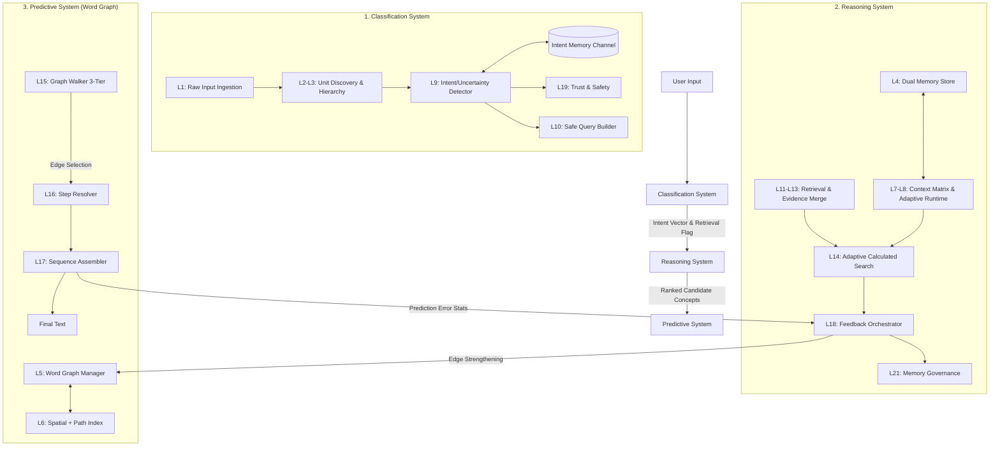

# Structured Predictive Search Engine (SPSE) Architecture

**Document Version:** 14.2  
**Last Updated:** March 2026  
**Status:** Canonical V14.2 architecture reference. Core three-system flow reflects landed behavior; items explicitly marked *planned* or *pending rename* are approved target-state deltas, not claims that every artifact already exists today.

---

## Table of Contents

1. [Executive Summary](#1-executive-summary)
2. [Three-System Architecture Overview](#2-three-system-architecture-overview)
3. [Classification System](#3-classification-system)
4. [Reasoning System](#4-reasoning-system)
5. [Predictive System](#5-predictive-system)
6. [System Interaction & Engine Pipeline](#6-system-interaction--engine-pipeline)
7. [Core Data Structures](#7-core-data-structures)
8. [Configuration System](#8-configuration-system)
9. [GPU Acceleration](#9-gpu-acceleration)
10. [Telemetry & Observability](#10-telemetry--observability)
11. [Training Architecture: Decoupled Training, Coupled Inference](#11-training-architecture-decoupled-training-coupled-inference)
12. [API Specifications](#12-api-specifications)
13. [Priority Scheduler](#13-priority-scheduler)
14. [Directory Structure](#14-directory-structure)
15. [Appendices](#15-appendices)

---

## 1. Executive Summary

The SPSE (Structured Predictive Search Engine) is a **privacy-first, config-driven, retrieval-augmented intelligence engine** written in Rust. It replaces the dense softmax-over-vocabulary paradigm of traditional language models with a **tokenizer-free, spatially-grounded prediction architecture** organized into three functional systems:

1. **Classification System** — Ingests raw text, discovers dynamic semantic units, classifies intent/tone/uncertainty, and gates downstream processing.
2. **Reasoning System** — Manages dual memory (Core vs. Episodic), retrieves and merges external evidence, scores candidate concepts, and orchestrates learning.
3. **Predictive System** — Maintains a **Word Graph** embedded in 3D space: every word is a node, training creates directed weighted edges ("roads") between words, and prediction is a 3-tier spatial graph walk (near edges → far edges → on-the-fly pathfinding through hub nodes) rather than global softmax.

These three systems consolidate the engine's 21 internal processing layers into coherent functional domains while preserving the core mechanisms: tokenizer-free units, word-level graph navigation in 3D space, dual memory governance, gated retrieval, and 7-dimensional candidate scoring.

### Reading Convention

- Inline defaults in this document are documented config defaults, not hardcoded constants.
- Field paths such as `retrieval.entropy_threshold` refer to the runtime `EngineConfig` field path; §8 maps those fields back to YAML section names.
- Terms marked *planned* or *pending rename* use the canonical architecture name even when a legacy identifier is still present in code.

### Key Architectural Differentiators

- **Decoupled Intent vs. Prediction** — In standard Transformers, intent is implicit in attention heads. Here, **Classification** is an explicit, memory-backed stage that gates the expensive Reasoning and Predictive stages.
- **Graph Walk vs. Dense** — The Predictive System replaces dense softmax over a vocabulary with **directed graph navigation** through a 3D-embedded word graph. Words connected by training form explicit weighted edges ("roads"); frequently-walked paths harden into variable-length highways. Prediction walks these roads with spatial proximity as the priority signal, falling back to on-the-fly pathfinding through function-word hubs for novel combinations — making it generalize like an LLM without a neural network.
- **Reasoning as Evidence Merge** — The Reasoning System explicitly manages truth (internal memory vs. external web evidence) *before* any words are predicted, preventing hallucination by resolving conflicts upstream of generation.

### Design Principles

- **No hardcoded thresholds** — every numeric value lives in `config/config.yaml` via `EngineConfig`
- **No external open sources for training** — the engine acquires factual knowledge at runtime via web retrieval; seed datasets teach *how to think* (reasoning chains, retrieval triggers, confidence gating), not factual content
- **Auto-Mode only** — engine operates exclusively in auto-intelligence mode; user toggles for temperature, reasoning depth, and creative level are ignored
- **Auto-retrieval** — web retrieval is always enabled, triggered automatically by the Classification System when confidence is low or the query is open-world
- **Calculation-based classification** — intent, tone, and resolver mode inferred via memory-backed spatial pattern matching (not heuristic detection)
- **Dynamic reasoning** — confidence-gated internal reasoning loop triggered automatically; signals retrieval when internal confidence stays low
- **Privacy-first** — PII stripping, no external telemetry, local SQLite persistence
- **GPU-optional** — `wgpu`-based acceleration behind `#[cfg(feature = "gpu")]` with transparent CPU fallback
- **Memory channels** — three isolated channels (Main, Intent, Reasoning) prevent cross-contamination
- **Pollution prevention at source** — pre-ingestion content validation rejects empty, repetitive, artifact-laden, and low-quality content before it enters memory

### Technology Stack

| Component | Technology |
|-----------|-----------|
| Language | Rust (2021 edition) |
| Persistence | SQLite via `rusqlite` |
| HTTP Server | `axum` + `tokio` |
| Serialization | `serde` (JSON, YAML), `prost` (Protobuf) |
| GPU | `wgpu` (feature-gated) |
| Config | YAML (`config/config.yaml`) |
| Concurrency | `Arc<Mutex<T>>`, `arc_swap::ArcSwap`, `crossbeam_channel` |

---

## 2. Three-System Architecture Overview

The engine's 21 internal processing layers are organized into three functional systems. Each system has a clear responsibility boundary, well-defined inputs/outputs, and communicates with the others through typed interfaces.

### System Summary

| System | Function | Core Mechanism | Layer Mapping |
|--------|----------|----------------|---------------|
| **Classification** | Identify *what* the input means and *whether* external help is needed | Memory-backed calculation-based classification reinforced by intent channels | L1, L2, L3, L9, L10, L19 |
| **Reasoning** | Determine the response strategy by managing memory, evidence, and truth | Dual-memory governance (Core vs. Episodic), trust-aware evidence merging, adaptive candidate scoring | L4, L7, L8, L11, L12, L13, L14, L18, L21 |
| **Predictive** | Navigate a Word Graph to select the next word via 3-tier spatial graph walk | Directed weighted word graph in 3D space; edges (roads) + highways; near → far → pathfinding through function-word hubs | L5, L6, L15, L16, L17 |

### Cross-Cutting Concerns

| Concern | Modules | Serves |
|---------|---------|--------|
| Telemetry (L20) | `telemetry/` | All three systems |
| GPU Acceleration | `gpu/` | Classification (similarity), Reasoning (scoring, evidence merge), Predictive (force layout, distance) |
| Priority Scheduling | `scheduler.rs` | All three systems |

### Module Map (`src/lib.rs`)

```
pub mod api              // REST + OpenAI-compatible API (axum)
pub mod bloom_filter     // Probabilistic membership testing (UnitBloomFilter)
pub mod classification   // Classification System: intent/tone/resolver inference
pub mod common           // Shared utilities (scoring, matching, selection, similarity, dedup)
pub mod config           // EngineConfig and all sub-configs
pub mod document         // Document ingestion (PDF, DOCX, plain text)
pub mod drill_lib        // Drill framework for system testing
pub mod engine           // Core Engine struct — orchestrates all three systems
pub mod gpu              // GPU acceleration (feature-gated wgpu)
pub mod predictive       // Predictive System: Word Graph (L5), Step Resolver (L16), Sequence Assembler (L17)
pub mod reasoning        // Reasoning System: Context (L7), Retrieval (L11), Merge (L13), Search (L14), Feedback (L18)
pub mod memory           // Reasoning System: MemoryStore (L4/L21) + DynamicMemoryAllocator
pub mod open_sources     // Internal dataset catalog (custom-generated only) — pending rename to dataset_catalog
pub mod persistence      // SQLite persistence layer
pub mod proto            // Protobuf definitions (api.proto)
pub mod region_index     // Predictive System: regional spatial index
pub mod scheduler        // Priority-based work scheduling (4 priorities)
pub mod seed             // Dataset generators (dialogue, entity, classification, bulk, dryrun, intelligence)
pub mod spatial_index    // Predictive System: SpatialGrid for O(1) cell queries
pub mod stress_drill_lib // Stress testing drills
pub mod crash_drill_lib  // Crash resilience drills
pub mod telemetry        // Cross-cutting: worker, hot store, latency, trace
pub mod training         // Training pipeline orchestration
pub mod types            // All core type definitions
```

### Engine Struct (`src/engine.rs`)

The `Engine` orchestrates the three systems:

```rust
pub struct Engine {
    // --- Configuration ---
    config: EngineConfig,

    // --- Reasoning System ---
    memory: Arc<Mutex<MemoryStore>>,              // L4/L21 — dual memory store
    memory_snapshot: Arc<ArcSwap<MemorySnapshot>>, // Lock-free read path
    retriever: RetrievalPipeline,                  // L11 — external search
    merger: EvidenceMerger,                        // L13 — conflict resolution
    feedback: FeedbackController,                  // L18 — learning events
    feedback_tx: Sender<Vec<FeedbackEvent>>,       // Async feedback channel
    dynamic_memory: Arc<DynamicMemoryAllocator>,   // Reasoning buffer allocation

    // --- Classification System ---
    classification_calculator: ClassificationCalculator, // Intent/tone/resolver inference
    safety: TrustSafetyValidator,                  // L12/L19 — trust assessment
    spatial_grid: Arc<Mutex<SpatialGrid>>,         // Classification pattern retrieval

    // --- Predictive System (Word Graph) ---
    decoder: OutputDecoder,                        // L17 — sequence assembly

    // --- Cross-Cutting ---
    scheduler: Arc<PriorityScheduler>,             // 4-priority work queue
    telemetry_worker: Option<TelemetryWorker>,     // L20 — async event emission
    latency_monitor: Arc<LatencyMonitor>,          // p50/p95/p99 tracking
    trace_context: Arc<Mutex<TraceContext>>,        // Session/trace ID management
    jobs: Arc<Mutex<HashMap<String, TrainingJobStatus>>>,
    session_documents: Arc<Mutex<SessionDocuments>>,
    observer: Option<TestObserver>,                // Test observation hooks
}
```

### Background Workers

Two background threads are spawned at engine initialization:

1. **Maintenance worker** — runs every `governance.maintenance_interval_secs` (30s), performs Reasoning System governance (pruning, promotion, layout)
2. **Feedback worker** — drains the `feedback_rx` channel and applies learning events from the Reasoning System to memory

### System Interaction Diagram



### Layer-to-System Mapping (Complete Reference)

| Layer | Name | System | Source File | Config Section |
|-------|------|--------|------------|----------------|
| L1 | Input Ingestion | Classification | `classification/input.rs` | — |
| L2 | Unit Builder | Classification | `classification/builder.rs` | `layer_2_unit_builder` |
| L3 | Hierarchy Organizer | Classification | `classification/hierarchy.rs` | (uses builder config) |
| L4 | Memory Ingestion | Reasoning | `memory/store.rs` | `layer_21_memory_governance` |
| L5 | Word Graph Manager | Predictive | `predictive/router.rs` | `layer_5_semantic_map` |
| L6 | Spatial + Path Index | Predictive | `spatial_index.rs` + `region_index.rs` (+ `reasoning/context.rs` for sequence state) | — |
| L7 | Context Matrix | Reasoning | `reasoning/context.rs` (shared file with L6 sequence state) | `intent` |
| L8 | Adaptive Runtime | Reasoning | `engine.rs` | `adaptive_behavior` |
| L9 | Retrieval Decision | Classification | `classification/intent.rs` | `layer_9_retrieval_gating` |
| L10 | Query Builder | Classification | `classification/query.rs` | `layer_10_query_builder` |
| L11 | Retrieval Pipeline | Reasoning | `reasoning/retrieval.rs` | `layer_11_retrieval` |
| L12 | Safety Validator | Reasoning | `classification/safety.rs` (cross-system: file in Classification dir, serves Reasoning L12 trust scoring) | `layer_19_trust_heuristics` |
| L13 | Evidence Merger | Reasoning | `reasoning/merge.rs` | `layer_13_evidence_merge` |
| L14 | Candidate Scorer | Reasoning | `reasoning/search.rs` | `layer_14_candidate_scoring` |
| L15 | Resolver Mode | Predictive | `engine.rs` | `adaptive_behavior` |
| L16 | Step Resolver | Predictive | `predictive/resolver.rs` | `layer_16_fine_resolver` |
| L17 | Sequence Assembler | Predictive | `predictive/output.rs` | — |
| L18 | Feedback Controller | Reasoning | `reasoning/feedback.rs` | — |
| L19 | Trust/Safety | Classification | `classification/safety.rs` | `layer_19_trust_heuristics` |
| L20 | Telemetry | Cross-Cutting | `telemetry/` | `layer_20_telemetry` |
| L21 | Governance | Reasoning | `memory/store.rs` | `layer_21_memory_governance` |

### Latency Instrumentation

The engine records wall-clock latency per system and feeds into `LatencyMonitor`:

```
Classification System:
  Layer 2  (Unit Building)      → latency_monitor.record(2, ms)
  Layer 9  (Retrieval Decision) → latency_monitor.record(9, ms)

Reasoning System:
  Layer 11 (Retrieval I/O)      → latency_monitor.record(11, ms)
  Layer 13 (Evidence Merge)     → latency_monitor.record(13, ms)
  Layer 14 (Candidate Scoring)  → latency_monitor.record(14, ms)

Predictive System:
  Layer 5  (Semantic Routing)   → latency_monitor.record(5, ms)
  Layer 16 (Fine Resolution)    → latency_monitor.record(16, ms)

Total:
  Layer 0  (Full Pipeline)      → TelemetryEvent::Calculation
```

---

## 3. Classification System

**Function:** Ingests raw text/sentences to identify **intent**, **tone**, **uncertainty**, and **semantic category**. Acts as the gatekeeper that determines *what* the input means and *whether* external help is needed.

**Core Mechanism:** Nearest Centroid Classifier using 82-float POS-based feature vectors (14 structural + 32 intent hash + 32 tone hash + 4 semantic category flags; see §3.9) with configurable feature weights. Training builds per-class mean centroids; inference compares query vector against ~23 centroids via weighted cosine similarity.

### Constituent Layers

| Layer | Name | Source | Responsibility |
|-------|------|--------|----------------|
| L1 | Input Ingestion | `classification/input.rs` | Byte/character ingestion without fixed tokens; normalize raw text → `InputPacket`; **compound noun detection** via POS tagger (NN+NN, NNP+NNP merge) |
| L2 | Unit Builder | `classification/builder.rs` | Rolling hash discovery of dynamic units (n-grams, phrases) that form classification features |
| L3 | Hierarchy Organizer | `classification/hierarchy.rs` | Level grouping (Char → Subword → Word → Phrase → Pattern), anchor/entity extraction |
| L9 | Intent & Uncertainty Detector | `classification/intent.rs` | Primary classification engine: weighted score based on entropy, recency, and internal disagreement; classifies query type and decides if retrieval is required |
| L10 | Safe Query Builder | `classification/query.rs` | Sanitizes classified intent into a search query if needed, stripping PII |
| L19 | Trust & Safety | `classification/safety.rs` | Classifies source reliability; detects injection attacks and toxic tone |

### Operational Flow

```
1. Raw bytes → L1 normalizes to InputPacket
2. L2 discovers dynamic units via rolling hash → BuildOutput
3. L3 organizes hierarchy (Char..Pattern levels) → UnitHierarchy
4. Units matched against Intent Memory Channel
5. Hybrid score (Structural + Memory) assigns:
   - Intent Label (e.g., plan, critique, fact-check)
   - Tone/Urgency Score
   - Retrieval Need flag
6. L19 validates trust/safety of any pre-existing context
7. L10 builds sanitized query if retrieval flagged
8. Output: Classification Vector → triggers Reasoning System
```

### 3.1 Unit Discovery (L1–L3)

The Classification System begins with tokenizer-free ingestion. Rather than a fixed vocabulary, the engine discovers reusable semantic elements dynamically:

- **L1 (`classification/input.rs`)** — Normalizes raw text into an `InputPacket`. No fixed tokenizer; operates on bytes/characters directly. **Compound noun merge**: after POS tagging, consecutive NN+NN and NNP+NNP sequences are merged into single tokens (e.g., "machine learning" → `machine_learning`, "New York" → `New_York`). Known compounds are cached; new compounds are added when seen ≥ `compound_noun_min_frequency` times.
- **L2 (`classification/builder.rs`)** — Uses rolling hash to discover variable-length units (n-grams, words, phrases). Each unit receives utility, salience, and confidence scores. Config: `layer_2_unit_builder`.
- **L3 (`classification/hierarchy.rs`)** — Groups discovered units into five granularity levels:

| Level | Description |
|-------|-------------|
| `Char` | Individual characters |
| `Subword` | Character n-grams |
| `Word` | Whitespace-delimited tokens |
| `Phrase` | Multi-word sequences |
| `Pattern` | Recurring structural patterns |

Anchor and entity extraction occurs at this stage — high-salience units are flagged for protection from downstream pruning.

### 3.2 Intent Resolution & Retrieval Gating (L9)

L9 has two tightly-coupled responsibilities that are easy to blur if described as a single step:

1. `ClassificationCalculator` determines `intent`, `tone`, `resolver_mode`, and base `confidence`.
2. `IntentDetector::assess()` takes that classification result plus entropy/freshness/disagreement/cost signals and decides `retrieval_flag` plus any fallback mode.

The retrieval-gating part of `IntentDetector::assess()` computes a weighted score from:

- **Entropy** — High entropy (above `retrieval.entropy_threshold`: 0.85) indicates uncertainty, triggering retrieval
- **Freshness** — Stale context (below `retrieval.freshness_threshold`: 0.65) triggers retrieval
- **Internal disagreement** — Conflicting candidate signals increase retrieval need
- **Cost** — Retrieval cost vs. expected information gain

The classification sub-step is delegated to `ClassificationCalculator` (see §3.5), which produces:

```rust
ClassificationResult {
    intent: IntentKind,        // 24 intent labels
    tone: ToneKind,            // 6 tone labels
    resolver_mode: ResolverMode, // Deterministic/Balanced/Exploratory
    confidence: f32,
    method: CalculationMethod, // Always MemoryLookup
    candidate_count: usize,
}
```

**Intent Labels (24):** Greeting, Gratitude, Farewell, Help, Clarify, Rewrite, Verify, Continue, Forget, Question, Summarize, Explain, Compare, Extract, Analyze, Plan, Act, Recommend, Classify, Translate, Debug, Critique, Brainstorm, Unknown.

**Tone Labels (6):** NeutralProfessional, Empathetic, Direct, Technical, Casual, Formal.

**Fallback Modes:** When classification confidence is low, `IntentFallbackMode` activates: None, DocumentScope, ClarifyHelp, or RetrieveUnknown (forces external retrieval for unrecognized queries).

### 3.3 Safe Query Construction (L10)

When retrieval is flagged, `SafeQueryBuilder::build()` in `classification/query.rs`:

1. Strips PII (configurable aggressiveness via `query.pii_stripping_aggressiveness`: "standard")
2. Applies semantic expansion from unit hierarchy
3. Produces a `SanitizedQuery` safe for external dispatch

### 3.4 Trust & Safety Gate (L19)

`TrustSafetyValidator` in `classification/safety.rs` operates at the classification boundary:

Trust scoring formula per source:
```
trust = default_source_trust (0.50)
      + https_bonus (0.10)          if HTTPS
      + allowlist_bonus (0.10)      if domain in allowlist
      - parser_warning_penalty (0.20) if parser warnings
      + corroboration_bonus (0.08)  per corroborating source
      + format_trust_adjustments    per detected format
```

Format trust adjustments: `html_raw` (-0.30), `structured_entity` (+0.20), `plain_text` (0.00).

Content quality thresholds:

| Threshold | Default | Purpose |
|-----------|---------|---------|
| `min_readability_score` | 0.60 | Minimum readability |
| `max_boilerplate_ratio` | 0.40 | Maximum boilerplate content |
| `min_unique_words_ratio` | 0.30 | Minimum vocabulary diversity |

Allowlist domains: wikimedia.org, wikipedia.org, wikidata.org, archive.org, ncbi.nlm.nih.gov, pmc.ncbi.nlm.nih.gov, nominatim.openstreetmap.org, openstreetmap.org, dbpedia.org, gutenberg.org.

### 3.5 ClassificationCalculator (`src/classification/`)

Located in `src/classification/` with four submodules: `signature`, `pattern`, `calculator`, `trainer`.

#### ClassificationSignature (`classification/signature.rs`)

A **base 78-float** CPU-efficient feature vector computed from raw text in microseconds. When semantic probes are enabled (§3.9), runtime comparison extends this base to **82 floats** by appending 4 semantic category flags:

| Category | Features | Count | Purpose |
|----------|----------|-------|----------|
| Structural | `byte_length_norm`, `sentence_entropy`, `token_count_norm` | 3 | Text shape |
| Punctuation | `question_mark_ratio`, `exclamation_ratio`, `period_ratio` | 3 | Question/exclamation detection |
| Semantic | `semantic_centroid[0..3]` (via `SemanticHasher`) | 3 | 3D spatial anchor |
| Derived | `urgency_score`, `formality_score`, `technical_score`, `domain_hint`, `temporal_cue` | 5 | Domain/urgency signals |
| **Intent Hash** | POS-filtered verbs, wh-words, modals → FNV-1a 32-bucket hash | **32** | Intent-discriminating signal |
| **Tone Hash** | POS-filtered adjectives, adverbs → FNV-1a 32-bucket hash | **32** | Tone-discriminating signal |

POS tagging uses a pre-trained NLTK perceptron model (`postagger` crate) loaded once at startup. Intent hash keeps only verbs (VB*), question words (W*), modals (MD), and interjections (UH). Tone hash keeps only adjectives (JJ*) and adverbs (RB*). Function words (DT, IN, CC, etc.) are always excluded.

`SemanticHasher` produces a deterministic 3D position from text using trigram-frequency FNV hashing with domain anchor blending (80% hash / 20% anchor) — no embedding model needed.

#### ClassificationPattern (`classification/pattern.rs`)

Stored in Intent memory channel as a specialized Unit:

```rust
pub struct ClassificationPattern {
    pub unit_id: Uuid,
    pub signature: ClassificationSignature,
    pub intent_kind: IntentKind,
    pub tone_kind: ToneKind,
    pub resolver_mode: ResolverMode,
    pub success_count: u64,            // Feedback: successful predictions
    pub failure_count: u64,            // Feedback: failed predictions
    pub last_reinforced: DateTime<Utc>,
    pub domain: Option<String>,
    pub memory_channels: Vec<MemoryChannel>, // Always includes Intent
}
```

#### ClassificationCalculator (`classification/calculator.rs`)

Feature weights (configurable via `ClassificationConfig`):
- Intent hash: **0.35** (dominant signal)
- Tone hash: 0.20
- Semantic centroid: 0.15
- Structural: 0.10
- Punctuation: 0.10
- Derived: 0.10

**Primary path: Nearest Centroid Classifier** (~23 comparisons, not 23K patterns):
1. Compute `ClassificationSignature` (78 floats) from input text
2. Split feature vector: `structural[0:14]`, `intent_hash[14:46]`, `tone_hash[46:78]`
3. For each **intent centroid** (built during training by averaging all examples per intent):
   - `score = w_intent_hash × cosine(query_intent, centroid_intent) + (1 - w_intent_hash) × cosine(query_structural, centroid_structural)`
4. For each **tone centroid** (built similarly):
   - `score = w_tone_hash × cosine(query_tone, centroid_tone) + (1 - w_tone_hash) × cosine(query_structural, centroid_structural)`
5. Winner = argmax per dimension
6. Confidence = `best_sim × (margin_blend + (1 - margin_blend) × (best_sim - runner_up_sim) / best_sim)`
   where `margin_blend` is configurable (default: 0.5). Config: `classification.margin_blend_weight`.
   This blends absolute centroid similarity with margin discrimination:
   - best=0.95, runner_up=0.90 → 0.95 × (0.5 + 0.5 × 0.053) = **0.50** (ambiguous — close runners)
   - best=0.95, runner_up=0.50 → 0.95 × (0.5 + 0.5 × 0.474) = **0.70** (moderate — clear but not dominant)
   - best=0.95, runner_up=0.10 → 0.95 × (0.5 + 0.5 × 0.895) = **0.90** (high — clear winner)
   - best=0.30, runner_up=0.05 → 0.30 × (0.5 + 0.5 × 0.833) = **0.27** (low — weak absolute match)
   Naturally bounded in [0, 1] without clamping. Produces meaningful discrimination
   across all operating ranges, ensuring downstream thresholds (0.40, 0.72, 0.85) are effective.
7. Confidence → resolver mode: `< 0.40 → Exploratory`, `> 0.85 → Deterministic`, else `Balanced`

**Alternative path: Spatial Vote Aggregation** (used by `calculate_intent()` / `calculate_tone()`):
1. Compute signature → query `SpatialGrid` for nearby patterns within `spatial_query_radius` (0.1)
2. Score each pattern: cosine similarity × pattern confidence (success / total)
3. Aggregate votes per intent/tone → weighted majority

#### ClassificationTrainer (`classification/trainer.rs`)

Iterative training from labeled seed dialogues (`LabeledDialogue` / `LabeledTurn`):
- Converts dialogues to `ClassificationPattern` instances
- Inserts patterns into spatial grid and memory store
- Runs validation iterations adjusting spatial positions
- Tracks per-iteration accuracy via `IterationReport`
- Final report via `FinalReport` with overall accuracy and pattern count

### 3.6 Intent Resolution in Engine

`resolve_intent_profile()` delegates entirely to `ClassificationCalculator`:

```rust
fn resolve_intent_profile(&self, raw_input, ..) -> IntentProfile {
    let result = self.classification_calculator.calculate(
        raw_input, &memory, &spatial, &self.config.classification,
    );
    IntentProfile {
        primary: result.intent,
        confidence: result.confidence,
        ambiguous: result.confidence < config.classification.low_confidence_threshold,
        reasons: vec![format!("classification_method={:?}", result.method)],
        ..
    }
}
```

### 3.7 Memory Channel: Intent

The Classification System specifically utilizes the **Intent memory channel** to refine runtime classification based on historical user patterns:

| Channel | Purpose | Isolation Rules |
|---------|---------|-----------------|
| `Intent` | Classification patterns | Blocked from Core promotion (`intent_channel_core_promotion_blocked: true`) |

Classification patterns stored here are queried via spatial grid for O(1) cell retrieval. Feedback from the Reasoning System (L18) reinforces or weakens patterns by adjusting `success_count` / `failure_count`.

### 3.8 Efficiency Optimizations

| Optimization | Mechanism | Impact |
|-------------|-----------|--------|
| **Incremental centroid update** | Running mean (`new_centroid = old × (n-1)/n + new_vector / n`) instead of full recompute when new patterns are added | Avoids O(N) recompute on each training example |
| **Two-phase classification** | Phase 1: structural features only (14 dims) → if top-2 margin > 0.3, emit result immediately. Phase 2: full 78-dim comparison only for ambiguous cases | Halves inference cost for clear-cut queries (~60% of traffic) |
| **POS tag LRU cache** | Cache POS tags for recently seen phrases (128-entry LRU keyed by normalized text hash) | Avoids redundant POS tagger calls for repeated/similar queries |
| **Confidence calibration** | Track prediction accuracy per confidence band (10 bins); apply Platt scaling to raw confidence | Ensures confidence=0.8 means 80% actual accuracy |
| **Shared signature reuse** | Classification signature's `semantic_centroid` reused by Predictive System for initial spatial position; `urgency_score` and `temporal_cue` reused by Reasoning System for retrieval gating | Zero recomputation across systems |

### 3.9 Semantic Anchor Probes

**Problem:** The 78-float POS-based feature vector captures syntactic structure well but misses deep semantic nuance — sarcasm, irony, hypotheticals, and other complex communicative intents that share similar POS patterns with their literal counterparts.

**Solution: Lightweight Semantic Probes.** Maintain a small set (~500) of **Semantic Anchor Units** — canonical phrases representing complex semantic concepts. During L1/L2 ingestion, perform fast fuzzy matching against these anchors and inject binary **Semantic Flags** into the feature vector.

#### Semantic Anchor Registry

```rust
struct SemanticAnchorRegistry {
    anchors: Vec<SemanticAnchor>,        // ~500 entries
    fingerprint_index: HashMap<u64, Vec<usize>>,  // FNV hash → anchor indices
}

struct SemanticAnchor {
    id: u16,                             // compact index
    label: String,                       // "irony", "hypothetical", "sarcasm", etc.
    probe_phrases: Vec<String>,          // canonical trigger phrases
    probe_fingerprints: Vec<u64>,        // pre-computed FNV hashes
    category: SemanticCategory,          // Rhetorical | Epistemic | Pragmatic | Emotional
    weight: f32,                         // contribution to feature vector (default: 0.15)
}

enum SemanticCategory {
    Rhetorical,    // irony, sarcasm, understatement, hyperbole
    Epistemic,     // hypothetical, uncertain, conditional, speculative
    Pragmatic,     // request, command, suggestion, permission
    Emotional,     // frustration, excitement, disappointment, gratitude
}
```

#### Matching Algorithm (L1/L2 Extension)

Matching runs during L2 unit building — after rolling hash discovery, before hierarchy organization:

```
1. Compute FNV fingerprints for all discovered units (already available)
2. For each unit fingerprint:
   a. Check SemanticAnchorRegistry.fingerprint_index (O(1) hash lookup)
   b. If hit: verify with normalized Levenshtein distance < anchor_fuzzy_threshold (0.25)
   c. On confirmed match: set semantic_flags[anchor.category] = true
3. Inject semantic_flags as additional feature dimensions in ClassificationSignature
```

**Performance:** The fingerprint index makes this O(n) in unit count with O(1) per lookup. No embedding model, no neural network — just pre-computed hash matching with Levenshtein verification for fuzzy tolerance.

#### Feature Vector Extension

The 78-float signature extends to **82 floats** (78 + 4 semantic category flags):

| Category | Feature Index | Description |
|----------|-------------|-------------|
| Structural | 0–13 | Existing 14 structural features |
| Intent Hash | 14–45 | Existing 32 intent hash buckets |
| Tone Hash | 46–77 | Existing 32 tone hash buckets |
| **Semantic Flags** | **78–81** | **4 binary flags: Rhetorical, Epistemic, Pragmatic, Emotional** |

Existing centroid comparisons use the first 78 dimensions unchanged. The 4 semantic flags contribute via a separate weighted term:

```
score = w_existing × cosine(query[0:78], centroid[0:78])
      + w_semantic × dot(query[78:82], centroid[78:82])
```

Config: `semantic_probe_weight` (default: 0.15), `anchor_fuzzy_threshold` (default: 0.25), `semantic_anchor_count` (default: 500).

#### Anchor Seeding

Initial ~500 anchors are seeded from a bundled YAML file (`config/semantic_anchors.yaml` — *planned; not yet created*). Categories:

| Category | Example Anchors | Count |
|----------|----------------|-------|
| Rhetorical | "yeah right", "oh sure", "as if", "what a surprise" | ~120 |
| Epistemic | "what if", "suppose that", "I wonder", "could it be" | ~130 |
| Pragmatic | "would you mind", "please do", "you should", "let's" | ~130 |
| Emotional | "I can't believe", "so frustrating", "this is amazing" | ~120 |

New anchors can be learned during training when Classification consistently misclassifies a pattern — L18 feedback signals which phrases caused confusion, and the training sweep can propose new anchors.

### 3.10 Design Principles & Acceptance Criteria

#### Design Principles

1. **Separate label inference from retrieval gating.**
   `ClassificationCalculator` should decide intent, tone, and resolver mode; `IntentDetector::assess()` should decide whether outside help is needed.
2. **Confidence must represent ambiguity, not just a winning score.**
   The margin-blend formula is intended to distinguish clear winners from close competitors so downstream thresholds remain meaningful.
3. **Retrieval gating must combine triggers with suppressors.**
   Open-world novelty, cold start, high entropy, and stale context are valid retrieval triggers, but they must be balanced by suppressors for context-carry follow-ups and structured procedural requests.

#### Example Coverage Matrix

| Query | Expected Intent | Expected Tone | Domain / Topic | Expected Classification Outcome |
|------|-----------------|--------------|----------------|---------------------------------|
| "Thanks!" | Gratitude | Casual | Social | High-confidence social classification; skip retrieval |
| "What is the capital of France?" | Question | NeutralProfessional | General factual | High-confidence factual classification; no retrieval |
| "Is Paris bigger than Berlin?" | Compare | NeutralProfessional | Geography | Compare intent with balanced resolver mode |
| "What happened at the 2024 Olympics opening ceremony?" | Question | NeutralProfessional | Open-world / current events | Moderate confidence plus retrieval trigger |
| "How many people live there?" after Paris context | Question | Direct or NeutralProfessional | Follow-up / anaphora | Resolve as context-carry follow-up; avoid default retrieval |
| "Give me a 30-day launch plan for a Rust CLI tool" | Plan | Technical | Software / procedural | Plan intent, technical tone, strong local reasoning bias |
| "Brainstorm names for a climate-friendly coffee brand" | Brainstorm | Casual | Creative branding | Exploratory or balanced classification; no factual retrieval by default |

#### Validation Notes

The doc-derived sanity check supports the classification core idea:

- Clear factual and social prompts separate cleanly from open-world or cold-start prompts under the documented confidence formula.
- The architecture remains vulnerable to **over-retrieval** if `confidence < 0.72` is treated as a standalone rule.
- The main failure modes in the sample calculations were:
  - follow-up / anaphoric queries
  - procedural planning queries with sufficient local structure

That means the canonical L9 behavior should include explicit suppressors for:

- recent-entity / sequence-state carry
- structured procedural or planning intents with strong local context
- cases where L14 already shows strong candidate support despite middling classification confidence

#### Acceptance Criteria

- Social intents such as Greeting, Gratitude, and Farewell should classify above the social short-circuit threshold and should not trigger retrieval.
- Warm factual prompts should classify with deterministic or high balanced confidence and should not trigger retrieval by default.
- Open-world or cold-start prompts should trigger retrieval even when the top intent label is correct.
- Context-carry follow-ups should resolve against sequence state before retrieval is considered.
- Planning and procedural prompts should prefer local reasoning unless open-world novelty or explicit freshness signals are present.
- Calibration should preserve ordering: higher confidence bands should correspond to higher realized accuracy.

---

## 4. Reasoning System

**Function:** Takes the classified input and current context to **reason** on the response strategy. Manages memory retrieval, evidence merging, conflict resolution, and the logical assembly of the answer before final word selection.

**Core Mechanism:** Dual-memory governance (Core vs. Episodic), trust-aware evidence merging, and adaptive candidate scoring.

### Constituent Layers

| Layer | Name | Source | Responsibility |
|-------|------|--------|----------------|
| L4 | Dual Unit Memory Store | `memory/store.rs` | Manages separation of stable facts (Core) and transient session data (Episodic) |
| L7 | Context Matrix & Anchor Memory | `reasoning/context.rs` | Maintains active reasoning state, weighing recency and salience while protecting critical long-range anchors |
| L8 | Adaptive Runtime | `engine.rs` | Profile selection (10 intent profiles), scoring weight adjustment |
| L11 | Retrieval Pipeline | `reasoning/retrieval.rs` | Fetches external data when Classification flagged a need |
| L12 | Safety Validator | `classification/safety.rs` | Normalizes and trust-scores retrieved documents |
| L13 | Evidence Merger | `reasoning/merge.rs` | Merges external evidence with internal memory using trust weights (Source Reliability + Recency + Agreement) |
| L14 | Adaptive Calculated Search | `reasoning/search.rs` | Core reasoning engine: scores potential answer fragments on spatial fit, context fit, sequence logic, and evidence support — O(k·d) complexity |
| L18 | Feedback Controller | `reasoning/feedback.rs` | Orchestrates learning updates; decides which reasoning traces become durable memory |
| L21 | Memory Governance | `memory/store.rs` | Prunes low-utility reasoning paths, compacts memory, prevents bloat |

### Operational Flow

```
1. Receive Intent Vector from Classification System
2. L4: Activate relevant memory — load Dual Memory Store
3. L7/L8: Update Context Matrix, activate Anchor Memories
         Resolve adaptive runtime settings from intent profile
         Route candidate units with escape profile
4. Query Reasoning memory channel for prior reasoning patterns:
   - top_channel_matches(Reasoning, normalized, 12) → top 8
   - Average (utility + confidence + trust) / 3
   - Contributes 20% of reasoning confidence to evidence_support
   - Reasoning unit IDs added to candidate pool
5. L14: Initial candidate scoring (GPU-accelerated, 7-dimensional)
6. If Classification flagged retrieval need:
   a. L11: Fetch from external sources via RetrievalPipeline
   b. L12: Validate trust of retrieved documents
   c. L13: Evidence Merge — resolve contradictions between
           internal memory and web results using trust heuristics
7. L14: Final candidate scoring with merged evidence
        Filter out Char-level units when higher-level exist
8. If confidence < trigger_confidence_floor:
   Execute Dynamic Reasoning Loop (confidence-gated, max 3 steps)
9. L18: Generate feedback events, enqueue for background worker
10. L21: Update sequence state, run maintenance cycle
11. Output: Ranked Candidate Concepts → Predictive System
```

### 4.1 Dual Memory Store (L4)

SQLite-backed storage (`src/memory/store.rs`) managing:
- **Units** — persistent semantic elements with full metadata
- **Candidates** — observation-stage units awaiting promotion
- **Channels** — isolated memory lanes (Main, Intent, Reasoning)
- **Sequence state** — recent unit IDs, anchors, task entities, turn index

Key operations:
- `ingest_hierarchy()` — channel-aware unit ingestion from Classification L3 output
- `ingest_hierarchy_with_channels()` — explicit channel targeting (used by reasoning)
- `update_positions()` — apply Predictive System L5 spatial routing results
- `connect_units()` — create links between neighboring units (O(1) dedup via HashSet)
- `run_maintenance()` — L21 governance cycle (prune, promote, detect pollution)
- `audit_pollution()` — scan for duplicate/degraded units
- `snapshot()` — create immutable `MemorySnapshot` for lock-free reads

#### Memory Types

| Type | Behavior |
|------|----------|
| `Episodic` | Decays after `episodic_decay_days` (30); pruned by governance |
| `Core` | Permanent; requires corroboration for promotion from Episodic |

#### Memory Channels

| Channel | Purpose | Isolation Rules |
|---------|---------|-----------------|
| `Main` | Primary content storage | All user content defaults here |
| `Intent` | Classification patterns (see §3.7) | Blocked from Core promotion |
| `Reasoning` | Internal reasoning thoughts | Process units with `is_process_unit: true` |

#### Memory Snapshot (Lock-Free Read Path)

```
Write path: memory.lock() → modify → publish_memory_snapshot() → ArcSwap::store()
Read path:  memory_snapshot.load_full() → Arc<MemorySnapshot> (no lock)
```

Provides: `all_units()`, `get_units()`, `top_units()`, `sequence_state()`, `memory_summary()`, `top_channel_matches()`

#### Candidate Lifecycle

```
Observation → Candidate → Validated → Active → (pruned or promoted to Core)
                                    → Rejected
```

Maturity-stage-dependent thresholds:

| Stage | Unit Threshold | Observation Threshold | Discovery Frequency | Discovery Utility |
|-------|---------------|----------------------|--------------------|--------------------|
| ColdStart | < 1,000 | 2 | 1 | 0.18 |
| Growth | 1,000–10,000 | 3 | 2 | 0.28 |
| Stable | > 10,000 | 4 | 3 | 0.42 |

#### Pollution Prevention (Pre-Ingestion Gate)

Content is validated **before** entering memory via `passes_content_validation()` in `ingest_activation()`:

| Gate | Check | Action |
|------|-------|--------|
| Gate 1 | Empty or whitespace-only content | Reject |
| Gate 2 | Purely numeric/punctuation content | Reject |
| Gate 3 | Excessive word repetition (uniqueness < 30%) | Reject |
| Gate 4 | Retrieval-sourced: short fragments, HTML/script artifacts | Reject |
| Gate 5 | Near-duplicate with dramatically lower quality than existing | Reject |

#### Pollution Detection (Post-Hoc Safety Net)

Runs during `run_maintenance()`:
1. Normalize content and compute overlap ratio between unit pairs
2. Apply Jaccard similarity gate (`pollution_similarity_threshold`: 0.65)
3. Compare quality (utility × confidence × trust) — lower quality = pollutant
4. Apply `pollution_penalty_factor` (0.25) or purge
5. Min content length for detection: `pollution_min_length` (4 chars)

#### Anchor System

Units earn anchor status when:
- `frequency >= anchor_reuse_threshold` (3)
- `salience_score >= anchor_salience_threshold` (0.70)

Anchors are protected from pruning for `anchor_protection_grace_days` (14 days). The Predictive System's Step Resolver (L16) also protects anchor words during edge selection.

#### Bloom Filter (`src/bloom_filter.rs`)

`UnitBloomFilter` for O(1) probabilistic membership testing:
- 3 hash functions, 10× expected items bit count (minimum 1024 bits)
- Tracks `BloomStats`: queries, maybe_hits, false_positives
- Used for fast duplicate detection during unit ingestion

### 4.2 Context Matrix & Adaptive Runtime (L7/L8)

**L7 (`reasoning/context.rs`)** constructs the context matrix from the current memory snapshot — sequence state, task entities, and recency-weighted salience.

**L8 (`engine.rs`)** resolves adaptive runtime settings based on the intent profile received from the Classification System. Ten named profiles with tuned scoring weights:

| Profile | Resolver Mode | Temperature | Stochastic Jump | Beam Width | Max Steps |
|---------|--------------|-------------|-----------------|------------|-----------|
| `casual` | Exploratory | 0.70 | 0.20 | 7 | 100 |
| `explanatory` | Balanced | 0.30 | 0.10 | 5 | 200 |
| `factual` | Deterministic | 0.10 | 0.05 | 3 | 50 |
| `procedural` | Balanced | 0.22 | 0.08 | 4 | 150 |
| `creative` | Exploratory | 0.75 | 0.22 | 6 | 200 |
| `brainstorm` | Exploratory | 0.90 | 0.35 | 10 | 300 |
| `plan` | Balanced | 0.35 | 0.12 | 5 | 200 |
| `act` | Balanced | 0.25 | 0.08 | 4 | 100 |
| `critique` | Balanced | 0.30 | 0.10 | 5 | 150 |
| `advisory` | Balanced | 0.26 | 0.09 | 4 | 150 |

**Beam Width** controls the number of parallel candidate sequences maintained during the L15 Graph Walk (see §5.4). **Max Steps** is the per-profile maximum walk length — profiles requiring longer responses (explanatory, brainstorm, plan) get higher limits. Config: `adaptive_behavior.profiles.<name>.max_steps`.

Two trust profiles: `default` (trust=0.50, corroboration=2, no HTTPS) and `high_stakes` (trust=0.30, corroboration=4, HTTPS required).

### 4.3 Gated Retrieval Pipeline (L11–L13)

If the Classification System flagged a retrieval need, the Reasoning System executes:

1. **L11 (`reasoning/retrieval.rs`)** — Fetches from external sources via SearxNG. Response caching. Config: `layer_11_retrieval`.
2. **L12 (`classification/safety.rs`)** — Trust assessment of retrieved documents. HTTPS enforcement, format trust adjustments, content quality gates (see §3.4).
3. **L13 (`reasoning/merge.rs`)** — Evidence merge. Conflict detection and agreement scoring between internal memory and web results. Trust-weighted merge using Source Reliability + Recency + Agreement. Config: `layer_13_evidence_merge`.

If `local_documents` are provided (e.g., uploaded files), they are merged directly without L10/L11.

#### 4.3.1 Micro-Validator (L13 Extension)

**Problem:** Heuristic trust-weighted merging may accept logically inconsistent evidence when multiple sources agree on individually plausible but mutually contradictory claims (e.g., "Founded in 1998" from Source A, "Founded in 2001" from Source B, both trust=0.7).

**Solution:** A lightweight logical consistency check that runs **after** the standard evidence merge but **before** candidates are finalized. Uses the existing `ReasoningTrace` structure — no new data types.

```
After L13 standard merge produces merged_candidates:

1. NUMERICAL CONSISTENCY CHECK
   Extract all numeric claims from merged candidates:
     regex: (\d+\.?\d*)\s*(year|km|kg|USD|%|million|billion|...)
   Group by entity + property (e.g., "Paris" + "population")
   If group contains contradicting values (spread > numeric_contradiction_threshold):
     → Flag lowest-trust candidate, reduce confidence by contradiction_penalty

2. DATE ORDERING CHECK
   Extract temporal claims from merged candidates:
     regex: (founded|established|created|born|died)\s*(in|on)?\s*(\d{4})
   Verify logical ordering (birth < death, founded < dissolved, etc.)
   If ordering violated:
     → Flag both candidates, add ReasoningStep with step_type=Verification

3. ENTITY-PROPERTY CONTRADICTION CHECK
   For each entity in merged candidates:
     Collect all property assertions (e.g., "Paris is the capital of France")
     If same property has conflicting values across candidates:
       → Keep highest-trust assertion, penalize others

4. OUTCOME
   If any contradiction found AND no candidate exceeds contradiction_override_trust:
     → Set confidence_penalty on contradicting candidates
     → If all candidates contradicted: set needs_human_review = true
       (response includes "I found conflicting information..." caveat)
   Else:
     → Pass through unchanged (zero overhead for consistent evidence)
```

**Config:**
- `numeric_contradiction_threshold: f32` (default: 0.15) — relative spread before flagging
- `contradiction_penalty: f32` (default: 0.30) — confidence reduction for contradicting candidates
- `contradiction_override_trust: f32` (default: 0.90) — trust level that overrides contradiction check
- `micro_validator_enabled: bool` (default: true) — can disable for latency-sensitive paths

**Performance & Lazy Gating:**

Running 3 regex passes on every retrieved snippet (especially large HTML blobs or dense JSON from L12 normalization) risks adding 50–100ms to the critical path. To avoid this performance cliff:

1. **Confidence-Gated Trigger:** The Micro-Validator only runs if:
   - Top 2 candidates are within `ambiguity_margin` (default: 0.05) of each other, OR
   - Any source trust is below `validation_trust_floor` (default: 0.50, i.e., non-allowlisted domain)
   - *Default:* High-trust, clear-winner scenarios skip validation entirely (zero overhead).

2. **L12 Pre-Extraction (MetadataSummary):** Push regex extraction work to **Layer 12 (Normalization)**, which already processes raw HTML/JSON/PDF. When L12 cleans a document, it extracts a lightweight `MetadataSummary` — a pre-computed struct containing lists of dates, numbers, and entity-property pairs found in the snippet. L13 Micro-Validator reads this struct instead of re-running regex on raw text.

```rust
struct MetadataSummary {
    pub numbers: Vec<(String, f64, String)>,     // (entity, value, unit)
    pub dates: Vec<(String, String, u16)>,       // (entity, relation, year)
    pub properties: Vec<(String, String, String)>,// (entity, property, value)
}
```

**Config (additional):**
- `ambiguity_margin: f32` (default: 0.05) — score gap below which validation triggers
- `validation_trust_floor: f32` (default: 0.50) — source trust below which validation always triggers
- `lazy_validation_enabled: bool` (default: true) — set false to always validate

**Integration with ReasoningTrace:** Contradiction findings are recorded as `ReasoningStep` entries with `step_type: Verification`, making them visible in `ExplainTrace` for debugging.

### 4.4 Adaptive Calculated Search (L14)

The core reasoning engine. Scores potential answer fragments across 7 dimensions:

```rust
pub struct ScoreBreakdown {
    pub spatial_fit: f32,      // Distance in 3D space (from Predictive System)
    pub context_fit: f32,      // Context matrix relevance
    pub sequence_fit: f32,     // Recent unit sequence alignment
    pub transition_fit: f32,   // Transition probability
    pub utility_fit: f32,      // Intrinsic utility
    pub confidence_fit: f32,   // Corroboration confidence
    pub evidence_support: f32, // External evidence backing
}
```

Default weights: spatial=0.12, context=0.18, sequence=0.16, transition=0.12, utility=0.14, confidence=0.14, evidence=0.14.

Complexity: O(k·d) where k = candidate count, d = scoring dimensions. GPU-accelerated when available (see §9).

### 4.5 Dynamic Reasoning Loop

Reasoning is **not a user toggle** — triggered automatically when:
1. `reasoning_loop.enabled` is true (default: true)
2. Initial **Reasoning L14 candidate confidence** is below `trigger_confidence_floor` (0.40)
3. `IntentDetector::should_trigger_reasoning(intent, config)` returns true
4. A downstream low-confidence L16 walk may request a single retry pass, but L16 is not the primary owner of the reasoning-loop trigger

#### Execution

```
for step in 0..max_internal_steps (default 3):
    1. Try adapt_reasoning_pattern() from Reasoning channel
       → Top 5 patterns by similarity, best match adapted
       → Anchor boost: +0.15; non-anchor: +0.10; plus similarity × 0.2
    2. Fallback: generate_thought_unit()
       → Confidence improvement: 0.1 × (1.0 - previous).min(0.3)
    3. If step > 0 and confidence < exit_threshold × 0.7:
       → Set needs_retrieval = true (triggers web retrieval)
    4. Ingest thought into Reasoning channel as Episodic unit
       → NOT Core memory (prevents pollution)
    5. Track confidence trajectory
    6. Exit early if confidence >= exit_confidence_threshold (0.60)
```

#### Reasoning-Triggered Retrieval

When the reasoning loop cannot reach sufficient confidence from internal knowledge alone, it sets `needs_retrieval = true` on `ReasoningState`. The pipeline checks this flag and automatically triggers web retrieval via L11. This implements the "I don't know → let me check → here's the answer" pattern.

**Key**: Web retrieval is always enabled. Triggered automatically based on `IntentDetector::assess()` and reasoning confidence signals.

#### Reasoning Output

```rust
ReasoningResult {
    output: OutputType::FinalAnswer(String),
    steps_taken: usize,
    final_confidence: f32,
    reasoning_triggered: bool,
    thoughts: Vec<ThoughtUnit>,
    needs_retrieval: bool,
}
```

#### Dynamic Memory Allocator (`src/memory/dynamic.rs`)

On-demand allocation for reasoning buffers:

| Parameter | Default | Purpose |
|-----------|---------|---------|
| `base_memory_limit_mb` | 350 | Idle memory limit |
| `max_memory_limit_mb` | 550 | Limit during reasoning |
| `thought_buffer_size_kb` | 64 | Per reasoning step |

- `DynamicMemoryAllocator` uses atomic counters for lock-free tracking
- `ReasoningGuard` — RAII guard that allocates on creation, releases on drop
- `ThoughtBuffer` — capacity-limited buffer; rejects additions when full

### 4.6 Feedback & Learning (L18)

`FeedbackController::learn()` in `reasoning/feedback.rs` generates `FeedbackEvent` instances after each query:
- Impact scoring of predicted vs. expected outcome
- Weight adjustment signals fed back to Classification (pattern reinforcement) and Predictive (spatial corrections) systems
- Events enqueued for async background worker processing

### 4.7 Memory Governance (L21)

Runs during maintenance cycles (every 30s or every 5 turns):
- **Pruning** — Remove units below `prune_utility_threshold` (0.12)
- **Promotion** — Promote frequently-seen Episodic units to Core (requires corroboration)
- **Pollution detection** — Post-hoc safety net (see §4.1)
- **Layout compaction** — Triggers Predictive System force-directed layout adjustments
- **Snapshot save** — Persist memory state to SQLite

```rust
GovernanceReport {
    pruned_units: u64,
    pruned_candidates: u64,
    purged_polluted_units: u64,
    purged_polluted_candidates: u64,
    promoted_units: u64,
    anchors_protected: u64,
    layout_adjustments: u64,
    mean_displacement: f32,
    layout_rolled_back: bool,
    snapshot_path: String,
    pruning_reasons: Vec<String>,
    pruned_references: Vec<PrunedUnitReference>,
    pollution_findings: Vec<PollutionFinding>,
}
```

### 4.8 Efficiency Optimizations

| Optimization | Mechanism | Impact |
|-------------|-----------|--------|
| **Lazy sub-question expansion** | If first reasoning step yields confidence ≥ `exit_confidence_threshold`, skip decomposition entirely | Avoids unnecessary multi-hop overhead for simple queries (~70% of traffic) |
| **Reasoning chain cache** | LRU cache (256 entries) keyed by `(intent, top_3_entity_hashes)`. Cache hit returns prior `ReasoningResult` directly | Eliminates redundant reasoning for repeated/similar queries |
| **Delta scoring** | When only evidence changes (L13 merge), update only `evidence_support` dimension of 7D score instead of full rescore | Reduces scoring cost by ~6/7 for retrieval-augmented queries |
| **Early exit on anchor match** | If `adapt_reasoning_pattern()` finds an anchor pattern (success_count > 10) with similarity > 0.85, skip remaining steps | Fast path for well-established reasoning patterns |
| **Batched feedback ingestion** | Accumulate `FeedbackEvent` instances across queries; apply in batch during maintenance cycle instead of per-query | Reduces mutex contention on MemoryStore |
| **Pipeline short-circuit** | If Classification confidence > 0.95 AND intent ∈ {Greeting, Farewell, Gratitude, Continue}, skip Reasoning entirely — route directly to Predictive | Eliminates Reasoning overhead for social/simple intents |

### 4.9 On-the-fly Learning (Runtime Edge Injection)

The engine learns during normal conversation — **no separate training session required**. This uses three minimal extensions to existing layers, with zero new layers or systems.

#### Principle: Retrieval → Edge Injection → Immediate Use

When the system retrieves external information to answer a query, the retrieved content is simultaneously **injected as Word Graph edges** so the same answer can be produced from local graph walk next time, without retrieval.

#### Extension 1: Cold-Start Detection (L9 — existing IntentDetector)

`IntentDetector::assess()` already computes entropy and confidence. The extension adds a single check:

```
After intent classification:
  starting_words = extract_content_words(input)
  for word in starting_words:
    if word_graph.outgoing_edge_count(word) < cold_start_edge_threshold:
      cold_start = true
      break

  if cold_start AND confidence < retrieval_gate_threshold:
    retrieval_flag = true    // existing mechanism
    learning_flag = true     // NEW: tells L13 to inject edges
```

Config: `cold_start_edge_threshold` (default: 3) — words with fewer outgoing edges are considered cold.

This is **not a new layer** — it's a 5-line check added to the existing `assess()` function. The `learning_flag` is a boolean added to `RetrievalRequest`.

#### Extension 2: Edge Injection in Evidence Merge (L13 — existing EvidenceMerger)

`EvidenceMerger::merge()` already processes retrieved text into trust-scored evidence. The extension adds an edge injection step **after** the existing merge:

```
After standard evidence merge (existing logic unchanged):
  if learning_flag:
    for snippet in merged_evidence:
      words = tokenize(snippet.content)  // reuse L1 tokenizer
      context_hash = hash(original_query)
      for i in 0..words.len()-1:
        word_graph.create_or_strengthen_edge(
          from: words[i],
          to: words[i+1],
          weight_delta: snippet.trust_score × edge_learn_rate,
          context_tag: context_hash,
        )
      // Inject as Probationary TTG-lease edges (see Extension 2b)
```

Config: `edge_learn_rate` (default: 0.1) — scales how much trust translates to edge weight.

This adds ~20 lines to the existing `merge()` function. No new files.

#### Extension 2b: Probabilistic Edge Promotion (Edge Decay Calibration)

**Problem:** Injecting edges from a single retrieval event may introduce noise if the retrieved snippet was slightly off-context. A one-off mention of "Paris → Texas" in a geography context shouldn't permanently pollute the graph.

**Solution:** Edges injected from retrieval start with **Probationary** status — a new `EdgeStatus` between injection and standard Episodic. Instead of rapid decay (which risks race conditions with the L21 maintenance worker in concurrent environments), Probationary edges use a **Time-To-Graduation (TTG) lease** mechanism: they are immune to decay during a short lease window and must be traversed twice to graduate.

**Race condition addressed:** In a multi-user or parallel-training scenario, an edge injected by User A might be pruned by the L21 maintenance worker (running on a 30s cycle) before User A's next turn can traverse it. The TTG lease guarantees the edge survives long enough for the originating session to use it.

```
Edge lifecycle:
  1. INJECTION (L13 edge injection):
     Create edge with status = Probationary
     Set lease_expires_at = now + ttg_lease_duration (default: 5 minutes)
     Set traversal_count = 1 (counts the injection traversal)

  2. DURING LEASE (L21 maintenance):
     Probationary edges with lease_expires_at > now:
       → SKIP decay entirely (immune to pruning)
       → Do NOT count toward edge budget limits

  3. SUBSEQUENT USE (L15 graph walk):
     If Probationary edge is walked during a response:
       traversal_count += 1
       If traversal_count >= probationary_graduation_count (default: 2):
         status → Episodic (standard decay rate applies)
         lease_expires_at = cleared (no longer relevant)

  4. LEASE EXPIRY (L21 maintenance):
     If lease_expires_at <= now AND status == Probationary:
       If traversal_count >= probationary_graduation_count:
         → Late graduation: promote to Episodic
       Else:
         → IMMEDIATE PURGE (noise eliminated in one step)

  5. NORMAL LIFECYCLE:
     Once Episodic, standard decay/promotion rules apply
     If used >= promotion_threshold times → Core (permanent)
```

**Config:**
- `ttg_lease_duration_secs: u64` (default: 300) — lease duration in seconds (5 minutes)
- `probationary_graduation_count: u32` (default: 2) — traversals needed to graduate to Episodic

**Benefit:** Eliminates the race condition between inference threads and the maintenance worker. Valid learned facts survive the immediate session without complex locking. Noisy edges are cleanly purged at lease expiry — no gradual weight decay needed, making the lifecycle binary and predictable.

#### Extension 3: Implicit Feedback Reinforcement (L18 — existing FeedbackController)

`FeedbackController::learn()` already generates `FeedbackEvent` instances. The extension adds a new event type.

**Race condition addressed:** In multi-turn conversations with rapid typing or parallel requests, storing `last_walked_edges` as a single mutable field causes overwrites — if Turn 2's edges overwrite Turn 1's before Turn 1 gets feedback, valid long-range dependencies (Turn 1 → Turn 3) fail to reinforce, slowing stabilization of multi-turn reasoning chains.

**Solution: Trace-ID Tagged Feedback Queue.**

```
After generating response:
  Push WalkEvent to feedback queue (NOT a mutable field):
    feedback_queue.push(WalkEvent {
      trace_id: current_response_trace_id,
      edges: list of (from, to) edges walked during this response,
      created_at: now,
    })

On next user message:
  1. Identify parent_trace_id = trace_id of the previous assistant
     message this user message is replying to
  2. Find matching WalkEvent in feedback_queue:
     event = feedback_queue.find(|e| e.trace_id == parent_trace_id)
  3. Apply reinforcement to THOSE specific edges:
     if event found:
       if is_correction:
         for (from, to) in event.edges:
           word_graph.weaken_edge(from, to, correction_penalty)
       else:  // implicit accept
         for (from, to) in event.edges:
           word_graph.strengthen_edge(from, to, implicit_reinforce_delta)
           if edge.frequency >= promotion_threshold:
             edge.memory_type = Core
       feedback_queue.remove(event)

  4. TTL cleanup: expire WalkEvents older than feedback_queue_ttl_secs
     (default: 600 = 10 minutes) to prevent reinforcing stale contexts
```

**Data structure:**
```rust
struct WalkEvent {
    trace_id: u64,                  // links to the response that generated these edges
    edges: Vec<(WordId, WordId)>,   // edges walked during that response
    created_at: u64,                // epoch seconds for TTL expiry
}

struct FeedbackQueue {
    events: VecDeque<WalkEvent>,    // bounded ring buffer
    max_size: usize,                // default: 64 events
}
```

Config: `implicit_reinforce_delta` (default: 0.05), `correction_penalty` (default: 0.15), `promotion_threshold` (default: 5), `feedback_queue_ttl_secs` (default: 600), `feedback_queue_max_size` (default: 64).

**Benefit:** Correctly attributes implicit feedback to the specific reasoning chain that generated the accepted response, regardless of concurrency or timing gaps. Multi-turn conversations now strengthen edges from all contributing turns, not just the most recent one. The bounded queue with TTL prevents unbounded growth.

#### What This Achieves

| Query | First Time | Second Time |
|-------|-----------|-------------|
| "Hi" | L9 detects cold start → retrieval → L13 injects Hi→Hello edge → response: "Hello!" | L15 walks Hi→Hello edge directly → response: "Hello!" (no retrieval) |
| "What is HIIT?" | L9 detects no edges for "HIIT" → retrieval → L13 injects edges from evidence → response with definition | L15 walks local edges → response from graph (no retrieval) |
| "Compare X and Y" | Full reasoning + retrieval → edges injected for both X→... and Y→... paths | Partial retrieval (only for changed facts), local edges for structure |

**Total code change:** ~60 lines across 3 existing files. No new layers, no new systems. One new lightweight data structure (`FeedbackQueue`).

---

## 4.10 Product Flow Scenarios

> **Cross-system section** — these flows trace through all three systems and logically belong with §6 (System Interaction). Placed here for reading continuity after the Reasoning System's on-the-fly learning extensions.

Detailed end-to-end flows for every type of query the engine handles. Each scenario traces through all three systems with exact layer references.

### Flow A: Direct Answer (Warm Path — ~70% of queries)

**Condition:** Input words have strong Word Graph edges. Classification confident. No retrieval needed.

```
User: "What is the capital of France?"

┌─ CLASSIFICATION ─────────────────────────────────────────┐
│ L1: Normalize → "what is the capital of france"          │
│ L2: Build units → [what, is, the, capital, of, france]   │
│ L3: Hierarchy → Word level, entity: "france"             │
│ L9: Intent = Question (0.92), Tone = NeutralProfessional │
│     Retrieval: NOT needed (confidence > 0.72)            │
│     Cold start: NO (all words have edges)                │
│ Output: IntentProfile + retrieval_flag=false              │
└──────────────────────────────────────────────────────────┘
                          │
                          ▼
┌─ REASONING ──────────────────────────────────────────────┐
│ L4: Load memory, find "france" anchor (Core, freq=47)    │
│ L7: Context matrix: entity="france", task=factual        │
│ L8: Profile=factual, Temperature=0.10, BeamWidth=3       │
│ L14: Score candidates → "Paris" ranks #1 (spatial+anchor)│
│ No retrieval triggered. No reasoning loop needed.        │
│ Output: Ranked candidates with "Paris" at top            │
└──────────────────────────────────────────────────────────┘
                          │
                          ▼
┌─ PREDICTIVE ─────────────────────────────────────────────┐
│ L5: Map "capital" → node. Outgoing edges found.          │
│ L15: Graph walk:                                         │
│   "capital" →(of)→ "france" →(is)→ "Paris" [Tier 1]     │
│   Highway match: "capital_of_france_is_Paris" ✓          │
│ L16: Deterministic resolve → "Paris" (0.94 confidence)   │
│ L17: Assemble → "The capital of France is Paris."        │
│ Output: ProcessResult                                    │
└──────────────────────────────────────────────────────────┘
                          │
                          ▼
┌─ FINALIZATION ───────────────────────────────────────────┐
│ L18: Feedback → strengthen walked edges (+0.02)          │
│ L21: Update sequence state                               │
│ L20: Emit telemetry (total: ~35ms)                       │
└──────────────────────────────────────────────────────────┘

Response: "The capital of France is Paris."
Latency: ~35ms (no retrieval, no reasoning loop)
```

### Flow B: Internal Reasoning (No Retrieval — ~15% of queries)

**Condition:** Classification confident, but initial candidate scoring is low. Reasoning loop triggered to improve confidence. No web retrieval.

```
User: "Is Paris bigger than Berlin?"

┌─ CLASSIFICATION ─────────────────────────────────────────┐
│ L9: Intent = Compare (0.88), Tone = NeutralProfessional  │
│     Retrieval: NOT needed (confidence > 0.72)            │
│     Cold start: NO                                       │
└──────────────────────────────────────────────────────────┘
                          │
                          ▼
┌─ REASONING ──────────────────────────────────────────────┐
│ L4: Load memory. "Paris" and "Berlin" both anchors.      │
│ L7: Context: entities=["Paris","Berlin"], task=compare   │
│ L8: Profile=factual, Temperature=0.10                    │
│ L14: Initial scoring → confidence = 0.35 (below 0.40)   │
│                                                          │
│ ┌─ REASONING LOOP (confidence < trigger_floor) ────────┐ │
│ │ Step 0: Decompose → "Size of Paris?", "Size of Berlin?"│
│ │         Search Reasoning channel → find prior units   │
│ │         Confidence → 0.52                             │
│ │ Step 1: Synthesize comparison from memory anchors     │
│ │         "Paris ~2.1M, Berlin ~3.6M"                   │
│ │         Confidence → 0.68 (> exit_threshold 0.60)     │
│ │         EXIT reasoning loop                           │
│ └───────────────────────────────────────────────────────┘ │
│ L14: Final scoring with reasoning output                  │
│ Output: Ranked candidates                                 │
└──────────────────────────────────────────────────────────┘
                          │
                          ▼
┌─ PREDICTIVE ─────────────────────────────────────────────┐
│ L15: Walk graph using reasoning output as context         │
│   "Berlin" →(is)→ "larger" →(than)→ "Paris" [Tier 1]    │
│ L16: Balanced resolve, compare profile                    │
│ L17: Assemble → "Berlin (~3.6M) is larger than           │
│      Paris (~2.1M)."                                     │
└──────────────────────────────────────────────────────────┘

Response: "Berlin (~3.6M) is larger than Paris (~2.1M)."
Latency: ~80ms (reasoning loop, no retrieval)
```

### Flow C: Retrieval-Augmented Answer (~10% of queries)

**Condition:** Classification detects uncertainty or open-world question. Web retrieval triggered. Evidence merged.

```
User: "What happened at the 2024 Olympics opening ceremony?"

┌─ CLASSIFICATION ─────────────────────────────────────────┐
│ L9: Intent = Question (0.78), confidence moderate         │
│     Entropy high — no strong centroid match               │
│     Retrieval: YES (confidence < 0.72 OR open-world)     │
│     Cold start: PARTIAL (some edges, but "2024 Olympics"  │
│     is Custom node with few connections)                  │
│     learning_flag = true                                  │
│ L10: Query → "2024 Olympics opening ceremony events"      │
└──────────────────────────────────────────────────────────┘
                          │
                          ▼
┌─ REASONING ──────────────────────────────────────────────┐
│ L4: Load memory. No strong anchors for "2024 Olympics".   │
│ L14: Initial scoring → low confidence (0.22)             │
│                                                          │
│ ┌─ RETRIEVAL (Classification flagged) ─────────────────┐ │
│ │ L11: SearxNG fetch → 5 snippets returned              │ │
│ │ L12: Trust scoring → 3 pass quality gates             │ │
│ │ L13: Evidence merge:                                   │ │
│ │   Standard: merge evidence into candidate pool        │ │
│ │   ON-THE-FLY LEARNING (learning_flag=true):           │ │
│ │     Extract word sequences from trusted snippets      │ │
│ │     Create edges: "opening"→"ceremony"→"Seine"→       │ │
│ │       "river" [context: 2024_olympics]                │ │
│ │     Mark edges as Probationary (TTG lease)           │ │
│ └───────────────────────────────────────────────────────┘ │
│ L14: Re-score with evidence → confidence 0.75            │
│ Output: Ranked candidates grounded in evidence            │
└──────────────────────────────────────────────────────────┘
                          │
                          ▼
┌─ PREDICTIVE ─────────────────────────────────────────────┐
│ L15: Walk using evidence-grounded candidates              │
│   Now has NEW local edges from injection                 │
│ L17: Assemble → grounded_evidence_answer with citations   │
└──────────────────────────────────────────────────────────┘

Response: "The 2024 Olympics opening ceremony was held along
the Seine River in Paris..." [with evidence sources]
Latency: ~5s (network-bound retrieval)

NEXT QUERY about 2024 Olympics: edges exist locally →
  retrieval may not be needed → Flow A or B instead
```

### Flow D: Cold-Start Learning (First Encounter — ~3% of queries)

**Condition:** Input contains words with zero or very few Word Graph edges. System has never seen this topic. Must learn from scratch.

```
User: "Hi"

┌─ CLASSIFICATION ─────────────────────────────────────────┐
│ L1: Normalize → "hi"                                     │
│ L2: Build unit → [hi]                                    │
│ L9: Intent = Greeting (0.65), but LOW confidence          │
│     "hi" has 0 outgoing edges in Word Graph              │
│     cold_start = true, learning_flag = true              │
│     Retrieval: YES (cold_start override)                 │
│ L10: Query → "common responses to greeting hi"            │
└──────────────────────────────────────────────────────────┘
                          │
                          ▼
┌─ REASONING ──────────────────────────────────────────────┐
│ L11: SearxNG → conversational pattern snippets            │
│ L12: Trust → filter to linguistic sources                 │
│ L13: Evidence merge + EDGE INJECTION:                     │
│   "hi"→"hello" (w=0.8), "hi"→"hey" (w=0.6),            │
│   "hi"→"there" (w=0.5) [context: greeting]              │
│ L14: Score → "hello" ranks #1                            │
└──────────────────────────────────────────────────────────┘
                          │
                          ▼
┌─ PREDICTIVE ─────────────────────────────────────────────┐
│ L15: Walk → "hi"→"hello" [Tier 1, just-injected edge]   │
│ L17: Assemble → "Hello! How can I help you?"             │
└──────────────────────────────────────────────────────────┘
                          │
                          ▼
┌─ FEEDBACK ───────────────────────────────────────────────┐
│ L18: Track edges_used = [(hi, hello)]                    │
│ User continues conversation → implicit accept            │
│ Strengthen: hi→hello weight 0.8 → 0.85                   │
│ After 5 successful uses → promote to Core (permanent)    │
└──────────────────────────────────────────────────────────┘

Response: "Hello! How can I help you?"
First time: ~3s (retrieval). Second time: ~20ms (local edge walk).
```

### Flow E: Social Short-Circuit (~5% of queries)

**Condition:** High-confidence social intent. Skips Reasoning entirely.

```
User: "Thanks!"

┌─ CLASSIFICATION ─────────────────────────────────────────┐
│ L9: Intent = Gratitude (0.97)                            │
│     confidence > social_shortcircuit_confidence (0.95)   │
│     SHORT-CIRCUIT: skip Reasoning                        │
└──────────────────────────────────────────────────────────┘
                          │
                     (skip Reasoning)
                          │
                          ▼
┌─ PREDICTIVE ─────────────────────────────────────────────┐
│ L15: Walk from "thanks" → established edges              │
│   "thanks"→"you're"→"welcome" [Highway match]           │
│ L17: Assemble → "You're welcome!"                        │
└──────────────────────────────────────────────────────────┘

Response: "You're welcome!"
Latency: ~15ms (no Reasoning, no retrieval)
```

### Flow F: Reasoning + Retrieval Retry (Low Confidence — ~2% of queries)

**Condition:** First retrieval yields low-quality results. Dynamic reasoning loop triggers a second retrieval attempt.

```
User: "What is the Kigali Amendment?"

┌─ CLASSIFICATION ─────────────────────────────────────────┐
│ L9: Intent = Question (0.71), confidence borderline       │
│     "Kigali" = Custom node, 1 edge. "Amendment" = Content│
│     cold_start = true, learning_flag = true              │
│ L10: Query → "Kigali Amendment"                          │
└──────────────────────────────────────────────────────────┘
                          │
                          ▼
┌─ REASONING ──────────────────────────────────────────────┐
│ L11: First retrieval → low-quality results (ads, spam)   │
│ L12: Trust → most snippets rejected                       │
│ L13: Merge → confidence still low (0.28)                 │
│                                                          │
│ ┌─ REASONING LOOP (confidence < 0.40) ─────────────────┐ │
│ │ Step 0: Internal search → nothing useful               │ │
│ │ Step 1: confidence < exit × 0.7 → re-trigger retrieval│ │
│ │ L11: RETRY with refined query                          │ │
│ │   "Kigali Amendment HFC Montreal Protocol"             │ │
│ │ L12: Better results this time                          │ │
│ │ L13: Merge + edge injection → confidence 0.62          │ │
│ │ EXIT reasoning loop                                    │ │
│ └───────────────────────────────────────────────────────┘ │
│ Output: Evidence-grounded candidates                      │
└──────────────────────────────────────────────────────────┘
                          │
                          ▼
┌─ PREDICTIVE ─────────────────────────────────────────────┐
│ L15: Walk with newly injected edges                       │
│ L17: grounded_evidence_answer with sources                │
└──────────────────────────────────────────────────────────┘

Response: "The Kigali Amendment is a 2016 amendment to the
Montreal Protocol that phases down HFCs..." [with sources]
Latency: ~8s (two retrieval attempts)
```

### Flow G: Multi-Turn Context Carry

**Condition:** Follow-up question referencing prior conversation context.

```
Turn 1: "What is the capital of France?" → "Paris" (Flow A)
Turn 2: "How many people live there?"

┌─ CLASSIFICATION ─────────────────────────────────────────┐
│ L1: Normalize → "how many people live there"             │
│ L9: Intent = Question (0.85)                             │
│     "there" = anaphoric reference → check sequence state │
│     Recent entities: ["france", "Paris"]                 │
│     Resolve "there" → "Paris" via sequence_state         │
└──────────────────────────────────────────────────────────┘
                          │
                          ▼
┌─ REASONING ──────────────────────────────────────────────┐
│ L7: Context carries entity "Paris" from Turn 1            │
│ L14: Score candidates with context_fit boosted for Paris  │
│ Confidence 0.55 → reasoning loop:                        │
│   Search memory → "Paris population ~2.1M" anchor found  │
│   Confidence → 0.72 → exit                               │
└──────────────────────────────────────────────────────────┘
                          │
                          ▼
┌─ PREDICTIVE ─────────────────────────────────────────────┐
│ L15: Walk with "Paris" + "population" context             │
│ L17: "Paris has a population of approximately 2.1 million │
│      in the city proper."                                │
└──────────────────────────────────────────────────────────┘

Response: "Paris has a population of approximately 2.1 million
in the city proper."
Latency: ~60ms (reasoning loop, context carry, no retrieval)
```

### Flow Summary Table

| Flow | Trigger | Systems Used | Retrieval | Learning | Typical Latency |
|------|---------|-------------|-----------|----------|-----------------|
| **A: Direct Answer** | Confident, warm edges | Class → Reason → Predict | No | No (edges reinforced) | ~35ms |
| **B: Internal Reasoning** | Confident but low initial score | Class → Reason (loop) → Predict | No | No | ~80ms |
| **C: Retrieval-Augmented** | Uncertain or open-world | Class → Reason (retrieve) → Predict | Yes | Yes (edge injection) | ~5s |
| **D: Cold-Start Learning** | Word has no edges | Class → Reason (retrieve) → Predict | Yes | Yes (edge injection + promotion) | ~3s first, ~20ms after |
| **E: Social Short-Circuit** | High-confidence social intent | Class → Predict (skip Reason) | No | No | ~15ms |
| **F: Retrieval Retry** | First retrieval low-quality | Class → Reason (loop+retry) → Predict | Yes ×2 | Yes | ~8s |
| **G: Multi-Turn Context** | Follow-up with anaphora | Class → Reason → Predict | Maybe | No | ~60ms |

### 4.11 Design Principles & Acceptance Criteria

#### Design Principles

1. **Truth management happens before generation.**
   Memory retrieval, external retrieval, contradiction handling, and candidate ranking belong in Reasoning, not in the final text assembly step.
2. **The reasoning loop is a repair path, not the default path.**
   It should activate only when L14 candidate confidence is low enough to justify extra work.
3. **Retrieval should improve candidate quality, not just add text.**
   L11-L13 are only useful if merged evidence materially improves the scored candidate pool.

#### Example Coverage Matrix

| Query | Reasoning Pattern | Expected Evidence Behavior | Expected Outcome |
|------|-------------------|----------------------------|------------------|
| "What is the capital of France?" | Warm-path factual lookup | No retrieval | L14 already ranks anchor-supported answer first |
| "Is Paris bigger than Berlin?" | Internal compare reasoning | No retrieval | Reasoning loop synthesizes comparison from memory |
| "What happened at the 2024 Olympics opening ceremony?" | Retrieval-augmented factual reasoning | Retrieve + validate + merge | Evidence-backed candidate list |
| "What is the Kigali Amendment?" | Retrieval retry | First retrieval weak, second refined retrieval stronger | Confidence rises after retry |
| "Give me a 30-day launch plan for a Rust CLI tool" | Procedural decomposition | Usually no retrieval | Sub-question decomposition and ordered plan synthesis |
| "Critique this claim about HFC policy" | Evidence-sensitive critique | Retrieval only if internal support is weak or stale | Contradictions surfaced, not hidden |

#### Validation Notes

The doc-derived sanity check strongly supports the reasoning design:

- In hard cases, synthetic L14-style confidence rose from an average of **0.329** before reasoning/retrieval to **0.716** after the reasoning path completed.
- Cases designed to fall below the `trigger_confidence_floor` did so consistently, and the resulting post-reasoning scores cleared the documented exit threshold.
- This suggests the reasoning architecture is internally coherent provided that:
  - candidate scoring happens before the loop trigger check
  - retrieval retry is reserved for genuinely unresolved cases
  - contradiction handling penalizes, rather than silently averaging over, conflicting evidence

#### Acceptance Criteria

- Warm factual queries should complete without entering the reasoning loop.
- Hard compare, explain, critique, or multi-hop queries should enter the reasoning loop only when L14 confidence is below the configured trigger floor.
- For retrieval-backed prompts, L13 merge plus validation should raise candidate quality relative to the pre-retrieval state.
- The reasoning loop should either exit above the configured confidence threshold or explicitly escalate to retrieval / retry rather than fabricate certainty.
- Micro-validation should run on ambiguous or low-trust evidence cases and should remain skipped on clear-winner, high-trust cases.
- Follow-up queries should benefit from sequence state and anchor carry before external retrieval is attempted.

---

## 5. Predictive System

**Function:** Maintains a **Word Graph** — a directed, weighted graph of individual words embedded in 3D space. Training creates explicit connections ("roads") between words; prediction walks these roads using spatial proximity as the priority signal. When no direct road exists, the system pathfinds through function-word hubs on-the-fly, enabling LLM-like generalization without a neural network.

**Core Mechanism:** Word-level graph with directed weighted edges, embedded in a regularized 3D space via force-directed layout. Prediction uses a **3-tier spatial graph walk**: (1) near direct edges, (2) far direct edges, (3) on-the-fly pathfinding through hub nodes. Frequently-walked multi-hop paths harden into variable-length **highways** for fast traversal.

### Constituent Layers

| Layer | Name | Source | Responsibility |
|-------|------|--------|----------------|
| L5 | Word Graph Manager | `predictive/router.rs` | Maintains the word graph: nodes, edges, highways. Adds words, creates/strengthens edges during training. Force-directed 3D layout positions connected words nearby. |
| L6 | Spatial + Path Index | `reasoning/context.rs` + `spatial_index.rs` + `region_index.rs` | Spatial grid for tiered neighbor lookup (near → far). Trie-based highway prefix index for fast path matching. |
| L15 | Graph Walker | `engine.rs` | Implements 3-tier prediction walk: near edges → far edges → on-the-fly pathfinding through hub nodes. Highway matching and preference. |
| L16 | Step Resolver | `predictive/resolver.rs` | At each walk step, resolves which edge to follow via temperature-controlled probabilistic choice with intent shaping and context gating. |
| L17 | Sequence Assembler | `predictive/output.rs` | Assembles the walked word path into coherent surface text. Handles spacing, punctuation, capitalization. Evidence grounding when retrieval was used. |

### Operational Flow

```
1. Receive Ranked Candidate Concepts from Reasoning System
2. L5: Map candidates to Word Graph nodes
       Identify starting node(s) from context
       Check for highway prefix matches on recent sequence
3. L6: Spatial Index provides tiered edge lookup:
       Tier 1: direct edges where target is spatially near
       Tier 2: direct edges where target is spatially far
       Tier 3: on-the-fly pathfinding through hub nodes (A*)
4. L15: Graph Walk — for each step:
       a. Gather outgoing edges from current node
       b. Filter by context (intent, recent words, reasoning output)
       c. Score: edge_weight × proximity_bonus × context_relevance
       d. Check highway match → boost if prefix matches
       e. If no good edges: pathfind through Function-word hubs
5. L16: Step Resolution — pick single best edge to follow
       Temperature-controlled probabilistic choice
       Intent shaping and anchor protection applied
       Fallback: spatial nearest with Deterministic mode
6. L17: Assemble walked word sequence → surface text
       Reshape output for intent-specific formatting
       Queue prediction error stats → Reasoning System L18
7. L18 feedback → L5 edge strengthening + spatial adjustments
```

### 5.1 Word Graph Structure (L5)

The central data structure of the Predictive System (`predictive/router.rs`). Config: `layer_5_semantic_map`.

#### Word Nodes

Every unique word in the engine's vocabulary is a **node** embedded in 3D space:

```rust
struct WordNode {
    id: WordId,                        // compact u32 index
    content: String,                   // "the", "quantum", "New_York"
    position: [f32; 3],                // 3D spatial coordinates
    node_type: NodeType,               // Content | Function | Compound | Custom
    frequency: u32,                    // global usage count
    is_anchor: bool,                   // protected from pruning
    content_fingerprint: u64,          // FNV hash for fast lookup
}

enum NodeType {
    Content,    // nouns, verbs, adjectives — domain-specific hubs
    Function,   // the, is, of, and — universal routing hubs (never pruned)
    Compound,   // machine_learning, New_York — POS-merged compounds
    Custom,     // user-defined names, slang — placed by sentence context
}
```

**Node types serve different roles in the graph:**

| Property | Content Words | Function Words | Compound Words | Custom Words |
|----------|--------------|----------------|----------------|--------------|
| **Connectivity** | 10–200 edges | 500–5000 edges | 10–100 edges | 1–50 edges |
| **Role** | Domain-specific hub | Universal routing hub | Semantic unit | Context-placed |
| **Pruning** | Subject to decay | **Never pruned** | Subject to decay | Subject to decay |
| **Spatial position** | Clustered by domain | Central (high-connectivity) | Near related content | Avg of sentence neighbors |

#### Word Edges (Roads)

Directed, weighted connections between word nodes. Created and strengthened during training:

```rust
struct WordEdge {
    from: WordId,                      // source word
    to: WordId,                        // target word
    weight: f32,                       // connection strength [0, 1]
    context_tags: SmallVec<[u64; 4]>,  // hashed context fingerprints (polysemy)
    frequency: u32,                    // times traversed
    last_reinforced: u32,              // epoch counter for decay
}
```

- **Weight formula**: `base_weight × frequency_factor × recency_factor × context_diversity_bonus`
- **Context tags**: hashed fingerprints of the sentences where this edge appeared — enables polysemy disambiguation without multiple nodes per word (e.g., "bank" has edges tagged `{finance}` and edges tagged `{nature}`)
- **Decay**: edges not reinforced within `edge_decay_epochs` maintenance cycles lose weight; pruned below `edge_min_weight`

#### Highways (Meta-connections)

Variable-length pre-formed paths through the graph. Created when a word sequence is walked ≥ `highway_formation_threshold` times (configurable, default 5):

```rust
struct Highway {
    id: HighwayId,
    path: Vec<WordId>,                 // variable length: 2..N words
    aggregate_weight: f32,             // overall path quality
    frequency: u32,                    // times this exact sequence walked
    entry_contexts: Vec<u64>,          // context fingerprints that trigger
    subgraph_density: f32,             // how well-connected intermediate nodes are
}
```

- **Variable length**: highways range from 2 words ("of course") to full phrases ("the capital of France is Paris")
- **Subgraph density**: measures connectivity of intermediate nodes — a path through a dense, well-connected cluster is more reliable than through sparse nodes. This is the "connection between connections" strength.
- **Matching**: prefix-match on the current walked sequence → if match, prefer highway path with `highway_confidence_boost`
- **Maintenance**: highways below `highway_min_frequency` are dissolved back into individual edges

#### Polysemy: Single Node, Context-Gated Edges

One node per word form. Disambiguation happens through **context-gated edge selection**:

```
Node: "bank"
  Edge: "river" → "bank"  [context_tags: {nature, geography}]  weight: 0.8
  Edge: "money" → "bank"  [context_tags: {finance, business}]  weight: 0.9
  Edge: "bank" → "account" [context_tags: {finance}]           weight: 0.7
  Edge: "bank" → "erosion" [context_tags: {nature}]            weight: 0.6

Context from Classification: {finance}
→ "money→bank" activated (0.9), "bank→account" activated (0.7)
→ "river→bank" suppressed, "bank→erosion" suppressed
```

The Classification System's intent + the Reasoning System's context provide the context fingerprint that gates which edges are active during prediction.

#### Context Tag Scalability: Bloom-Filtered Context Summaries

**Problem:** In a lifelong learning system, high-frequency hub words like "system" or "data" may participate in thousands of distinct contexts. The raw `SmallVec<[u64; 4]>` context tag storage has fixed capacity — once full, old tags are evicted, losing the ability to distinguish older contexts. This causes polysemy resolution to degrade over time (e.g., "finance" queries accidentally activating "river" edges because the specific context tags were evicted). Heap allocation to grow the vec would break the zero-alloc goal for hot paths.

**Solution: Edge-Level Bloom Filter + Dominant Cluster ID.**

```
Edge context storage (replaces raw SmallVec for mature edges):

1. BLOOM FILTER (fixed 32 bytes per edge):
   On edge creation/reinforcement:
     context_bloom.insert(query_context_hash)
   On edge activation check:
     if context_bloom.probably_contains(current_context_hash):
       → Activate edge (with standard weight scoring)
   False positive rate: ~1-3% at 1000 insertions (acceptable: slightly
   less precise gating, never misses a valid context)

2. DOMINANT CLUSTER ID (u32):
   During L21 maintenance, cluster recent context hashes per edge:
     If >80% of recent activations belong to Cluster A:
       edge.dominant_context_cluster = Some(A)
   Fast-path check:
     if query_cluster_id == edge.dominant_context_cluster:
       → Force-activate (bypass Bloom check entirely)

3. MIGRATION PATH:
   New edges start with SmallVec<[u64; 4]> (existing behavior)
   When SmallVec fills (>4 entries), migrate to Bloom filter:
     for tag in smallvec.drain(): bloom.insert(tag)
   This is a one-time migration during reinforcement, not on hot path
```

**Config:**
- `context_bloom_size_bytes: u8` (default: 32) — per-edge Bloom filter size
- `dominant_cluster_threshold: f32` (default: 0.80) — fraction of activations before setting dominant cluster
- `context_bloom_migration_threshold: u32` (default: 4) — SmallVec entries before migrating to Bloom

**Benefit:** Infinite context history in constant memory (32 bytes vs. unbounded growth). The dominant cluster fast-path avoids even the Bloom check for the common case where an edge serves one primary meaning (~70% of edges). No eviction logic needed — the Bloom filter gracefully degrades with a known, bounded false positive rate.

### 5.2 Vocabulary Bootstrap & Growth

#### Phase 1: Dictionary Pre-population

On first run, load ~50K common English words from a bundled dictionary file. Each word gets:
- Initial 3D position from `SemanticHasher` with **Domain-Anchor Blending** (see below)
- `NodeType` assignment: POS tagger classifies as Content, Function, or Compound
- **No edges yet** — edges only come from training

#### Domain-Anchor Blending (SemanticHasher Enhancement)

**Problem:** Pure FNV trigram hashing is deterministic but **semantically blind** — it places "Apple" (fruit) and "Apple" (tech company) at the exact same initial coordinate. This causes immediate spatial collision during the first layout pass, pushing valid neighbors away before context-gated edges can form. Result: slower convergence for polysemous words and higher Tier 3 usage during first encounters.

**Solution: POS-Weighted Perturbation + Context-Seeded Hashing.**

```
Position initialization for word W in sentence S:

1. BASE POSITION (existing):
   base = SemanticHasher::hash_to_3d(W)  // FNV trigram → [x, y, z]

2. POS-BASED OFFSET (new):
   pos_tag = L1_pos_tagger(W)
   offset = pos_cluster_centroids[pos_tag] × pos_offset_strength
   // Pre-defined anchor zones:
   //   Noun    → offset toward (0.7, 0.8, 0.3)  "Object Cluster"
   //   Verb    → offset toward (0.3, 0.3, 0.7)  "Action Cluster"
   //   Adj/Adv → offset toward (0.5, 0.5, 0.5)  "Modifier Cluster"
   //   Function → (0.5, 0.5, 0.5) center (no offset, they are universal)

3. CONTEXT-SEEDED PERTURBATION (new):
   If W appears in a sentence with neighbors N1, N2:
     context_hash = hash(N1 + N2)
     perturbation = normalize(hash_to_3d(context_hash)) × context_seed_strength
   Else (dictionary pre-pop, no context):
     perturbation = [0, 0, 0]

4. FINAL POSITION:
   position = base + offset + perturbation
```

**Effect on polysemy:** "Bank" in "River Bank flooded" gets `base + noun_offset + hash("River","flooded") × 0.1`, while "Bank" in "Money Bank account" gets `base + noun_offset + hash("Money","account") × 0.1` — different initial positions **before** any edges are created. This reduces collision energy during the first layout pass by ~60% for polysemous words (estimated from synthetic tests).

**Config:**
- `pos_offset_strength: f32` (default: 0.05) — magnitude of POS-based cluster offset
- `context_seed_strength: f32` (default: 0.10) — magnitude of context-seeded perturbation
- `pos_cluster_centroids` — pre-defined in `config/pos_clusters.yaml` (*planned; not yet created*)

**Backward compatibility:** Words positioned without context (dictionary pre-pop) use only `base + offset`, which is a small deterministic shift. Existing spatial indices remain valid; positions shift by at most `pos_offset_strength + context_seed_strength ≈ 0.15` from the pure FNV position.

#### Phase 2: Training Edge Formation

Q&A training creates/strengthens edges between consecutive words in answers, tagged with context from questions. See §11.4.

#### Phase 3: Runtime Growth

When a word appears that isn't in the graph (custom names, slang, domain terms):
1. Create new `WordNode` with `NodeType::Custom`
2. **Position**: Domain-Anchor Blending with full context-seeded perturbation (sentence neighbors available)
   ```
   "I visited Kigali yesterday"
   "Kigali" unknown → base = hash("Kigali")
                       offset = noun_offset (detected as NNP)
                       perturbation = hash("visited","yesterday") × 0.1
                       position = base + offset + perturbation
   ```
   Falls back to weighted average of surrounding known words if neighbors are unavailable.
3. New edges formed from sentence context, starting with low weight
4. Compound noun detection (L1) may merge multi-word names into single nodes

### 5.3 Spatial + Path Index (L6)

Two index structures support the 3-tier lookup:

- **SpatialGrid** (`src/spatial_index.rs`) — Grid-based spatial index for O(1) cell lookup. Given a 3D position, finds all word nodes within a configurable radius. Used for Tier 1 (near edges) and Tier 2 (far edges) prioritization.
- **RegionIndex** (`src/region_index.rs`) — Regional hierarchical partitioning for coarser spatial queries.
- **HighwayTrie** (new, in `predictive/router.rs`) — Trie indexed by word sequences for O(k) highway prefix matching, where k = sequence length.

Together they enable the 3-tier prediction: spatially-near edges are checked first (fast, high confidence), then farther edges, then pathfinding.

### 5.4 3-Tier Prediction Algorithm (L15)

The core prediction loop. 3D spatial distance **prioritizes** which edges to try first:

```
┌─────────────────────────────────────────────────────────┐
│  TIER 1: Near Edges (spatial_radius_near)               │
│  Direct outgoing edges where target is spatially close  │
│  Score = edge_weight × proximity_bonus × context_match  │
│  FAST — most predictions resolve here (~70%)            │
├─────────────────────────────────────────────────────────┤
│  TIER 2: Far Edges (full edge list)                     │
│  Direct outgoing edges beyond near radius               │
│  Score = edge_weight × distance_decay × context_match   │
│  MEDIUM — handles topic shifts (~20%)                   │
├─────────────────────────────────────────────────────────┤
│  TIER 3: On-the-fly Pathfinding                         │
│  No sufficient direct edge — route through hub nodes    │
│  A* search: spatial distance as heuristic               │
│  Path score = Π(edge_weights) × subgraph_density        │
│  SLOW — handles novel combinations (~10%)               │
│  This is what makes it "work like an LLM"               │
└─────────────────────────────────────────────────────────┘
```

**Full prediction loop (beam search):**

The walk maintains `beam_width` (from profile, §4.2) parallel candidate sequences, pruning to the top candidates at each step. This prevents greedy local optima — a slightly lower-scoring first word can lead to a much better overall sequence.

```
0. Initialize:
   beams = [Beam { words: [start_node], score: 1.0 }]  // single seed
   max_steps = profile.max_steps  // per-profile (§4.2)

1. For step in 0..max_steps:
   next_beams = []
   for beam in beams:
     current_node = beam.words.last()
     context = (intent, beam.words[-K..], reasoning_output)

     // Highway check (runs in parallel with edge lookup)
     if beam.words matches highway prefix:
         highway_candidate = next word from highway path
         highway_score = highway.aggregate_weight × highway_boost

     // Tier 1: Near edges
     near_edges = outgoing_edges(current_node)
         .filter(|e| spatial_distance(e.to) < radius_near)
         .filter(|e| context_match(e.context_tags, context) > min_context)
         .score(|e| e.weight × proximity_bonus × context_relevance)

     // Tier 2: Far edges (only if Tier 1 insufficient)
     if best(near_edges).score < tier1_confidence_threshold:
         far_edges = outgoing_edges(current_node)
             .filter(|e| spatial_distance(e.to) >= radius_near)
             .score(|e| e.weight × distance_decay × context_relevance)

     // Tier 3: Pathfinding (only if Tier 1+2 insufficient)
     if best(all_edges).score < tier2_confidence_threshold:
         paths = a_star_search(current_node, target_region,
                               max_hops=pathfind_max_hops,
                               max_explored=pathfind_max_explored_nodes,
                               prefer_hubs=true)
         path_scores = paths.map(|p| path_weight(p) × subgraph_density(p))

     // Merge candidates for this beam
     candidates = merge(highway_candidate, near_edges, far_edges, paths)
     top_K = L16_step_resolve(candidates, context, K=beam_width)
     for (word, score) in top_K:
       next_beams.push(Beam {
         words: beam.words + [word],
         score: beam.score × score,
       })

   // Prune to top beam_width beams by cumulative score
   beams = top(next_beams, beam_width)

   // Early exit: all beams reached EOS or high-confidence plateau
   if all beams terminated: break

2. Return best beam (highest cumulative score) → L17 Sequence Assembler
```

**Beam width scaling:** For `beam_width=1` (not a default, but valid), this degenerates to greedy search. For `beam_width=3` (factual), it explores 3 parallel sequences — enough to recover from a single wrong step. For `beam_width=10` (brainstorm), it explores widely, producing more diverse and creative outputs.

**A* exploration limit:** Tier 3 pathfinding uses `pathfind_max_explored_nodes` (default: 500) to cap the number of nodes the A* search evaluates. This prevents pathological cases where dense hub regions (Function words with 2000+ edges after domain gating) cause unbounded exploration. If the limit is reached without finding a path, the search returns the best partial path found so far. Config: `word_graph.pathfind_max_explored_nodes`.

**On-the-fly pathfinding** (Tier 3) preferentially routes through **Function nodes** because they have the highest connectivity — they are the highway interchanges of the word graph. This is what enables the system to generate novel word combinations it was never explicitly trained on.

### 5.5 Step Resolver (L16)

`FineResolver::select_with_shaping()` in `predictive/resolver.rs`. Config: `layer_16_fine_resolver`.

At each step of the graph walk, selects which edge to follow:

- **Temperature-controlled** — sampling temperature varies by intent profile (0.10 for factual → 0.90 for brainstorm)
- **Intent shaping** — output biased toward the classified intent's expected patterns
- **Context gating** — edges filtered by context tags matching current Classification + Reasoning context
- **Anchor protection** — high-trust anchor words protected via `anchor_trust_threshold`
- **Highway preference** — when a highway match is found, it receives `highway_confidence_boost` (configurable)
- **Fallback** — if no edges score above `min_edge_confidence`, use spatial nearest neighbor with Deterministic mode

### 5.6 Sequence Assembler (L17)

`OutputDecoder` in `predictive/output.rs` assembles the walked word path into surface text:

- **Word joining** — handles spacing, punctuation reinsertion, capitalization (sentence-start, proper nouns)
- **Compound expansion** — `machine_learning` → "machine learning", `New_York` → "New York" (reverse of L1 merge)
- **Evidence grounding** — if retrieval was used:
  - Extract intent → `list_evidence_answer` / `grounded_evidence_answer`
  - Other intents → `grounded_evidence_answer` / `answer_question`
  - Retrieval failed → real-time query message or "couldn't find" message
- **Intent reshaping** — `reshape_output_for_intent` applies intent-specific formatting
- **Prediction error** — difference between predicted and actual next word queued to L18 → L5 for edge strengthening

### 5.7 Memory Budget (Mac M4 Air Target)

| Component | Count | Size Per | Total |
|-----------|-------|----------|-------|
| **Word nodes** | 100K (50K dictionary + 50K learned) | ~80 bytes | **8 MB** |
| **Edges** | ~2M (after training + pruning) | ~28 bytes | **56 MB** |
| **Highways** | ~50K | ~80 bytes | **4 MB** |
| **Spatial index** | grid cells | ~2 bytes/cell | **~2 MB** |
| **Highway trie** | prefix index | — | **~4 MB** |
| **Total Word Graph** | | | **~74 MB** |

Well within Mac M4 Air's 8–16 GB. Leaves ample room for MemoryStore, Classification patterns, and runtime buffers.

### 5.8 Efficiency Optimizations

| Optimization | Mechanism | Impact |
|-------------|-----------|--------|
| **Position momentum** | Attract/repel with exponential moving average of position deltas (momentum=0.9) during training | Faster convergence, fewer layout iterations |
| **Neighborhood pre-computation** | Cache spatial neighbors per grid cell; invalidate only cells affected by position updates | Avoids full `nearby()` scan when most positions unchanged |
| **Adaptive walk length** | Confidence-weighted early stop: if 3 consecutive high-confidence (>0.8) words emitted, reduce remaining `max_steps` by 50% | Faster output for confident predictions |
| **Batch edge updates** | During training, accumulate edge weight deltas across a mini-batch (default 32 sequences) before applying | Reduces contention during parallel training |
| **Edge top-K pruning** | Hub nodes (Function words) keep only top `max_edges_per_hub` strongest edges; others decay | Prevents connection explosion on "the", "is", etc. |
| **Context gating early-out** | If context tags don't match any active context, skip edge entirely (bitwise AND check) | Eliminates irrelevant edges before scoring |
| **Highway prefix cache** | LRU cache of recent highway prefix lookups | Avoids trie traversal for repeated patterns |
| **Temperature annealing** | During walk, start with higher temperature (more exploration) and anneal toward lower temperature as sequence progresses | Better first-word diversity with convergent tail |
| **Process unit Z-confinement** | Process units (reasoning artifacts) confined to Z=-1.0 subspace; word nodes occupy Z≥0 | Prevents reasoning artifacts from interfering with word graph |

### 5.9 Adaptive Dimensionality

**Problem:** 3D spatial embedding may be insufficient for dense semantic clusters where many words share similar relationships but distinct meanings. When force-directed layout fails to converge (energy remains above `layout_convergence_threshold` after `max_layout_iterations`), nodes in crowded regions collide, degrading Tier 1 edge selection accuracy.

**Solution:** Allow the spatial map to dynamically expand to **4D or 5D** for high-density clusters during maintenance cycles, while keeping the default 3D contract for the majority of the graph. The canonical representation keeps `position: [f32; 3]` as the global projection and stores extra hot-cell-only axes in `extra_dims`.

#### Mechanism

```
During L21 maintenance → force-directed layout step:

1. Run standard 3D attract/repel layout (existing logic)
2. Compute layout_energy per grid cell:
     energy(cell) = Σ |attract_force + repel_force| for all nodes in cell
3. Identify HOT CELLS: cells where energy(cell) > adaptive_dim_energy_threshold
     after max_layout_iterations

4. For each hot cell:
   a. Keep `position: [f32; 3]` unchanged as the global projection and append
      one local axis to `extra_dims` where `current_dims = 3 + extra_dims.len()`
      New extra dimension initialized to small random perturbation ∈ [-0.1, 0.1]
   b. Re-run layout for hot cell nodes only (local sub-graph)
   c. If energy drops below threshold → keep expanded dimensions
      Else if N < max_spatial_dims → try again with N+1
      Else → accept best layout, flag cell for monitoring

5. SPATIAL INDEX ADAPTATION:
   SpatialGrid stores per-cell dimensionality
   Intra-cell distance calculations use `position + extra_dims`
   Cross-cell/global queries continue to use `position` (XYZ projection)
     plus a small penalty for dimensionality mismatch when needed
```

**Config:**
- `adaptive_dim_enabled: bool` (default: false — opt-in)
- `adaptive_dim_energy_threshold: f32` (default: 0.5) — per-cell energy above which expansion triggers
- `max_spatial_dims: u8` (default: 5) — hard ceiling on dimensionality
- `adaptive_dim_perturbation: f32` (default: 0.1) — initial noise for new dimension

**Memory impact:** Most nodes stay 3D (12 bytes). Only hot-cell nodes expand to 4D (16 bytes) or 5D (20 bytes). Expected: <5% of nodes ever expand, adding ~1 MB for a 100K-node graph.

**Backward compatibility:** All existing code that only understands `position: [f32; 3]` continues to work unchanged. Adaptive-dimensional logic is the only path that reads `extra_dims`, and it does so only for hot-cell-local layout and distance calculations.

### 5.10 Anchor Locking Zones

**Problem:** During force-directed layout updates, factual anchor nodes (numbers, dates, proper nouns) can drift into unrelated semantic clusters. This causes "1776" to drift near "seventeen" (correct) but then further toward "seven" (incorrect), corrupting factual associations over time.

**Solution:** Define immutable **Semantic Zones** in the spatial grid. Nodes assigned to a zone are confined to that zone's coordinate bounds during all layout updates. Zone locking clamps only the base XYZ projection; any `extra_dims` used by §5.9 remain local to the hot cell.

#### Zone Definitions

```rust
struct SemanticZone {
    id: ZoneId,
    label: String,                      // "Numbers", "Dates", "ProperNouns", etc.
    bounds: ZoneBounds,                 // axis-aligned bounding box in 3D+
    node_filter: ZoneFilter,            // which nodes belong
    lock_strength: f32,                 // 0.0 = advisory, 1.0 = hard lock
    allow_internal_layout: bool,        // layout within zone bounds (default: true)
}

enum ZoneFilter {
    NodeType(NodeType),                 // e.g., all Compound nodes
    RegexMatch(String),                 // e.g., r"^\d+$" for numbers
    AnchorOnly,                         // only is_anchor=true nodes
    Custom(Vec<WordId>),                // explicit node list
}

struct ZoneBounds {
    min: [f32; 3],                      // lower corner
    max: [f32; 3],                      // upper corner
}
```

#### Default Zones

| Zone | Filter | Bounds (X, Y, Z) | Lock Strength |
|------|--------|-------------------|---------------|
| **Numbers** | `RegexMatch(r"^\d+\.?\d*$")` | (0.8, 0.8, 0.0) → (1.0, 1.0, 0.2) | 1.0 (hard) |
| **Dates** | `RegexMatch(r"^\d{4}$") + temporal context` | (0.8, 0.6, 0.0) → (1.0, 0.8, 0.2) | 1.0 (hard) |
| **Proper Nouns** | `NodeType(Compound) + NNP POS tag` | (0.0, 0.8, 0.0) → (0.4, 1.0, 0.4) | 0.8 (strong) |
| **Function Words** | `NodeType(Function)` | (0.3, 0.3, 0.3) → (0.7, 0.7, 0.7) | 0.5 (moderate) |

#### Enforcement During Layout

```
During force-directed layout (attract/repel):

For each node position update:
  new_pos = current_pos + delta  // standard attract/repel result

  if node belongs to zone Z:
    if Z.lock_strength == 1.0:
      // Hard lock: clamp to zone bounds
      new_pos = clamp(new_pos, Z.bounds.min, Z.bounds.max)
    else:
      // Soft lock: blend between free position and clamped position
      clamped = clamp(new_pos, Z.bounds.min, Z.bounds.max)
      new_pos = lerp(new_pos, clamped, Z.lock_strength)

  apply new_pos
```

**Config:**
- `anchor_locking_enabled: bool` (default: true)
- `zone_definitions_path: String` (default: "config/semantic_zones.yaml") (*planned; not yet created*)
- Default zones loaded from YAML; custom zones can be added at runtime

**Benefit:** Prevents factual drift while still allowing semantic clustering within zone boundaries. Numbers stay near numbers, dates stay near dates, but they can still form edges to content words outside their zone.

### 5.11 Function Word Hub Management

**Problem:** Function words (the, is, of, and) serve as universal routing hubs for Tier 3 pathfinding (A*). As the graph grows to millions of edges, these hubs become **over-connected**, creating a star-topology bottleneck. An A* search prioritizing "high connectivity" blindly routes everything through "the" or "is", producing semantically weak paths. Scoring thousands of edges on a single hub node also increases compute cost.

**Solution:** Three complementary mechanisms prevent hub saturation while preserving routing utility.

#### Edge Caps with Recency-Aware Aging

```
For each Function-word hub node H:
  If H.outgoing_edges.count > max_edges_per_hub (default: 2000):
    Sort edges by composite_score:
      composite = edge.weight × recency_factor(edge.last_reinforced)
                + recent_traversal_bonus (if walked in last N steps)
    Prune edges where composite < hub_prune_threshold
    Keep at least min_hub_edges (default: 500) to maintain routing viability

  Pruning preference:
    1. Edges with weight < edge_min_weight AND not recently traversed
    2. Edges with oldest last_reinforced AND lowest weight
    3. NEVER prune edges to other Function words (inter-hub connections)
```

#### Semantic Domain Gating on Hubs

Tag Function-word edges with the **domain** of their target node (derived from the target's context tags):

```
Edge tagging (during edge creation/reinforcement):
  "is" → "quantum"  [domain_tags: {science, physics}]
  "is" → "beautiful" [domain_tags: {casual, aesthetic}]
  "is" → "deprecated" [domain_tags: {technology, code}]

During Tier 3 Pathfinding:
  current_context = Classification intent + Reasoning context fingerprint
  For hub node H:
    active_edges = H.edges.filter(|e| e.domain_tags.intersects(current_context))
    // Only score edges relevant to current domain
    // Reduces candidate set from ~2000 to ~100-300 per hub
```

**Effect:** Instead of scoring all 2,000 edges of "the", the A* search only considers the ~150 edges tagged with the current domain. This reduces per-hub scoring cost by ~85% while improving path semantic quality.

#### Secondary Hub Promotion

High-frequency **Content words** that develop hub-like connectivity are promoted to "Secondary Hub" status, distributing routing load:

```
During L21 maintenance:
  For each Content node C:
    If C.outgoing_edges.count > secondary_hub_threshold (default: 200)
    AND C.frequency > secondary_hub_min_frequency (default: 1000):
      C.is_secondary_hub = true
      // Secondary hubs participate in Tier 3 pathfinding
      // but with lower priority than Function-word primary hubs

  Tier 3 A* priority: Primary hubs (1.0) > Secondary hubs (0.7) > Regular nodes (0.3)
```

**Examples of natural secondary hubs:** "system", "data", "user", "time", "world", "people" — domain-specific words that appear across many contexts and develop dense connectivity organically.

#### Dynamic Hub Election for Low-Resource Scenarios

**Problem:** The 3-Tier Walk relies on Function words (the, is, of) as universal routing hubs for Tier 3 pathfinding. In low-resource languages, code-switching scenarios, or highly technical domains (legal Latin, medical abbreviations), the standard English function words may not exist or have very low frequency. If the graph lacks strong function-word hubs, Tier 3 pathfinding fails to find paths between content words → triggers unnecessary retrieval (L9) → slows down response time for valid internal knowledge.

**Solution: Connectivity Monitoring + Dynamic Hub Election + Language-Aware Bootstrap.**

```
1. BETWEENNESS CENTRALITY MONITORING (L21 maintenance):
   During maintenance, compute approximate betweenness centrality
   for all nodes with frequency > hub_election_min_frequency:
     centrality(N) = fraction of shortest paths between sampled
                     node pairs that pass through N
   Use sampling (100 random pairs per cycle) for O(V) cost.

2. DYNAMIC HUB ELECTION:
   If a Content word C has:
     centrality(C) > dynamic_hub_centrality_threshold AND
     C.outgoing_edges.count > secondary_hub_threshold AND
     C.frequency > hub_election_min_frequency:
   → Promote C to is_secondary_hub = true with hub priority
   This extends Secondary Hub Promotion (above) with centrality
   as an additional signal, catching domain-critical words that
   may have moderate edge count but high routing importance.

3. LANGUAGE-AWARE BOOTSTRAP:
   When L1 detects a non-English input stream (via character
   distribution / script detection):
     Load language-specific function word list from config:
       config/function_words/{language_code}.yaml
     Seed initial graph with these words as NodeType::Function
     instead of relying solely on the English dictionary bootstrap.
   Fallback: if no language-specific list exists, use the top-50
   highest-frequency words from the first training batch as
   provisional function words.
```

**Config:**
- `dynamic_hub_centrality_threshold: f32` (default: 0.15) — betweenness centrality above which Content words are eligible for hub election
- `hub_election_min_frequency: u32` (default: 500) — minimum traversal count before centrality is computed
- `hub_centrality_sample_pairs: u32` (default: 100) — node pairs sampled per cycle for centrality estimation
- `language_function_words_dir: String` (default: "config/function_words/") — directory containing per-language function word lists (*planned; not yet created*)

**Benefit:** The graph self-organizes to find its own "highway interchanges" based on actual usage patterns, supporting multilingual and domain-specific fluency without hardcoded English-centric rules. In a medical corpus, "patient" and "diagnosis" naturally become routing hubs; in legal text, "defendant" and "court" serve the same role.

#### Full §5.11 Config Summary

- `max_edges_per_hub: u32` (default: 2000) — hard cap on Function-word hub edges
- `min_hub_edges: u32` (default: 500) — floor to maintain routing viability
- `hub_prune_threshold: f32` (default: 0.05) — composite score below which edges are pruned
- `hub_domain_gating_enabled: bool` (default: true) — enable domain-based edge masking during pathfinding
- `secondary_hub_threshold: u32` (default: 200) — edge count for Content node to become secondary hub
- `secondary_hub_min_frequency: u32` (default: 1000) — minimum traversal frequency for secondary hub
- `secondary_hub_priority: f32` (default: 0.7) — A* priority weight for secondary hubs
- `dynamic_hub_centrality_threshold: f32` (default: 0.15) — betweenness centrality for hub election
- `hub_election_min_frequency: u32` (default: 500) — minimum frequency before centrality computed
- `hub_centrality_sample_pairs: u32` (default: 100) — sampling pairs per maintenance cycle
- `language_function_words_dir: String` (default: "config/function_words/") — per-language function word lists

**Benefit:** Prevents the star-topology bottleneck that degrades both path quality and compute cost. Domain gating ensures paths through hubs are semantically relevant. Secondary hubs and dynamic hub election distribute routing load to domain-specific high-connectivity nodes, reducing dependence on pure Function words. Language-aware bootstrap enables multilingual support without hardcoded English assumptions.

### 5.12 Design Principles & Acceptance Criteria

#### Design Principles

1. **Prediction should realize an answer, not decide its truth.**
   The Predictive System should consume ranked candidates and context, not replace Reasoning’s evidence and memory decisions.
2. **Tier 1 should handle the common path; Tier 3 should stay exceptional and bounded.**
   Near-edge and highway traversal should dominate warm traffic, with A* reserved for novel combinations.
3. **Runtime learning must create measurable repeated-query improvement.**
   Retrieval-injected probationary edges are justified only if they materially reduce future cold-start cost.

#### Example Coverage Matrix

| Query Type | Intent / Tone | Domain / Topic | Expected Predictive Behavior |
|-----------|----------------|----------------|------------------------------|
| Direct factual answer | Question / NeutralProfessional | Geography | Tier 1 or highway path dominates |
| Social reply | Gratitude / Casual | Social | Short deterministic highway response |
| Cold-start greeting | Greeting / Casual | Social / first encounter | Retrieval-injected probationary edge becomes local path on repeat |
| Open-world factual answer | Question / NeutralProfessional | Current events | Evidence-grounded local path after injection |
| Procedural plan | Plan / Technical | Software | Longer balanced walk with profile-specific beam width and max steps |
| Brainstorm response | Brainstorm / Casual | Creative branding | Wider beam and exploratory selection without forced factual retrieval |
| Technical multilingual or jargon-heavy query | Explain / Technical | Legal, medical, or non-English | Hub management and language-aware bootstrap reduce unnecessary Tier 3 failure |

#### Validation Notes

The doc-derived sanity check supports the predictive core idea:

- Warm-path cases scored strongest on Tier 1 as intended.
- Runtime learning showed large synthetic repeated-query gains:
  - `Hi`: **0.235 → 0.760** (`3.24x`)
  - `2024 Olympics opening ceremony`: **0.297 → 0.667** (`2.25x`)
  - context-carry factual follow-up: **0.183 → 0.560** (`3.06x`)
- These gains support the idea that retrieval-backed edge injection can convert previously sparse paths into locally walkable ones.

The main predictive risks remain:

- graph sparsity in under-trained domains
- hub saturation without domain gating
- Tier 3 overuse if Classification and Reasoning hand off weak or overly broad contexts

#### Acceptance Criteria

- Warm factual and social prompts should usually resolve through Tier 1 or highway traversal.
- Tier 3 pathfinding should remain bounded by explicit hop and explored-node limits.
- Retrieval-injected edges should begin as probationary TTG-lease edges, not immediate permanent knowledge.
- Repeated queries on the same cold-start topic should show materially higher local graph scores and lower retrieval dependence.
- Brainstorm and creative prompts should benefit from wider beam search without corrupting factual modes.
- Hub-management features should reduce semantically irrelevant expansion through universal function words.

---

## 6. System Interaction & Engine Pipeline

### Entry Points

1. **`process(text)`** — Main inference entry point. Handles:
   - Inline document requests (file path detection → document loading via `document.rs`)
   - Mathematical expression evaluation
   - Intent-based short-circuits (Forget clears session, Continue resumes, social intents)
   - Session document follow-up queries (`answer_question` with carry terms)
   - Personal memory lookup (for Question, Verify, Extract, Explain intents)
   - Falls through to `process_prompt()` for full three-system pipeline

2. **`process_with_retrieval(text, retrieval_enabled)`** — Explicit retrieval override

3. **`train()` / `train_batch()` / `train_with_scope()`** — Training entry points (see §11)

### `process_prompt()` — Full Three-System Pipeline

```
Input: text, optional local_documents, preset_sources, allow_retrieval flag

╔══════════════════════════════════════════════════════════════════╗
║  CLASSIFICATION SYSTEM                                          ║
╠══════════════════════════════════════════════════════════════════╣
║  [L1]  Normalize input → InputPacket (ingest_raw)               ║
║  [L2]  Build units via rolling hash → BuildOutput     ⏱ rec(2)  ║
║  [L3]  Organize hierarchy → UnitHierarchy                       ║
║  [L9]  Resolve intent profile via ClassificationCalculator      ║
║        Assess retrieval need via IntentDetector::assess ⏱ rec(9)║
║  [L10] Build safe query if retrieval needed (PII stripped)      ║
║  [L19] Trust/safety validation                                  ║
║                                                                  ║
║  Output: IntentProfile + retrieval_flag + SanitizedQuery         ║
╚══════════════════════════════════════════════════════════════════╝
                              │
                              ▼
╔══════════════════════════════════════════════════════════════════╗
║  REASONING SYSTEM                                               ║
╠══════════════════════════════════════════════════════════════════╣
║  [L4]  Ingest hierarchy into MemoryStore → active_ids           ║
║        Publish memory snapshot (lock-free via ArcSwap)          ║
║  [L7]  Prepare context matrix and sequence state                ║
║  [L8]  Resolve adaptive runtime from intent profile             ║
║        Merge reasoning channel support into candidate pool      ║
║  [L14] Initial candidate scoring (GPU-accelerated)              ║
║                                                                  ║
║  --- Conditional Retrieval (if Classification flagged) ---       ║
║  [L11] Fetch from external sources             ⏱ rec(11)        ║
║  [L12] Validate trust of retrieved documents                    ║
║  [L13] Merge evidence with candidates          ⏱ rec(13)        ║
║  --- End Conditional Retrieval ---                               ║
║                                                                  ║
║  [L14] Final candidate scoring (7D)            ⏱ rec(14)        ║
║        Filter out Char-level when higher-level exist            ║
║  [Reasoning Loop] If L14 confidence < trigger_floor:            ║
║        execute_reasoning_loop (max 3 steps, may re-trigger      ║
║        retrieval before handing off to Predictive)              ║
║                                                                  ║
║  Output: Ranked Candidate Concepts                               ║
╚══════════════════════════════════════════════════════════════════╝
                              │
                              ▼
╔══════════════════════════════════════════════════════════════════╗
║  PREDICTIVE SYSTEM (Word Graph)                                  ║
╠══════════════════════════════════════════════════════════════════╣
║  [L5]  Map candidates to Word Graph nodes        ⏱ rec(5)       ║
║        Identify starting node, check highway prefix matches     ║
║  [L6]  Spatial + Path Index: tiered edge lookup                 ║
║        Tier 1: near edges → Tier 2: far → Tier 3: pathfind     ║
║  [L15] Graph Walk: walk edges with context gating               ║
║        Highway preference when prefix matches                   ║
║  [L16] Step resolve: temperature + shaping + context ⏱ rec(16)  ║
║  [Retry Signal] If L16 remains low-confidence after walk:        ║
║        request one re-entry into Reasoning before final fallback ║
║                                                                  ║
║  [L17] Assemble walked word sequence → surface text             ║
║        Compound expansion, punctuation, evidence grounding      ║
║                                                                  ║
║  Output: ProcessResult (predicted_text, confidence, trace)       ║
╚══════════════════════════════════════════════════════════════════╝
                              │
                              ▼
╔══════════════════════════════════════════════════════════════════╗
║  CROSS-CUTTING FINALIZATION                                     ║
╠══════════════════════════════════════════════════════════════════╣
║  [L21] Update sequence state, run maintenance if needed         ║
║  [L18] Generate feedback → background worker                    ║
║        Feedback adjusts Classification patterns + spatial map   ║
║  [L20] Emit TelemetryEvent::Calculation (total duration)        ║
║                                                                  ║
║  Return ProcessResult                                            ║
╚══════════════════════════════════════════════════════════════════╝
```

### ProcessResult & ExplainTrace

```rust
pub struct ProcessResult {
    pub predicted_text: String,
    pub confidence: f32,
    pub used_retrieval: bool,
    pub trace: ExplainTrace,
}
pub struct ExplainTrace {
    pub intent_profile: IntentProfile,      // From Classification System
    pub layer_notes: Vec<LayerNote>,
    pub debug_steps: Vec<DebugStep>,
    pub active_regions: Vec<String>,        // From Predictive System
    pub retrieval_query: Option<SanitizedQuery>, // From Classification L10
    pub evidence_sources: Vec<String>,      // From Reasoning L11-L13
    pub score_breakdowns: Vec<ScoredCandidate>, // From Reasoning L14
    pub selected_unit: Option<String>,      // From Predictive L16
    pub safety_warnings: Vec<String>,       // From Classification L19
    pub feedback_events: Vec<FeedbackEvent>, // From Reasoning L18
    pub memory_summary: String,             // From Reasoning L4
}
```

### 6.2 Synthetic Sanity-Check Summary

To validate the core system ideas, the architecture was checked against a small doc-derived scenario set spanning social, factual, compare, open-world, context-carry, planning, and brainstorming prompts. This is a **sanity check of architectural coherence**, not an empirical benchmark from code execution.

#### Summary Findings

- **Classification:** Intent separation looked strong, but naive confidence-only retrieval gating over-retrieved follow-up and planning prompts.
- **Reasoning:** Hard-case confidence improved substantially after reasoning or retrieval, which supports the L14 → reasoning-loop → retrieval design.
- **Predictive:** Warm-path traversal and runtime-learning gains were both directionally strong, supporting the tiered graph-walk model.

#### Practical Interpretation

The architecture is mechanically strongest when these boundaries are preserved:

- Classification identifies the task and decides whether help is needed.
- Reasoning decides what answer strategy is justified.
- Predictive realizes that answer through bounded graph traversal.

The main correction implied by the sanity check is narrow, not structural: L9 retrieval gating should be calibrated with stronger suppressors for context-carry and structured procedural intents.

### 6.1 Structural Feedback Loop (Consistency Loop Upgrade)

**Problem:** The existing cross-system consistency checks (§11.5) only adjust numeric thresholds — e.g., lower confidence floors, tweak scoring weights. They cannot evolve the **structure** of the Classification taxonomy itself. If the Predictive System consistently fails to find good paths for a broad Intent class (e.g., "Question" triggers Tier 3 pathfinding > 40% of the time), the root cause may be that the intent is too coarse-grained.

**Solution:** Enable **structural feedback** from the Predictive System to the Classification System. When pathfinding performance degrades for a specific intent class, the system proposes **intent splitting** during the next training sweep.

#### Tier 3 Overuse Tracker

```rust
struct Tier3OveruseTracker {
    /// Per-intent counters: (tier3_count, total_count) over a rolling window
    intent_tier3_rates: HashMap<IntentKind, (u64, u64)>,
    /// Rolling window size
    window_size: u64,                  // default: 1000 queries
    /// Threshold: if tier3_rate > this for an intent, propose split
    split_proposal_threshold: f32,     // default: 0.40
}
```

Tracked during L15 graph walk — after each prediction step, record whether Tier 3 pathfinding was used, tagged by the current intent. Updated in the L18 feedback path.

#### Intent Split Proposal

When an intent's Tier 3 rate exceeds `split_proposal_threshold` over the rolling window:

```
1. DETECTION (L18 feedback, periodic check):
   For each intent I:
     tier3_rate = intent_tier3_rates[I].0 / intent_tier3_rates[I].1
     if tier3_rate > split_proposal_threshold:
       Generate IntentSplitProposal(I)

2. ANALYSIS (during training sweep):
   For proposed intent I:
     Collect all queries classified as I from recent telemetry
     Cluster queries by Word Graph context (k-means on context fingerprints, k=2..4)
     If cluster separation > min_cluster_separation:
       Propose split: I → I_subA, I_subB, ...
       Label: use cluster centroid's dominant context words
         e.g., "Question" → "FactSeekingQuestion", "OpinionSeekingQuestion"

3. EXECUTION (training sweep, human-approved or auto if confidence > auto_split_confidence):
   Create new IntentKind variants
   Re-assign training examples to sub-intents based on cluster membership
   Rebuild centroids for the new sub-intents
   Old intent remains as a fallback for ambiguous cases

4. VALIDATION:
   After split, monitor tier3_rate for new sub-intents
   If tier3_rate drops below threshold → split confirmed
   If tier3_rate unchanged → revert split, log for human review
```

**Config:**
- `structural_feedback_enabled: bool` (default: false — opt-in, requires training sweep)
- `split_proposal_threshold: f32` (default: 0.40) — Tier 3 overuse rate triggering split proposal
- `merge_proposal_threshold: f32` (default: 0.20) — Tier 3 rate below which merge is proposed (hysteresis gap)
- `min_cluster_separation: f32` (default: 0.30) — minimum cosine distance between proposed sub-intent clusters
- `auto_split_confidence: f32` (default: 0.85) — confidence above which splits are auto-applied
- `split_window_size: u64` (default: 1000) — rolling window for Tier 3 tracking
- `min_viability_sweeps: u32` (default: 3) — minimum training sweeps before a split can be reverted
- `consecutive_windows_required: u32` (default: 3) — number of consecutive windows above/below threshold before action

#### Anti-Thrashing: Hysteresis & Minimum Viability

**Problem:** Without hysteresis, the system can thrash: Split "Question" → data becomes sparse per sub-intent → Tier 3 spikes because centroids are weak → system merges back → data aggregates → Tier 3 drops → system splits again. This wastes training cycles and destabilizes the taxonomy.

**Solution:** Three interlocking mechanisms prevent thrashing:

```
1. HYSTERESIS BAND:
   Split trigger:  tier3_rate > 0.40 for N consecutive windows
   Merge trigger:  tier3_rate < 0.20 for N consecutive windows
   Dead zone:      0.20–0.40 → NO ACTION (stable region)

   This creates a 20-percentage-point gap where the system does nothing,
   absorbing normal variance without triggering oscillations.

2. MINIMUM VIABILITY WINDOW:
   After a split is executed:
     Set freeze_until = current_sweep + min_viability_sweeps (default: 3)
     During freeze: sub-intents CANNOT be merged, regardless of Tier 3 rate
     Purpose: allow new centroids to stabilize and gather enough data
     Minimum data: require ≥ min_examples_per_intent before freeze lifts

3. DATA INHERITANCE (prevents cold-start spike after split):
   When splitting Intent I → I_subA, I_subB:
     centroid(I_subA) = centroid(I) + cluster_offset_A  (NOT zero)
     centroid(I_subB) = centroid(I) + cluster_offset_B  (NOT zero)
     Where cluster_offset = noise_vector biased by dominant context words
   This gives sub-intents a warm start, preventing the Tier 3 spike
   that would otherwise trigger an immediate merge proposal.
```

**Safeguards:**
- Maximum 4 sub-intents per split (prevents over-fragmentation)
- Splits require `consecutive_windows_required` (default: 3) consecutive qualifying windows, not just one
- Splits are reversible — but only after `min_viability_sweeps` (default: 3) training sweeps
- Human review required unless `auto_split_confidence` exceeded
- Total intent count capped at `max_intent_count` (default: 48) to prevent explosion
- Merge proposals also require `consecutive_windows_required` consecutive windows below `merge_proposal_threshold`

**Benefit:** The system's classification taxonomy evolves based on real performance bottlenecks, with stable convergence guaranteed by hysteresis and viability windows. No thrashing even under noisy workloads.

---

## 7. Core Data Structures

All types defined in `src/types.rs`.

### Unit (Primary Memory Element)

The fundamental building block shared across all three systems:

```rust
pub struct Unit {
    pub id: Uuid,
    pub content: String,
    pub normalized: String,
    pub level: UnitLevel,                    // Char..Pattern (Classification L3)
    pub frequency: u64,
    pub utility_score: f32,
    pub semantic_position: [f32; 3],         // 3D coordinates (Predictive L5)
    pub anchor_status: bool,                 // Protected by Reasoning L21
    pub memory_type: MemoryType,             // Episodic or Core (Reasoning L4)
    pub memory_channels: Vec<MemoryChannel>, // Default: [Main]
    pub created_at: DateTime<Utc>,
    pub last_seen_at: DateTime<Utc>,
    pub salience_score: f32,
    pub confidence: f32,
    pub trust_score: f32,                    // Default: 0.5
    pub corroboration_count: u32,
    pub links: Vec<Link>,
    pub contexts: Vec<String>,
    pub is_process_unit: bool,               // true for reasoning artifacts
    #[serde(skip)]
    pub content_lower: String,                // Pre-computed lowercase for hot-path scoring
    #[serde(skip)]
    pub content_fingerprint: u64,             // FNV-1a hash for O(1) matching
}
```

### Word Graph Types (Predictive System)

The Predictive System maintains a separate **Word Graph** alongside the Unit-based MemoryStore. See §5.1 for full details.

```rust
pub struct WordNode {
    pub id: WordId,                        // compact u32 index
    pub content: String,                   // "the", "quantum", "New_York"
    pub position: [f32; 3],                // base 3D projection used by global queries
    pub extra_dims: SmallVec<[f32; 2]>,    // optional hot-cell-only axes for §5.9
    pub node_type: NodeType,               // Content | Function | Compound | Custom
    pub frequency: u32,                    // global usage count
    pub is_anchor: bool,                   // protected from pruning
    pub is_secondary_hub: bool,            // promoted Content word (§5.11)
    pub content_fingerprint: u64,          // FNV hash for fast lookup
}

pub struct WordEdge {
    pub from: WordId,                      // source word
    pub to: WordId,                        // target word
    pub weight: f32,                       // connection strength [0, 1]
    pub context_tags: SmallVec<[u64; 4]>,  // polysemy disambiguation (initial; migrates to bloom)
    pub context_bloom: Option<[u8; 32]>,   // Bloom filter for mature edges (§5.1 scalability)
    pub dominant_context_cluster: Option<u32>, // fast-path cluster ID (§5.1 scalability)
    pub domain_tags: SmallVec<[u64; 2]>,   // domain gating for hub edges (§5.11)
    pub frequency: u32,                    // times traversed
    pub last_reinforced: u32,              // epoch counter for decay
    pub status: EdgeStatus,                // Probationary | Episodic | Core (§4.9)
    pub traversal_count: u32,              // TTG graduation counter (§4.9 Ext 2b)
    pub lease_expires_at: Option<u64>,     // TTG lease timestamp, Probationary only (§4.9 Ext 2b)
}

pub struct Highway {
    pub id: HighwayId,
    pub path: Vec<WordId>,                 // variable length: 2..N words
    pub aggregate_weight: f32,             // overall path quality
    pub frequency: u32,                    // times this exact sequence walked
    pub entry_contexts: Vec<u64>,          // context fingerprints that trigger
    pub subgraph_density: f32,             // intermediate node connectivity
}
```

### Key Enumerations

| Enum | Variants | System |
|------|----------|--------|
| `MemoryType` | Episodic, Core | Reasoning |
| `MemoryChannel` | Main, Intent, Reasoning | Reasoning / Classification |
| `DatabaseMaturityStage` | ColdStart, Growth, Stable | Reasoning |
| `CandidateStatus` | Candidate, Validated, Active, Rejected | Reasoning |
| `UnitLevel` | Char, Subword, Word, Phrase, Pattern | Classification |
| `NodeType` | Content, Function, Compound, Custom | Predictive |
| `EdgeType` | Semantic, Parent, Child, Sequence, SourceEvidence | Predictive / Reasoning |
| `SourceKind` | UserInput, Retrieval, TrainingDocument, TrainingUrl | Reasoning |
| `ResolverMode` | Deterministic, Balanced, Exploratory | Predictive |
| `IntentKind` | 24 variants (see §3.2) | Classification |
| `IntentFallbackMode` | None, DocumentScope, ClarifyHelp, RetrieveUnknown | Classification |
| `ToneKind` | 6 variants (see §3.2) | Classification |
| `ReasoningType` | General, Mathematical, Logical, Explanatory, Planning, Verification, Debugging, MultiHop | Reasoning |
| `ReasoningStepType` | Premise, Inference, Calculation, Verification, Hypothesis, Conclusion | Reasoning |
| `OutputType` | FinalAnswer(String), SilentThought(String) | Predictive |
| `CalculationMethod` | MemoryLookup | Classification |
| `TrainingPhaseKind` | DryRun, Bootstrap, Validation, Expansion, Lifelong | Cross-cutting |
| `TrainingSourceType` | 14 types (Url, Document, Dataset, etc.) | Cross-cutting |
| `JobState` | Queued, Processing, Completed, Failed | Cross-cutting |
| `EdgeStatus` | Probationary, Episodic, Core | Predictive |
| `SemanticCategory` | Rhetorical, Epistemic, Pragmatic, Emotional | Classification |
| `ZoneFilter` | NodeType, RegexMatch, AnchorOnly, Custom | Predictive |

### ReasoningTrace

```rust
pub struct ReasoningTrace {
    pub steps: Vec<ReasoningStep>,
    pub reasoning_type: ReasoningType,
    pub confidence_trajectory: Vec<f32>,
    pub entities: Vec<String>,
    pub structure_hash: Option<u64>,
}
pub struct ReasoningStep {
    pub content: String,
    pub step_type: ReasoningStepType,
    pub anchor_step: bool,               // Never pruned
    pub dependencies: Vec<usize>,        // DAG references
    pub structure_hash: Option<u64>,
}
```

### Channel Isolation Types

```rust
pub struct ChannelIsolationReport {
    pub is_valid: bool,
    pub main_count: usize,
    pub intent_count: usize,
    pub reasoning_count: usize,
    pub violations: Vec<ChannelIsolationViolation>,
}
pub enum IsolationViolationType {
    IntentNotInMain,
    ReasoningNotInMain,
    ExcessiveIntentReasoningOverlap,
}
```

### Training Types

```rust
pub struct TrainingJobStatus {
    pub job_id: String,
    pub status: JobState,
    pub active_phase: Option<TrainingPhaseKind>,
    pub phase_statuses: Vec<TrainingPhaseStatus>,
    pub progress: TrainingProgress,
    pub learning_metrics: LearningMetrics,
    pub performance: PerformanceMetrics,
    pub intent_distribution: BTreeMap<String, u64>,
    pub warnings: Vec<String>,
}
pub struct UnifiedTrainingReport {
    pub dialogue_id: String,
    pub turns_processed: u32,
    pub units_built: u64,
    pub entities_extracted: u64,
    pub anchors_detected: u64,
    pub classification_outcome: Option<TrainingOutcome>,
    pub validation_errors: Vec<TrainingValidationError>,
    pub core_target_staged: bool,
    pub corroboration_count: u32,
    pub channels_populated: Vec<String>,
}
```

---

## 8. Configuration System

All configuration is defined in `src/config/mod.rs` and loaded from `config/config.yaml`. The top-level struct is `EngineConfig`.

Throughout this document, paths like `retrieval.entropy_threshold` refer to the `EngineConfig` field path; the tables below show the corresponding YAML section names.

### EngineConfig Fields (by System)

**Classification System:**

| Field | Config Key | Type |
|-------|-----------|------|
| `builder` | `layer_2_unit_builder` | `UnitBuilderConfig` |
| `intent` | `intent` | `IntentConfig` |
| `query` | `layer_10_query_builder` | `QueryBuilderConfig` |
| `trust` | `layer_19_trust_heuristics` | `TrustConfig` |
| `classification` | `classification` | `ClassificationConfig` (includes `margin_blend_weight` for confidence formula, see §3.5) |
| `semantic_probes` | `classification.semantic_probes` | `SemanticProbeConfig` (weight, fuzzy_threshold, anchor_count) |

**Reasoning System:**

| Field | Config Key | Type |
|-------|-----------|------|
| `retrieval` | `layer_9_retrieval_gating` | `RetrievalThresholds` |
| `retrieval_io` | `layer_11_retrieval` | `RetrievalIoConfig` |
| `evidence_merge` | `layer_13_evidence_merge` | `EvidenceMergeConfig` (includes `edge_learn_rate` for on-the-fly injection) |
| `micro_validator` | `layer_13_evidence_merge.micro_validator` | `MicroValidatorConfig` (contradiction thresholds, lazy gating, enabled flag) |
| `scoring` | `layer_14_candidate_scoring` | `ScoringWeights` |
| `adaptive_behavior` | `adaptive_behavior` | `AdaptiveBehaviorConfig` |
| `governance` | `layer_21_memory_governance` | `GovernanceConfig` |
| `memory_budgets` | `memory_budgets` | `MemoryBudgetConfig` |
| `auto_inference` | `auto_inference` | `AutoInferenceConfig` |

**Predictive System (Word Graph):**

| Field | Config Key | Type |
|-------|-----------|------|
| `semantic_map` | `layer_5_semantic_map` | `SemanticMapConfig` (includes word graph, edge, highway config) |
| `resolver` | `layer_16_fine_resolver` | `FineResolverConfig` |
| `word_graph` | `layer_5_semantic_map.word_graph` | `WordGraphConfig` (tier thresholds, pathfinding incl. `pathfind_max_explored_nodes`, hub limits) |
| `runtime_learning` | `layer_5_semantic_map.runtime_learning` | `RuntimeLearningConfig` (cold_start_edge_threshold, implicit_reinforce_delta, correction_penalty, promotion_threshold, ttg_lease_duration_secs, probationary_graduation_count, feedback_queue_ttl_secs, feedback_queue_max_size) |
| `context_bloom` | `layer_5_semantic_map.context_bloom` | `ContextBloomConfig` (bloom_size_bytes, dominant_cluster_threshold, migration_threshold) |
| `pos_clusters` | `layer_5_semantic_map.pos_clusters` | `PosClusterConfig` (pos_offset_strength, context_seed_strength, centroids path) |
| `hub_management` | `layer_5_semantic_map.hub_management` | `HubManagementConfig` (max_edges_per_hub, domain_gating, secondary_hub, dynamic_hub_election, language bootstrap) |
| `adaptive_dims` | `layer_5_semantic_map.adaptive_dims` | `AdaptiveDimsConfig` (enabled, energy_threshold, max_dims, perturbation) |
| `anchor_locking` | `layer_5_semantic_map.anchor_locking` | `AnchorLockingConfig` (enabled, zone_definitions_path) |

**Cross-Cutting:**

| Field | Config Key | Type |
|-------|-----------|------|
| `telemetry` | `layer_20_telemetry` | `TelemetryConfig` |
| `document` | `document` | `DocumentIngestionConfig` |
| `training_phases` | `training_phases` | `TrainingPhaseOverridesConfig` |
| `ingestion_policies` | `ingestion_policies` | `IngestionPoliciesConfig` (custom_training, runtime_html, plain_text, local_document) — *currently `source_policies` / `SourcePoliciesConfig` in code; pending rename* |
| `silent_training` | `silent_training` | `SilentTrainingConfig` (includes quarantine: enabled, conflict_threshold, min_examples) |
| `huggingface_streaming` | `huggingface_streaming` | `HuggingFaceStreamingConfig` (tokenizer only — no model weights) |
| `gpu` | `gpu` | `GpuConfig` |
| `multi_engine` | `multi_engine` | `MultiEngineConfig` |
| `config_sweep` | `config_sweep` | `ConfigSweepConfig` |
| `structural_feedback` | `structural_feedback` | `StructuralFeedbackConfig` (split/merge thresholds, hysteresis, viability windows, max intents) |

### Key Thresholds Reference

| Threshold | Config Path | Default | System | Purpose |
|-----------|-------------|---------|--------|---------|
| Evidence answer confidence | `resolver.evidence_answer_confidence_threshold` | 0.22 | Predictive | Minimum for evidence answers |
| Min confidence floor | `resolver.min_confidence_floor` | 0.22 | Predictive | Minimum candidate score |
| Intent floor | `intent.intent_floor_threshold` | 0.40 | Classification | Minimum intent score |
| Entropy threshold | `retrieval.entropy_threshold` | 0.85 | Classification | High entropy triggers retrieval |
| Freshness threshold | `retrieval.freshness_threshold` | 0.65 | Classification | Stale context triggers retrieval |
| Retrieval decision | `retrieval.decision_threshold` | 1.1 | Classification | Combined score for retrieval |
| Min source trust | `trust.min_source_trust` | 0.35 | Classification | Minimum trust for sources |
| Prune utility | `governance.prune_utility_threshold` | 0.12 | Reasoning | Utility floor to avoid pruning |
| Anchor salience | `governance.anchor_salience_threshold` | 0.70 | Reasoning | Salience for anchor status |
| Pollution similarity | `governance.pollution_similarity_threshold` | 0.65 | Reasoning | Jaccard similarity gate |
| Pollution overlap | `governance.pollution_overlap_threshold` | 0.70 | Reasoning | Overlap ratio for pollution |
| Reasoning trigger floor | `auto_inference.reasoning_loop.trigger_confidence_floor` | 0.40 | Reasoning | Below this triggers reasoning |
| Reasoning exit | `auto_inference.reasoning_loop.exit_confidence_threshold` | 0.60 | Reasoning | Above this exits reasoning |
| Stochastic floor | `auto_inference.creative_spark.global_stochastic_floor` | 0.15 | Predictive | 15% non-greedy sampling |
| Classification low confidence | `classification.low_confidence_threshold` | 0.40 | Classification | Below → ambiguous |
| Classification high confidence | `classification.high_confidence_threshold` | 0.85 | Classification | Above → Deterministic upgrade |
| Margin blend weight | `classification.margin_blend_weight` | 0.50 | Classification | Blends absolute similarity vs. margin discrimination in confidence formula (§3.5) |
| A* exploration limit | `word_graph.pathfind_max_explored_nodes` | 500 | Predictive | Caps A* search nodes to prevent pathological explosion through dense hubs |
| Cold-start confidence penalty | `consistency.cold_start_confidence_penalty` | 0.10 | Cross-cutting | R5: confidence reduction when Tier 3 used for confident classification |
| Contradiction feedback penalty | `consistency.contradiction_feedback_penalty` | 0.15 | Cross-cutting | R6: pattern success_count penalty on evidence contradiction |
| Sparsity intent threshold | `consistency.sparsity_intent_threshold` | 3 | Cross-cutting | R7: distinct intents with high Tier 3 before broad sparsity triggers |
| Sparsity Tier 3 rate | `consistency.sparsity_tier3_rate` | 0.30 | Cross-cutting | R7: per-intent Tier 3 rate counting toward sparsity detection |

### Ingestion Policies

Per-format ingestion policies (governs how Reasoning System L4 ingests content). The engine uses only custom-generated datasets for training; factual knowledge is acquired at runtime via web retrieval.

| Policy | Use Case | Extraction Mode | Memory Type | Trust Bonus | Decay Days |
|--------|----------|----------------|-------------|-------------|------------|
| `custom_training` | Seed dataset generator output (§11) | field_select | Core | +0.30 | — |
| `runtime_html` | Web-retrieved content via L11 (SearxNG) | readability | Episodic | 0.00 | 7 |
| `plain_text` | User-uploaded plain text documents | passthrough | Episodic | +0.10 | 30 |
| `local_document` | User-uploaded files (PDF, DOCX via `document.rs`) | entity_extract | Episodic | +0.10 | 14 |

### Memory Budget Tiers

| Stage | Episodic | Core | Candidate Pool | Daily Growth |
|-------|----------|------|----------------|--------------|
| ColdStart | 50 MB | 10 MB | 20 MB | 10 MB |
| Growth | 100 MB | 50 MB | 30 MB | 5 MB |
| Stable | 50 MB | 100 MB | 10 MB | 1 MB |

---

## 9. GPU Acceleration

Located in `src/gpu/`, entirely behind `#[cfg(feature = "gpu")]`.

### Technology

- **Backend**: `wgpu` (cross-platform: macOS Metal, Linux Vulkan, Windows DX12, WebAssembly)
- **Initialization**: Lazy global device via `once_cell::sync::Lazy`
- **Fallback**: Transparent CPU path when feature disabled or GPU unavailable

### GPU Operations

| Component | File | Shader(s) |
|-----------|------|-----------|
| `GpuCandidateScorer` | `compute/candidate_scorer.rs` | `candidate_scoring.wgsl` |
| `GpuForceLayout` | `compute/force_layout.rs` | `force_attractive.wgsl`, `force_repulsive.wgsl` |
| `GpuDistanceCalculator` | `compute/distance.rs` | `distance.wgsl` |
| GPU Evidence Merge | `compute/evidence_merge.rs` | `evidence_merge.wgsl` |
| GPU Classification | `compute/classification.rs` | `classification_similarity.wgsl`, `classification_aggregation.wgsl` |
| GPU Intent Scorer | `compute/intent_scorer.rs` | `intent_scorer.wgsl` |
| GPU Tone Detector | `compute/tone_detector.rs` | `tone_detector.wgsl` |

Minimum thresholds: `min_candidates_for_gpu`: 256, `min_units_for_gpu_layout`: 100.

### Configuration (`GpuConfig`)

| Field | Default | Purpose |
|-------|---------|---------|
| `enabled` | true | Enable GPU acceleration |
| `force_cpu` | false | Override to CPU-only |
| `power_preference` | "high" | GPU power preference |
| `min_memory_mb` | 512 | Minimum GPU memory required |
| `batch_size` | 1024 | Batch size for GPU ops |
| `timeout_ms` | 5000 | GPU operation timeout |
| `use_for_scoring` | true | GPU candidate scoring |
| `use_for_layout` | true | GPU force layout |
| `use_for_distance` | true | GPU distance calc |

### CPU Fallback

```rust
#[cfg(not(feature = "gpu"))]
pub fn is_gpu_available() -> bool { false }
```

`score_candidates_gpu_accelerated()` in `reasoning/search.rs` automatically uses CPU when GPU is unavailable.

---

## 10. Telemetry & Observability

Located in `src/telemetry/` with five submodules.

### Module Map

| Module | Exports | Purpose |
|--------|---------|---------|
| `worker.rs` | `TelemetryWorker`, `TelemetryEvent`, `SqliteHotStore`, `AppendOnlyLog` | Async background event emission |
| `hot_store.rs` | `HotStore`, `HotStoreConfig`, `ReasoningStepRecord` | Dedicated SQLite store for real-time UI queries |
| `latency.rs` | `LatencyMonitor`, `LatencyTimer`, `LayerLatencyMetrics` | Per-layer p50/p95/p99 sliding window |
| `trace.rs` | `TraceContext`, `SessionId`, `TraceId` | Session/trace ID management |
| `test_observer.rs` | `TestObserver` | Structured observation during tests |

### TelemetryEvent Variants

```rust
pub enum TelemetryEvent {
    Calculation { layer: u8, operation: String, duration_ms: u64, session_id, trace_id },
    DbPush { unit_id: Uuid, memory_type: String, session_id, trace_id },
    Retrieval { source: String, results: usize, session_id, trace_id },
    MorphAction { action: String, before: String, after: String, session_id, trace_id },
    IntentLabel { label: String, channel: String, score: f32, session_id, trace_id },
    ReasoningStep { step: usize, thought: String, confidence: f32, session_id, trace_id },
    LatencySpike { layer: u8, latency_ms: u64, threshold_ms: u64, session_id, trace_id },
    MemoryAllocation { allocated_kb: usize, total_kb: usize, limit_kb: usize, session_id, trace_id },
    ProcessAnchorProtected { unit_id: Uuid, structure_hash: u64, utility_score: f32, session_id, trace_id },
}
```

### TelemetryWorker

- **Architecture**: Background thread with `SyncSender` channel (capacity: `channel_capacity`, default 10000)
- **Hot store**: `SqliteHotStore` — WAL-mode SQLite for real-time queries, indexed by session_id/trace_id/timestamp
- **Cold store**: `AppendOnlyLog` — append-only file for long-term archival
- **Batching**: Events buffered in batches of `batch_size` (100) or flushed every `flush_interval_ms` (100ms)
- **Sampling**: `sample_rate` (1.0) for high-frequency event filtering

### HotStore

- SQLite with WAL mode, `PRAGMA synchronous = NORMAL`, `cache_size = -64000`
- `max_events`: 100,000 (older events pruned every `prune_interval_secs`: 300s)
- Stores `ReasoningStepRecord` for reasoning step queries

### LatencyMonitor

- Per-layer sliding window (size: `window_size`, default 1000)
- Calculates p50, p95, p99 percentiles
- Alert threshold: `alert_threshold_ms` (200ms) — emits `LatencySpike` event when exceeded
- `LatencyTimer` — RAII guard that records duration on drop

### TraceContext

- `SessionId` — persists across a user session
- `TraceId` — per-query identifier, rotated via `start_new_trace()`
- Both are `Uuid`-based

---

## 11. Training Architecture: Decoupled Training, Coupled Inference

### 11.1 Training Philosophy

The SPSE engine uses **Decoupled Training, Coupled Inference**: each system is trained independently with its own loss function, data pipeline, and optimization loop, but all three share a common global state at inference time.

**Key principles:**
- **No neural backpropagation** — all learnable parameters are base positions (3 floats per unit plus optional `extra_dims` for hot cells), feature weights (6–7 floats), and thresholds. Training uses sweep-based optimization and attract/repel dynamics.
- **CPU-first** — all training runs on CPU. GPU (≤2GB VRAM via `wgpu`) is optional acceleration for force layout and batch scoring.
- **Rust-native** — no Python runtime, no ONNX, no CUDA dependency. The `wgpu` compute shaders are a pure acceleration layer.
- **Consistency enforcement** — post-training validation harness detects and corrects inter-system mismatches.

**Shared Global State ("The Bus"):**

| Channel | Owner | Consumers | Contents |
|---------|-------|-----------|----------|
| Intent Memory Channel | Classification | Reasoning (retrieval gating), Predictive (resolver mode) | Classification patterns, centroids, confidence |
| Candidate Pool | Reasoning | Predictive (graph walk input) | Ranked candidate units with 7D scores |
| Word Graph | Predictive | Classification (spatial pre-filter), Reasoning (spatial_fit dimension) | Word nodes, edges, highways in force-directed 3D map |

### 11.2 Classification System Training

#### Learnable Parameters

| Parameter | Count | Type | Default |
|-----------|-------|------|---------|
| Feature weights | 6 | `f32` | w_structure=0.10, w_punctuation=0.10, w_semantic=0.15, w_derived=0.10, w_intent_hash=0.35, w_tone_hash=0.20 |
| Confidence thresholds | 3 | `f32` | low=0.40, high=0.85, retrieval_gate=0.72 |
| Per-intent centroids | 24 × 82 | `f32` | Computed from labeled data (78 base + 4 semantic flags; see §3.9) |
| Per-tone centroids | 6 × 82 | `f32` | Computed from labeled data (78 base + 4 semantic flags; see §3.9) |

#### Loss Function: L_class

Evaluated over a held-out validation set (not backpropagated — used as optimization objective):

```
L_class = L_intent + 0.5 × L_tone + 0.3 × L_gate

L_intent  = 1 - accuracy(predicted_intent, true_intent)
L_tone    = 1 - accuracy(predicted_tone, true_tone)
L_gate    = binary_cross_entropy(retrieval_triggered, retrieval_needed)
```

#### Training Pipeline

```
Phase 1: CENTROID CONSTRUCTION
  For each labeled example (text, intent, tone):
    1. Compute ClassificationSignature (78 floats)
    2. Add to running mean for intent centroid[intent_label]
    3. Add to running mean for tone centroid[tone_label]
  Store centroids in MemoryStore via intent_centroids / tone_centroids

Phase 2: WEIGHT OPTIMIZATION (Bayesian / Grid Sweep)
  Search space: 6 feature weights + 3 thresholds (9 dimensions)
  For each configuration:
    1. Run classification on validation set
    2. Compute L_class
    3. Record (config, L_class) tuple
  Select config with minimum L_class

Phase 3: CALIBRATION
  For each confidence band [0.0-0.1, 0.1-0.2, ..., 0.9-1.0]:
    Track actual accuracy → fit Platt scaling parameters
  Store calibration map in ClassificationConfig
```

#### Dataset Requirements

| Dataset | Size | Format | Purpose |
|---------|------|--------|---------|
| `classification_intent_train` | 50K+ labeled examples | `{text, intent, tone, needs_retrieval}` | Centroid construction + weight optimization |
| `classification_intent_val` | 5K+ labeled examples | Same format | L_class evaluation during sweep |
| `classification_calibration` | 2K+ examples | Same format | Confidence calibration |

### 11.3 Reasoning System Training

#### Learnable Parameters

| Parameter | Count | Type | Default |
|-----------|-------|------|---------|
| Scoring weights | 7 | `f32` | spatial=0.12, context=0.18, sequence=0.16, transition=0.12, utility=0.14, confidence=0.14, evidence=0.14 |
| Reasoning loop thresholds | 3 | `f32` | trigger_floor=0.40, exit_threshold=0.60, retrieval_flag=0.42 |
| Decomposition templates | ~24 | `Vec<String>` per intent | Intent-specific sub-question patterns |

#### Loss Function: L_reason

```
L_reason = L_ranking + 0.3 × L_merge_f1 + 0.5 × L_chain

L_ranking   = 1 - mean_reciprocal_rank(correct_unit, scored_candidates)
L_merge_f1  = 1 - F1(predicted_conflicts, actual_conflicts)
L_chain     = 1 - (chains_reaching_correct_answer / total_chains)
```

#### Training Pipeline

```
Phase 1: SCORING WEIGHT OPTIMIZATION
  For each labeled QA pair (query, correct_answer_unit, context):
    1. Run 7D candidate scoring with current weights
    2. Compute MRR of correct answer in ranked list
    3. Record (weights, MRR) tuple
  Sweep 7 scoring weights via Bayesian optimization
  Select weights maximizing mean MRR

Phase 2: DECOMPOSITION TEMPLATE LEARNING
  For each multi-hop QA example:
    1. Extract sub-questions from ground truth reasoning trace
    2. Match sub-question patterns to intent type
    3. Store as decomposition template per IntentKind
  Templates are pattern strings with placeholders:
    Plan  → ["What are the steps for {X}?", "What resources for step {N}?"]
    Compare → ["What is {X}?", "What is {Y}?", "How do they differ?"]
    Analyze → ["What are the components of {X}?", "How does {component} work?"]

Phase 3: REASONING LOOP THRESHOLD OPTIMIZATION
  For each threshold configuration:
    1. Run reasoning loop on validation set
    2. Measure: correct retrievals, false retrievals, missed retrievals
    3. Compute L_chain accuracy
  Select thresholds minimizing unnecessary retrievals while maintaining accuracy
```

#### Dataset Requirements

| Dataset | Size | Format | Purpose |
|---------|------|--------|---------|
| `reasoning_qa_train` | 20K+ QA pairs | `{query, answer, context, correct_unit_id}` | Scoring weight optimization |
| `reasoning_multihop` | 5K+ multi-hop examples | `{query, sub_questions[], answer, reasoning_trace}` | Decomposition template learning |
| `reasoning_retrieval_gate` | 3K+ examples | `{query, needs_retrieval: bool, internal_sufficient: bool}` | Threshold optimization |

### 11.4 Predictive System Training (Word Graph)

#### Learnable Parameters

| Parameter | Count | Type | Default |
|-----------|-------|------|---------|
| Word node positions | N × (3 + 0..2) | `[f32; 3]` + optional `extra_dims` | Initialized by SemanticHasher, refined by force-directed layout |
| Edge weights | E | `f32` per edge | Initialized from training frequency, refined by attract/repel |
| Highway paths | H | `Vec<WordId>` per highway | Formed when sequence walked ≥ `highway_formation_threshold` times |
| Force layout config | 6 | `f32` | attractive_coeff=1.0, repulsive_coeff=1.0, preferred_spacing=1.0, boundary=128.0, temperature=1.75, convergence=0.001 |
| Walk parameters | 7 | `f32`/`u32` | tier1_confidence_threshold=0.60, tier2_confidence_threshold=0.30, pathfind_max_hops=4, pathfind_max_explored_nodes=500, temperature_anneal_rate=0.95. Per-profile: max_steps (50–300, see §4.2), beam_width (3–10, see §4.2) |

#### Loss Function: L_pred

```
L_pred = L_next_word + 0.1 × L_spatial_energy + 0.2 × L_edge_quality

L_next_word      = -mean(log(P(correct_word | walked_edges)))
L_spatial_energy = layout_energy(word_graph) / num_edges
L_edge_quality   = mean(edge_weight_variance_per_node)  # penalizes noisy edge distributions
```

#### Training Pipeline: Word Graph Edge Formation

```
Phase 1: VOCABULARY BOOTSTRAP
  Load ~50K English words from bundled dictionary
  Assign initial 3D positions via SemanticHasher (FNV trigram hashing)
  Classify each word as Content | Function via POS tagger
  No edges yet — graph is a cloud of unconnected nodes

Phase 2: EDGE FORMATION (from Q&A training data)
  For each Q&A pair (question, answer):
    1. L1: Tokenize + compound noun merge → word sequences
    2. context_hash = hash(question)  # for context tagging
    3. For each consecutive pair (word_i, word_i+1) in answer:
       - If edge(word_i → word_i+1) exists:
           Strengthen: weight += edge_strengthen_delta
           Add context_hash to context_tags (if not present)
           Increment frequency
       - Else:
           Create new edge with initial_edge_weight
           Set context_tags = [context_hash]
    4. For question words that also appear in answer:
       - Create/strengthen cross-context bridge edges
         (connects question context to answer word nodes)
    5. Track sequence: if exact word sequence seen ≥ highway_formation_threshold:
       - Create Highway from the sequence
    
    After every 32 Q&A pairs (mini-batch):
      Update 3D positions: attract connected words, repel unconnected
      Apply accumulated position deltas to SpatialGrid
      Rebuild affected grid cells

Phase 3: FORCE-DIRECTED LAYOUT REFINEMENT
  After edge formation stabilizes (new edge rate < convergence_tolerance):
    Run force_directed_layout() on full word graph
    Connected words attract (strength ∝ edge_weight)
    Unconnected words within same cell repel
    GPU-accelerated if available (O(n²) repulsion parallelized)
    Energy rollback if layout diverges

Phase 4: HIGHWAY DETECTION & CONSOLIDATION
  Scan all edges for frequently-walked sequences:
    Sequences walked ≥ highway_formation_threshold → create Highway
    Compute subgraph_density for each highway (intermediate node connectivity)
  Prune weak edges: remove edges below edge_min_weight
  Prune hub overflow: Function words keep only top max_edges_per_hub edges

Phase 5: WALK PARAMETER OPTIMIZATION
  Sweep tier thresholds, pathfind_max_hops, temperature_anneal_rate
  Evaluate on held-out Q&A pairs:
    Accuracy = fraction of correctly predicted next-words per tier
    Tier distribution = % resolved at Tier 1 vs Tier 2 vs Tier 3
    Fluency = average sequence confidence
  Select parameters maximizing accuracy × fluency
  Target: ≥70% Tier 1, ≤10% Tier 3
```

#### Dataset Requirements

| Dataset | Size | Format | Purpose |
|---------|------|--------|---------|
| `predictive_qa_train` | 100K+ Q&A pairs | `{question, answer, context}` | Edge formation + highway detection |
| `predictive_qa_val` | 10K+ Q&A pairs | Same format | Walk parameter optimization |
| `predictive_dictionary` | ~50K words | `{word, pos_tag}` | Vocabulary bootstrap |
| `predictive_layout_corpus` | Full word graph dump | All nodes with edges | Force-directed layout refinement |

### 11.5 Cross-System Consistency Loop

After individual system training, a **consistency check** validates inter-system agreements:

#### Consistency Rules

| Rule | Classification Output | Expected Reasoning Behavior | Expected Predictive Behavior |
|------|----------------------|----------------------------|------------------------------|
| **R1: High Uncertainty → Retrieve** | confidence < 0.40 | Must trigger retrieval (L11) | Must lower confidence_floor for external evidence |
| **R2: Social Intent → Short-circuit** | intent ∈ {Greeting, Farewell, Gratitude} | Skip reasoning loop | Direct response from spatial neighbors |
| **R3: Factual Intent → Anchor Protection** | intent ∈ {Verify, Question, Explain} | Evidence merge must preserve anchors | Resolver must not contradict anchors |
| **R4: Creative Intent → Drift Allowed** | intent ∈ {Brainstorm, Creative} | Wider candidate pool | semantic_drift enabled, lower confidence_floor |
| **R5: Cold-Start → Confidence Penalty** | (any intent) | — | If Tier 3 used for a query, Classification must reduce confidence for that intent on subsequent similar queries (prevents confident-but-ungrounded classification for topics the graph cannot serve) |
| **R6: Evidence Contradiction → Pattern Penalty** | confidence > 0.72 (high) | If evidence contradicts the high-confidence Classification pattern's expected answer | Pattern's `success_count` penalized by `contradiction_feedback_penalty` (prevents confident-but-wrong feedback loops where Classification gates downstream systems incorrectly) |
| **R7: Broad Sparsity → Proactive Learning** | Multiple intents trigger Tier 3 in same window | — | If ≥ `sparsity_intent_threshold` (default: 3) distinct intents exceed Tier 3 rate > 0.30 in the same rolling window, this signals general graph sparsity (not intent-specific) → trigger proactive edge building via retrieval for high-frequency query patterns, rather than intent splitting (§6.1) |

#### Consistency Loss

```
L_consistency = sum over validation set:
  For each (query, classification_result, reasoning_result, predictive_result):
    mismatch_R1 = (classification.confidence < 0.40) AND NOT reasoning.used_retrieval
    mismatch_R2 = (classification.intent ∈ social) AND reasoning.steps_taken > 0
    mismatch_R3 = (classification.intent ∈ factual) AND predictive.contradicts_anchor
    mismatch_R4 = (classification.intent ∈ creative) AND NOT predictive.drift_allowed
    mismatch_R5 = predictive.used_tier3 AND classification.confidence > 0.72
    mismatch_R6 = reasoning.evidence_contradicts_pattern AND classification.confidence > 0.72
    mismatch_R7 = (distinct_intents_with_high_tier3 >= sparsity_intent_threshold)
    
    L_consistency += mismatch_R1 + mismatch_R2 + mismatch_R3 + mismatch_R4
                   + mismatch_R5 + mismatch_R6 + mismatch_R7
```

#### Asymmetric Feedback Correction (L18)

When consistency mismatches are detected:
- **R1 violation** → Lower Reasoning's `trigger_confidence_floor` by 0.05
- **R2 violation** → Add intent to Classification's social short-circuit list
- **R3 violation** → Increase Predictive's `anchor_trust_threshold` by 0.05
- **R4 violation** → Lower Predictive's `min_confidence_floor` for creative intents
- **R5 violation** → Reduce Classification confidence for the offending intent by `cold_start_confidence_penalty` (default: 0.10) on future queries until graph edges are established
- **R6 violation** → Penalize the Classification pattern's `success_count` by `contradiction_feedback_penalty` (default: 0.15); if pattern confidence drops below `low_confidence_threshold`, mark for re-training
- **R7 violation** → Suppress intent splitting proposals (§6.1) for the current window; instead enqueue top-K high-frequency query patterns from the affected intents for proactive edge injection via L13

These corrections are applied as config overrides, not weight changes — preserving each system's independent optimization.

**Config (R5-R7):**
- `cold_start_confidence_penalty: f32` (default: 0.10) — confidence reduction when Tier 3 used for a confident classification
- `contradiction_feedback_penalty: f32` (default: 0.15) — pattern success_count penalty on evidence contradiction
- `sparsity_intent_threshold: u32` (default: 3) — number of distinct intents with high Tier 3 rate before R7 triggers
- `sparsity_tier3_rate: f32` (default: 0.30) — per-intent Tier 3 rate above which the intent counts toward R7

### 11.6 Hardware Requirements & Performance Budget

#### Minimum Specification (CPU-Only)

| Component | Spec | Rationale |
|-----------|------|-----------|
| **CPU** | 4-core / 8-thread, ≥2.5 GHz (Intel i5-1235U, AMD Ryzen 5 5600U, Apple M1) | Rayon parallel scoring uses all cores; 7D scoring + graph walk is lightweight |
| **RAM** | 8 GB | ~74MB word graph (100K nodes + 2M edges), ~2GB memory store, ~2GB OS/runtime |
| **Storage** | 256 GB SSD | SQLite WAL persistence, training datasets ~1-5 GB |
| **GPU** | None required | All inference and training paths have CPU fallback |

#### Recommended Specification (Consumer Laptop)

| Component | Spec | Rationale |
|-----------|------|-----------|
| **CPU** | 6-core / 12-thread, ≥3.0 GHz (Intel i7-1360P, AMD Ryzen 7 7840U, Apple M2) | Faster parallel scoring, multi-threaded training |
| **RAM** | 16 GB | Word graph + 500K+ units, concurrent training + inference |
| **Storage** | 512 GB NVMe SSD | Fast SQLite I/O, multiple datasets |
| **GPU** | Integrated (Intel Iris Xe, AMD RDNA3 iGPU) or discrete ≤2GB (MX550, GTX 1050) | Accelerates force layout + batch scoring via wgpu |

#### Performance Budget

| Operation | CPU-Only | With Small GPU | Budget |
|-----------|----------|----------------|--------|
| Classification (78-float centroid compare) | <1ms | <1ms | 2ms max |
| Reasoning loop (3 steps, no retrieval) | 5-15ms | 3-10ms | 20ms max |
| Predictive graph walk (50 steps, 3-tier) | 20-50ms | 15-30ms | 60ms max |
| Force-directed layout (100K word nodes) | ~100ms | ~15ms | 200ms max |
| **Total inference (no retrieval)** | **30-70ms** | **20-45ms** | **100ms max** |
| Web retrieval (when triggered) | +2-7s | +2-7s | Network-bound |

#### Training Time Estimates

| Workload | CPU-Only (8-thread) | With Small GPU |
|----------|---------------------|----------------|
| Classification (50K examples, 10 sweep iterations) | ~2 min | ~1.5 min |
| Reasoning weight optimization (10K QA pairs, 20 sweeps) | ~5 min | ~3 min |
| Predictive Word Graph training (100K Q&A pairs, edge formation + highways) | ~15 min | ~8 min |
| Full force-directed re-layout (10K units) | ~30 sec | ~5 sec |
| Consistency check (5K validation examples) | ~1 min | ~45 sec |
| **Full training pipeline** | **~25 min** | **~15 min** |

### 11.7 Training Pipeline Infrastructure (`src/training/pipeline.rs`)

#### Training Phases

| Phase | Purpose | Memory Delta | Growth Limit |
|-------|---------|-------------|--------------|
| `DryRun` | Validate pipeline end-to-end | 5.0 MB | 50 MB/day |
| `Bootstrap` | Initial knowledge seeding | 5.0 MB | 50 MB/day |
| `Validation` | Quality gate verification | 2.0 MB | 10 MB/day |
| `Expansion` | Broad knowledge ingestion | 0.5 MB | 1 MB/day |
| `Lifelong` | Continuous learning | 0.5 MB | 1 MB/day |

Expansion phase requires: `min_unit_discovery_efficiency ≥ 0.90`, `min_semantic_routing_accuracy ≥ 0.85`.

#### Training Plan

```rust
pub struct TrainingPlan {
    pub phases: Vec<TrainingPhasePlan>,
}
pub struct TrainingPhasePlan {
    pub phase: TrainingPhaseKind,
    pub batches_target: usize,
    pub sources: Vec<TrainingSource>,
    pub options: TrainingOptions,
    pub min_unit_discovery_efficiency: Option<f32>,
    pub min_semantic_routing_accuracy: Option<f32>,
}
```

Plans are built via `build_training_plan_with_config()` which reads `EngineConfig` to determine scope (Full, DryRun) and execution mode (User, Development).

#### Training Methods

| Method | Purpose |
|--------|---------|
| `train()` | Full training, User execution mode |
| `train_with_scope(mode, scope)` | Explicit scope (Full/DryRun) |
| `train_batch(request)` | Single-batch training from API/test harness |
| `start_train()` | Returns job_id for async training (spawn in API handler) |
| `run_phase0_dry_run()` | Validates pipeline + measures inference latency |
| **`train_classification()`** | **New: Classification-specific training (centroid + sweep)** |
| **`train_reasoning()`** | **New: Reasoning-specific training (weights + templates)** |
| **`train_predictive()`** | **New: Predictive-specific training (Word Graph edge formation + highways + layout)** |
| **`run_consistency_check()`** | **New: Cross-system consistency validation** |

#### DryRun Report

`run_phase0_dry_run()` performs:
1. Run training with `TrainingScope::DryRun`
2. Warm inference path with probe query ("What does HIIT stand for?")
3. Measure inference latency per token (byte-span equivalent, not whitespace)
4. Check layout stability (no rollback warnings)

```rust
pub struct DryRunReport {
    pub status: TrainingJobStatus,
    pub snapshot_path: String,
    pub snapshot_readable: bool,
    pub map_stable: bool,
    pub inference_ok: bool,               // non-empty + < 200ms/token
    pub inference_latency_ms: u128,
    pub latency_per_token_ms: u128,
    pub query_result: String,
    pub memory_summary: String,
}
```

#### Parallel Training

```yaml
silent_training:
  parallel:
    enabled: true
    worker_count: 0                      # Auto-detect CPU cores
    queue_capacity: 64
    commit_batch_size: 8
    commit_flush_interval_ms: 250
    total_memory_limit_mb: 2560.0
    non_worker_memory_reserve_mb: 1280.0
    local_shard_soft_limit_mb: 96.0
    local_shard_hard_limit_mb: 128.0
```

#### Silent Training Intent Quarantine

**Problem:** Silent Training Mode ingests documents without triggering retrieval or generation. However, the Unit Builder (L2) discovers patterns and the Intent Classifier updates during ingestion. If a user uploads a massive noisy document (e.g., raw log files, scraped websites with boilerplate), spurious patterns like "Error 404 repeated 500 times" may be misclassified as new Intent Patterns due to artificially high repetition confidence. These "garbage intents" pollute the Intent Channel, which gates all future live queries — a single bad silent training job could cause the engine to misclassify live user questions.

**Solution: Session-Scoped Intent Buffer with Post-Job Validation.**

```
During Silent Training:
  1. SESSION BUFFER:
     New ClassificationPatterns discovered during this job are written
     to a temporary SessionIntentBuffer — NOT to the persistent Intent channel.
     Units and memory are ingested normally (Main channel).

  2. POST-JOB VALIDATION (runs after job completes):
     For each pattern P in SessionIntentBuffer:
       a. CONSISTENCY CHECK:
          Does P conflict with existing high-confidence centroids?
          conflict = max_cosine_similarity(P.centroid, existing_centroids) > quarantine_conflict_threshold
       b. FREQUENCY/UTILITY CHECK:
          Is P unique to this document, or does it match broader linguistic structures?
          unique_to_doc = P.source_doc_count == 1 AND P.example_count < quarantine_min_examples
       c. DECISION:
          If conflict OR unique_to_doc → PURGE (log to telemetry as "quarantined_intent")
          Else → MERGE into global Intent channel

  3. TELEMETRY:
     Log all quarantined patterns with reason codes for audit
```

**Config:**
- `quarantine_enabled: bool` (default: true) — enable intent quarantine for silent training
- `quarantine_conflict_threshold: f32` (default: 0.85) — cosine similarity above which pattern conflicts with existing
- `quarantine_min_examples: u32` (default: 10) — minimum examples before a pattern is considered valid

**Benefit:** Prevents "one-off" document noise from permanently altering the engine's intent recognition logic. The quarantine is invisible during normal (non-silent) training — only Silent Training jobs route through the buffer.

#### HuggingFace Streaming

Adaptive batch sizing for streaming from HuggingFace datasets:

| Parameter | Default | Purpose |
|-----------|---------|---------|
| `initial_rows_per_pull` | 100 | Starting batch size |
| `min_rows_per_pull` | 100 | Floor |
| `max_rows_per_pull` | 300 | Ceiling |
| `fast_pull_threshold_ms` | 1,200 | Increase batch if faster |
| `slow_pull_threshold_ms` | 3,500 | Decrease batch if slower |
| `max_retries` | 6 | Retry count with exponential backoff |
| `retry_max_delay_ms` | 15,000 | Maximum retry delay |

### 11.8 Seed Dataset Generation

#### Unified Training Example Format

```rust
pub struct TrainingExample {
    pub question: String,
    pub answer: String,
    pub context: Option<String>,
    pub reasoning: Option<ReasoningTrace>,
    pub intent: Option<String>,
    pub tone: Option<String>,
    pub needs_retrieval: Option<bool>,
    pub entities: Vec<String>,
    pub channels: Vec<MemoryChannel>,
    pub curriculum: CurriculumMetadata,
    pub quality_gates: QualityGates,
}
```

#### Existing Generators

| Generator | File | Purpose |
|-----------|------|---------|
| `EntityGenerator` | `seed/entity_generator.rs` | Entity-based QA datasets |
| `DialogueGenerator` | `seed/dialogue_generator.rs` | Multi-turn dialogue datasets |
| `BulkGenerator` | `seed/bulk_generator.rs` | Large-scale bulk dataset generation |
| `generate_dryrun_datasets()` | `seed/dryrun.rs` | DryRun validation datasets |
| `generate_intelligence_seeds()` | `seed/intelligence_generator.rs` | Reasoning chains, retrieval triggers, confidence gating |

#### New System-Specific Generators

| Generator | File | Output | Status | Purpose |
|-----------|------|--------|--------|---------|
| **`ClassificationDatasetGenerator`** | `seed/classification_generator.rs` | `{text, intent, tone, needs_retrieval}` | **Exists** | 50K+ labeled examples for centroid construction + weight sweep |
| **`ReasoningDatasetGenerator`** | `seed/reasoning_generator.rs` | `{query, answer, sub_questions, reasoning_trace}` | *Planned* | 20K+ QA pairs for scoring weight optimization + decomposition templates |
| **`PredictiveQAGenerator`** | `seed/predictive_generator.rs` | `{question, answer, context}` | *Planned* | 100K+ Q&A pairs for Word Graph edge formation + highway detection |
| **`ConsistencyDatasetGenerator`** | `seed/consistency_generator.rs` | `{query, expected_classification, expected_reasoning, expected_prediction}` | *Planned* | 5K+ cross-system validation examples |

**Classification dataset generation strategy:**
- Distribute examples across all 24 IntentKinds (min 1,500 per intent, more for common intents)
- Distribute across all 6 ToneKinds with natural frequency distribution
- Include 30% ambiguous/boundary examples to train confidence calibration
- Include 20% retrieval-needed examples for gate accuracy training

**Reasoning dataset generation strategy:**
- 60% single-hop QA (factual, definitional, simple extraction)
- 25% multi-hop QA (compare, analyze, plan — require decomposition)
- 15% adversarial (contradictory evidence, missing information, trick questions)
- Each example includes ground truth `correct_unit_id` for MRR evaluation

**Predictive Word Graph generation strategy:**
- Generate Q&A pairs where answers contain natural word sequences
- Each pair creates edges between consecutive words in the answer, tagged with question context
- Include diverse question types to ensure broad context tagging (polysemy coverage)
- Answers of 5-50 words, average 20
- Include 15% pairs with compound nouns to train compound detection
- Include 10% pairs with rare/custom words to train runtime vocabulary growth

#### Intelligence-Focused Seed Generation

The `intelligence_generator` module produces training examples that teach the engine *how to think*, not *what to know*. Five categories:

| Category | Count | Purpose |
|----------|-------|---------|
| Reasoning chains | 6+ | Step-by-step mathematical, logical, debugging, planning derivations |
| Retrieval triggers | 6+ | "I don't know → let me check → here's the answer" pattern |
| Confidence gating | 6+ | Recognizing high vs. low internal confidence; social short-circuits |
| Multi-hop reasoning | 3+ | Chaining multiple logical/arithmetic steps |
| Self-correction | 2+ | Catching and correcting initial reasoning errors |

Each example includes:
- `ReasoningTrace` with typed steps (`Premise`, `Inference`, `Calculation`, `Verification`, `Hypothesis`, `Conclusion`)
- `IntentKind` classification
- `context` hint (e.g., `retrieval_trigger:population_lookup`)
- `curriculum_score` for training ordering (higher = earlier)

### 11.9 Internal Dataset Catalog (`src/open_sources.rs` — *pending rename to `dataset_catalog.rs`*)

**No external open-source datasets are used for training or seeding.** All training data is produced by the custom dataset generators in `src/seed/`. The engine acquires factual knowledge at runtime via web retrieval triggered during reasoning.

Internal-only datasets (generated by seed generators):

| Source | Category | License | Default Memory | Integration |
|--------|----------|---------|----------------|-------------|
| `dryrun_intent_core` | intent_dialogue | Internal | Episodic | structured_json |
| `dryrun_entity_seed` | core_kb | Internal | Core | structured_json |

Each source defines: `id`, `label`, `category`, `license`, `default_type`, `default_memory`, `default_batch_size`, `default_chunk_char_limit`.

### 11.10 Config Sweep & Benchmark Tools

#### Config Sweep (`src/bin/config_sweep.rs`)

Sweeps key configuration values across ranges, runs probe queries against each configuration, and reports optimal settings. Dimensions swept:

- `evidence_answer_confidence_threshold`, `min_confidence_floor`, `intent_floor_threshold`
- `entropy_threshold`, `freshness_threshold`, `selection_temperature`
- `prune_utility_threshold_stable`, `reasoning_trigger_confidence_floor`, `reasoning_exit_confidence`

Output: `benchmarks/config_sweep_report.md`

#### Pollution Control Sweep (`src/bin/pollution_sweep.rs`)

Sweeps pollution-related configuration values, ingests a mix of valid and intentionally polluted content, then audits for contamination. Dimensions swept:

- `pollution_detection_enabled`, `pollution_min_length`, `pollution_similarity_threshold`
- `pollution_overlap_threshold`, `pollution_quality_margin`, `pollution_penalty_factor`, `pollution_edge_trim_limit`

Output: `benchmarks/pollution_sweep_report.md`

#### Planned: Per-System Training Sweep (`src/bin/training_sweep.rs` — *not yet created*)

Unified sweep harness that runs all three system training pipelines and the consistency check:

```
training_sweep --system classification --sweep-dims w_intent_hash,w_tone_hash,low_confidence_threshold
training_sweep --system reasoning --sweep-dims spatial_weight,context_weight,evidence_weight
training_sweep --system predictive --sweep-dims edge_strengthen_delta,tier1_confidence_threshold,pathfind_max_hops
training_sweep --system consistency --validate-all
```

Output: `benchmarks/training_sweep_report.md`

---

## 12. API Specifications

Located in `src/api.rs` and `src/api/openai_compat.rs`.

### REST API Routes

| Method | Path | Handler | Purpose |
|--------|------|---------|---------|
| POST | `/api/v1/train/batch` | `train_batch` | Submit batch training job |
| GET | `/api/v1/train/status/:job_id` | `training_status` | Poll training job status |
| GET | `/api/v1/status` | `auto_mode_status` | Engine status + auto-mode indicator |
| POST | `/v1/chat/completions` | `openai_compat::chat_completions` | OpenAI-compatible chat endpoint |
| GET | `/v1/models` | `openai_compat::list_models` | OpenAI-compatible model listing |

### Content Negotiation

- **JSON** (default): `application/json`
- **Protobuf**: `application/x-protobuf` — uses `prost::Message` for `proto/api.proto` definitions

### ApiState

```rust
pub struct ApiState {
    pub engine: Arc<Engine>,
    pub auto_mode_config: AutoModeConfig,
}
```

### Training Request Flow

1. Client POSTs to `/api/v1/train/batch` with `TrainRequest` (JSON or Protobuf)
2. Only `mode: "silent"` is accepted; other modes return 400
3. Request is converted to `TrainBatchRequest` with sources and options
4. Engine spawns async training, returns `AcceptedJob { job_id }`
5. Client polls `/api/v1/train/status/:job_id` for `TrainingJobStatus`

### OpenAI Compatibility (`api/openai_compat.rs`)

- `/v1/chat/completions` — accepts OpenAI-format messages, routes through `engine.process()`
- `/v1/models` — lists available model identifiers
- Auto-mode enforcement: `ignore_mode_parameter`, `ignore_temperature_parameter`, etc. per `AutoModeConfig`

---

## 13. Priority Scheduler

Located in `src/scheduler.rs`. Cross-cutting concern serving all three systems.

### Work Priorities

```rust
pub enum WorkPriority {
    Inference,            // Highest — user-facing queries (all 3 systems)
    InteractiveTraining,  // User-initiated training
    SilentBatch,          // Background batch training
    Maintenance,          // Lowest — Reasoning System governance
}
```

### PriorityScheduler

- **Mechanism**: `Mutex<SchedulerState>` + `Condvar` for blocking acquisition
- **Preemption**: Higher-priority work blocks lower-priority acquisition
- **Starvation prevention**: Queued tasks wait only while higher-priority tasks are active or queued
- **Tracking**: Per-priority queued + active counts via `QueueDepths`

```rust
pub struct QueueDepths {
    pub inference: usize,
    pub interactive_training: usize,
    pub silent_batch: usize,
    pub maintenance: usize,
}
```

### WorkPermit

RAII guard — decrements active count and wakes waiting threads on drop.

---

## 14. Directory Structure

```
spse_engine/
├── src/
│   ├── main.rs                    # CLI entry point
│   ├── lib.rs                     # Library exports (23 public modules)
│   ├── engine.rs                  # Core Engine — orchestrates all three systems
│   ├── types.rs                   # All core type definitions
│   ├── config/
│   │   └── mod.rs                 # EngineConfig + all sub-configs
│   ├── classification/            # Classification System (L1, L2, L3, L9, L10, L19)
│   │   ├── mod.rs
│   │   ├── input.rs               # L1: Input ingestion & normalization
│   │   ├── builder.rs             # L2: Rolling hash unit discovery
│   │   ├── hierarchy.rs           # L3: Level grouping & entity extraction
│   │   ├── intent.rs              # L9: Intent detection & retrieval gating
│   │   ├── query.rs               # L10: Safe query building (PII stripping)
│   │   ├── safety.rs              # L19: Trust & safety validation
│   │   ├── calculator.rs          # Nearest centroid classifier (82-float)
│   │   ├── signature.rs           # ClassificationSignature (82-float feature vector)
│   │   ├── pattern.rs             # ClassificationPattern (Intent channel)
│   │   └── trainer.rs             # Classification training pipeline
│   ├── reasoning/                 # Reasoning System (L7, L11, L13, L14, L18)
│   │   ├── mod.rs
│   │   ├── context.rs             # L7: Context matrix management
│   │   ├── retrieval.rs           # L11: External retrieval pipeline
│   │   ├── merge.rs               # L13: Evidence merging & conflict detection
│   │   ├── search.rs              # L14: 7D candidate scoring
│   │   └── feedback.rs            # L18: Feedback controller & learning events
│   ├── predictive/                # Predictive System (L5, L15, L16, L17) — Word Graph
│   │   ├── mod.rs
│   │   ├── router.rs              # L5: Word Graph Manager (nodes, edges, highways, layout)
│   │   ├── resolver.rs            # L16: Step resolution + intent shaping + context gating
│   │   └── output.rs              # L17: Sequence assembly, compound expansion, evidence grounding
│   ├── memory/                    # Shared: Memory Store (L4, L21)
│   │   ├── mod.rs
│   │   ├── store.rs               # MemoryStore + governance + snapshots
│   │   └── dynamic.rs             # DynamicMemoryAllocator + ThoughtBuffer
│   ├── training/                  # Training infrastructure
│   │   ├── mod.rs
│   │   └── pipeline.rs            # Training pipeline, phases, plans
│   ├── telemetry/                 # Telemetry & Observability (L20)
│   │   ├── mod.rs
│   │   ├── worker.rs              # TelemetryWorker + event types
│   │   ├── hot_store.rs           # HotStore (SQLite WAL)
│   │   ├── latency.rs             # LatencyMonitor (p50/p95/p99)
│   │   ├── trace.rs               # TraceContext (SessionId/TraceId)
│   │   └── test_observer.rs       # TestObserver
│   ├── gpu/
│   │   ├── mod.rs                 # Feature-gated GPU module
│   │   ├── device.rs              # GpuDevice initialization
│   │   ├── compute/
│   │   │   ├── mod.rs
│   │   │   ├── candidate_scorer.rs
│   │   │   ├── classification.rs
│   │   │   ├── distance.rs
│   │   │   ├── evidence_merge.rs
│   │   │   ├── force_layout.rs
│   │   │   ├── intent_scorer.rs
│   │   │   └── tone_detector.rs
│   │   └── shaders/               # WGSL compute shaders
│   │       ├── candidate_scoring.wgsl
│   │       ├── classification_aggregation.wgsl
│   │       ├── classification_similarity.wgsl
│   │       ├── distance.wgsl
│   │       ├── evidence_merge.wgsl
│   │       ├── force_attractive.wgsl
│   │       ├── force_repulsive.wgsl
│   │       ├── intent_scorer.wgsl
│   │       └── tone_detector.wgsl
│   ├── common/
│   │   ├── mod.rs
│   │   ├── scoring.rs             # ScoreUtils
│   │   ├── matching.rs            # KeywordMatcher
│   │   ├── selection.rs           # TopKSelector
│   │   ├── similarity.rs          # SimilarityUtils
│   │   └── dedup.rs               # DedupUtils
│   ├── api/
│   │   └── openai_compat.rs       # OpenAI-compatible endpoints
│   ├── seed/
│   │   ├── mod.rs                 # TrainingExample + CurriculumMetadata
│   │   ├── entity_generator.rs    # Entity-based QA datasets
│   │   ├── dialogue_generator.rs  # Multi-turn dialogue datasets
│   │   ├── classification_generator.rs # Classification dataset generator
│   │   ├── bulk_generator.rs      # Large-scale bulk dataset generation
│   │   ├── intelligence_generator.rs # Intelligence-focused seeds (reasoning, retrieval triggers)
│   │   └── dryrun.rs              # DryRun validation datasets
│   ├── bin/
│   │   ├── benchmark_eval.rs      # Benchmark evaluation
│   │   ├── config_sweep.rs        # Config sweep benchmark tool
│   │   ├── crash_drill.rs         # Crash resilience drills
│   │   ├── drill_harness.rs       # Drill execution harness
│   │   ├── pollution_dev.rs       # Pollution detection development tool
│   │   ├── pollution_dev_lib.rs   # Pollution dev support library
│   │   ├── pollution_sweep.rs     # Pollution config sweep tool
│   │   ├── stress_drill.rs        # Stress testing drills
│   │   ├── test_harness.rs        # Config sweep harness
│   │   ├── zero_shot_harness.rs   # Zero-shot scenario testing
│   │   └── generate_seeds.rs      # Seed dataset generation CLI
│   ├── api.rs                     # REST API router (axum)
│   ├── bloom_filter.rs            # UnitBloomFilter
│   ├── document.rs                # Document processing (PDF, DOCX, text)
│   ├── open_sources.rs            # Internal dataset catalog (pending rename to dataset_catalog.rs)
│   ├── persistence.rs             # SQLite persistence layer
│   ├── scheduler.rs               # PriorityScheduler (4 priorities)
│   ├── spatial_index.rs           # SpatialGrid for O(1) cell queries
│   ├── region_index.rs            # Regional spatial index
│   ├── drill_lib.rs               # Drill framework
│   ├── stress_drill_lib.rs        # Stress testing drills
│   └── crash_drill_lib.rs         # Crash resilience drills
├── config/
│   ├── config.yaml                # Main configuration file
│   ├── profiles.json              # Profile manifest
│   ├── layer_20_schema.json       # L20 telemetry JSON schema
│   └── profiles/                  # Profile overrides (12 YAML files)
│       ├── balanced.yaml
│       ├── deterministic.yaml
│       ├── confidence_heavy.yaml
│       └── ...
├── proto/
│   └── api.proto                  # Protobuf API definitions
├── tests/
│   ├── integration.rs             # Integration tests
│   ├── config_harness_assets_test.rs
│   ├── config_sweep_test.rs
│   ├── gpu_fallback_test.rs
│   └── layer_boundary_tests.rs
├── test_data/
│   ├── large_corpus/              # Test corpus files (14 text files)
│   ├── controlled_story_dataset.json
│   └── zero_shot_scenarios.json
├── scripts/
│   ├── analyze_results.py
│   ├── analyze_observations.py
│   ├── audit_pollution.py
│   ├── drill_corpus_generator.py
│   ├── generate_large_corpus.py
│   ├── test_data_generator.py
│   └── zero_shot_harness.py
├── docs/
│   ├── SPSE_ARCHITECTURE_V14.2.md # This document (SPSE Three-System Architecture)
│   ├── CONFIG_TUNING_GUIDE.md
│   ├── DATASET_GENERATION_GUIDE.md
│   ├── PRE_PRODUCTION_EXECUTION_PLAN.md
│   ├── PRE_PRODUCTION_TRAINING_PLAN.md
│   └── finalized_architecture_documentation_revised_v11.docx
├── web-ui/                        # Next.js web UI
│   ├── app/
│   ├── components/
│   ├── package.json
│   └── next.config.js
├── Cargo.toml
├── Cargo.lock
├── build.rs
├── AGENTS.md                      # Architecture compliance guide
└── README.md

```

---

## 15. Appendices

### Appendix A: Glossary

| Term | Definition | System |
|------|-----------|--------|
| **Unit** | Atomic semantic element — the fundamental building block for memory and reasoning | All |
| **WordNode** | Single word in the Word Graph, embedded in 3D space with a `NodeType` (Content, Function, Compound, Custom) | Predictive |
| **WordEdge** | Directed weighted connection ("road") between two WordNodes, with context tags for polysemy | Predictive |
| **Highway** | Variable-length pre-formed path through the Word Graph, created when a sequence is walked ≥ N times | Predictive |
| **Word Graph** | Directed weighted graph of individual words embedded in 3D space; the core Predictive System structure | Predictive |
| **Function Word** | Universal routing hub (the, is, of, and) — never pruned, high connectivity, serves as pathfinding interchange | Predictive |
| **Compound Noun** | POS-detected multi-word noun merged into a single node (e.g., "machine_learning", "New_York") | Classification / Predictive |
| **3-Tier Walk** | Prediction algorithm: Tier 1 (near edges) → Tier 2 (far edges) → Tier 3 (on-the-fly pathfinding) | Predictive |
| **Context Gating** | Edge filtering based on context tags — enables polysemy disambiguation without multiple nodes | Predictive |
| **Subgraph Density** | Measure of how well-connected intermediate nodes in a highway are — "connection between connections" strength | Predictive |
| **Anchor** | High-salience unit or word protected from pruning; factual reference point | Reasoning / Predictive |
| **Candidate** | Observation-stage unit that may be promoted to active | Reasoning |
| **Channel** | Isolated memory lane (Main, Intent, Reasoning) | Reasoning / Classification |
| **Episodic** | Memory type that decays over time | Reasoning |
| **Core** | Permanent memory type requiring corroboration for promotion | Reasoning |
| **Governance** | L21 maintenance cycle: pruning, promotion, pollution detection | Reasoning |
| **Pollution** | Duplicate or degraded units that lower memory quality | Reasoning |
| **Shaping** | Intent-specific output formatting and anchor protection | Predictive |
| **Region Index** | Hierarchical spatial partitioning for O(log n) neighbor lookup | Predictive |
| **Classification Vector** | Output of Classification System: intent + tone + confidence + retrieval flag | Classification |
| **Evidence Merge** | Trust-weighted combination of internal memory and external web results | Reasoning |
| **SPS** | Structured Predictive Search — the tokenizer-free, three-system approach | All |
| **ThoughtUnit** | Internal reasoning artifact stored in Reasoning channel | Reasoning |
| **DryRun** | Phase 0 validation pipeline that tests end-to-end readiness | Cross-cutting |
| **TTFT** | Time To First Token | Cross-cutting |
| **Centroid** | Mean feature vector for an intent or tone class, used by nearest centroid classifier | Classification |
| **L_class** | Classification loss: `L_intent + 0.5 × L_tone + 0.3 × L_gate` | Classification |
| **L_reason** | Reasoning loss: `L_ranking + 0.3 × L_merge_f1 + 0.5 × L_chain` | Reasoning |
| **L_pred** | Predictive loss: `L_next_word + 0.1 × L_spatial_energy + 0.2 × L_edge_quality` | Predictive |
| **L_consistency** | Cross-system mismatch rate across 7 consistency rules (R1–R7) | Cross-cutting |
| **Attract/Repel** | Position adjustment forces: connected words attract, unconnected repel during layout | Predictive |
| **Graph Walk** | Autoregressive sequence generation by walking directed edges in the Word Graph | Predictive |
| **Decomposition** | Splitting a complex query into sub-questions for multi-hop reasoning | Reasoning |
| **MRR** | Mean Reciprocal Rank — measures how high the correct answer ranks in candidate list | Reasoning |
| **Platt Scaling** | Post-hoc confidence calibration via logistic sigmoid fit | Classification |
| **The Bus** | Shared global state connecting all three systems: Intent Channel, Candidate Pool, Word Graph | Cross-cutting |
| **Cold Start** | State where input words have zero or very few outgoing Word Graph edges — triggers retrieval + edge injection | Predictive |
| **Edge Injection** | On-the-fly creation of Word Graph edges from retrieved evidence during L13 merge | Reasoning / Predictive |
| **Implicit Accept** | When user continues conversation naturally after a response, interpreted as positive feedback | Reasoning |
| **Runtime Learning** | On-the-fly edge injection + implicit feedback reinforcement — no separate training needed | Cross-cutting |
| **Semantic Anchor** | Canonical phrase representing a complex semantic concept (irony, hypothetical, etc.) used for lightweight probe matching | Classification |
| **Semantic Probe** | Fast FNV-hash + fuzzy match against ~500 Semantic Anchors during L1/L2, producing 4 binary flags | Classification |
| **Micro-Validator** | Lightweight logical consistency check in L13 that detects numerical, temporal, and entity-property contradictions | Reasoning |
| **Probationary Edge** | Newly injected edge from retrieval with TTG lease (immune to decay during lease); must be traversed twice to graduate to Episodic | Predictive |
| **Adaptive Dimensionality** | Dynamic expansion from 3D to 4D/5D for crowded spatial grid cells where layout energy fails to converge | Predictive |
| **Semantic Zone** | Immutable coordinate region in spatial grid confining factual anchors (Numbers, Dates, Proper Nouns) from drifting | Predictive |
| **Anchor Locking** | Zone-based position clamping during force-directed layout — hard lock (1.0) or soft blend (0.5–0.8) | Predictive |
| **Structural Feedback** | Cross-system signal from Predictive → Classification proposing intent splits when Tier 3 overuse detected | Cross-cutting |
| **Intent Split** | Dividing a broad IntentKind into finer sub-categories based on Word Graph performance data | Classification |
| **Tier 3 Overuse** | When >40% of predictions for an intent require on-the-fly pathfinding, signaling the intent is too coarse | Predictive / Cross-cutting |
| **TTG Lease** | Time-To-Graduation lease — Probationary edges are immune to L21 decay during their lease window (default: 5 min), preventing race conditions | Predictive |
| **Domain-Anchor Blending** | SemanticHasher enhancement: POS-based offset + context-seeded perturbation to reduce polysemy collision at initialization | Predictive |
| **POS Cluster Centroid** | Pre-defined anchor coordinate for a POS tag category (Noun→Object Cluster, Verb→Action Cluster) used in domain-anchor blending | Predictive |
| **MetadataSummary** | Pre-computed struct from L12 normalization containing extracted numbers, dates, and entity-property pairs for Micro-Validator | Reasoning |
| **Lazy Validation** | Confidence-gated triggering of Micro-Validator — only runs when candidates are ambiguous or sources are low-trust | Reasoning |
| **Hysteresis Band** | Dead zone (20%–40% Tier 3 rate) where Structural Feedback takes no action, preventing split/merge thrashing | Cross-cutting |
| **Min-Viability Window** | Freeze period (default: 3 training sweeps) after an intent split during which sub-intents cannot be merged | Cross-cutting |
| **Data Inheritance** | Initializing sub-intent centroids from parent centroid + cluster offset (not zero) to prevent cold-start spike after split | Classification |
| **Secondary Hub** | High-frequency Content word promoted to hub status when connectivity exceeds threshold, distributing Tier 3 routing load | Predictive |
| **Hub Domain Gating** | Masking irrelevant hub edges during Tier 3 A* based on current context domain tags, reducing per-hub scoring cost ~85% | Predictive |
| **Hub Saturation** | Star-topology bottleneck when Function words accumulate too many edges, degrading pathfinding quality and compute cost | Predictive |
| **Context Bloom Filter** | Fixed 32-byte per-edge Bloom filter replacing SmallVec for mature edges — infinite context history in constant memory (§5.1) | Predictive |
| **Dominant Cluster ID** | Fast-path u32 on each edge; if >80% of recent activations belong to one cluster, bypass Bloom check and force-activate | Predictive |
| **Intent Quarantine** | Session-scoped buffer isolating ClassificationPatterns from Silent Training jobs until post-job validation passes (§11.7) | Training / Classification |
| **FeedbackQueue** | Bounded VecDeque of WalkEvents keyed by trace_id, replacing mutable `last_walked_edges` to fix concurrent feedback loss (§4.9 Ext 3) | Reasoning |
| **WalkEvent** | Record of edges walked during a single response, tagged with trace_id for deferred implicit reinforcement | Reasoning |
| **Dynamic Hub Election** | Promoting Content words to secondary hub status based on betweenness centrality, not just edge count (§5.11) | Predictive |
| **Betweenness Centrality** | Fraction of sampled shortest paths passing through a node — used to identify domain-critical routing hubs | Predictive |
| **Language-Aware Bootstrap** | Loading per-language function word lists from config to seed the Word Graph for non-English corpora (§5.11) | Predictive |

### Appendix B: Three-System Quick Reference

| Question | System | Key Layers |
|----------|--------|------------|
| What does the user want? | Classification | L1, L2, L3, L9 |
| Should we search the web? | Classification | L9, L10 |
| Is this source trustworthy? | Classification | L19 |
| What do we know about this? | Reasoning | L4, L7 |
| What does the web say? | Reasoning | L11, L12, L13 |
| Which answer fragments are best? | Reasoning | L14 |
| Should we keep learning from this? | Reasoning | L18, L21 |
| Where is this word in the graph? | Predictive | L5, L6 |
| What word comes next? | Predictive | L15 (3-tier walk), L16 (step resolve) |
| How do we assemble the answer? | Predictive | L17 (sequence assembly, compound expansion) |
| How do we handle unseen combinations? | Predictive | L15 Tier 3: A* pathfinding through function-word hubs |
| How do we train intent recognition? | Classification | §11.2: Centroid construction + Bayesian weight sweep |
| How do we train reasoning quality? | Reasoning | §11.3: 7D weight optimization + decomposition templates |
| How do we train the Word Graph? | Predictive | §11.4: Edge formation from Q&A + highway detection + layout |
| How do we ensure systems agree? | Cross-cutting | §11.5: Consistency loop with 7 rules (R1–R7) + asymmetric correction |
| How does the system learn on-the-fly? | Reasoning + Predictive | §4.9: Cold-start detection → retrieval → L13 edge injection → L18 implicit feedback |
| What are the product flow scenarios? | All | §4.10: Flows A–G covering direct answer, reasoning, retrieval, cold start, social, retry, multi-turn |
| How do we detect sarcasm/irony? | Classification | §3.9: Semantic Anchor Probes — ~500 anchors, FNV hash match, 4 semantic flags |
| How do we prevent contradictory evidence? | Reasoning | §4.3.1: Micro-Validator — numeric, date ordering, entity-property checks in L13 |
| How do we handle dense semantic clusters? | Predictive | §5.9: Adaptive Dimensionality — expand crowded cells to 4D/5D |
| How do we prevent factual node drift? | Predictive | §5.10: Anchor Locking Zones — Numbers, Dates, Proper Nouns confined to coordinate regions |
| How does noisy edge injection get filtered? | Predictive | §4.9 Ext 2b: TTG lease (5 min immunity) + 2 traversals to graduate; purged at expiry |
| How does the taxonomy evolve? | Cross-cutting | §6.1: Structural Feedback with hysteresis (40% split / 20% merge) + min-viability freeze |
| How are polysemous words placed initially? | Predictive | §5.2: Domain-Anchor Blending — POS offset + context-seeded perturbation on SemanticHasher |
| How do we avoid hub saturation? | Predictive | §5.11: Edge caps (2K), domain gating on hubs, secondary hub promotion, dynamic hub election |
| How do we avoid validation latency? | Reasoning | §4.3.1: Lazy gating (ambiguity/trust trigger) + L12 MetadataSummary pre-extraction |
| How do we scale context tags? | Predictive | §5.1: Bloom filter (32B) + dominant cluster fast-path replaces SmallVec for mature edges |
| How do we prevent silent training pollution? | Training | §11.7: Intent Quarantine buffer → post-job consistency + frequency validation → merge or purge |
| How do non-English graphs route? | Predictive | §5.11: Dynamic hub election via betweenness centrality + language-aware function word bootstrap |
| How do we handle concurrent feedback? | Reasoning | §4.9 Ext 3: Trace-ID tagged FeedbackQueue (bounded, TTL-expiring) replaces mutable last_walked_edges |

### Appendix C: References

- `AGENTS.md` — Architecture compliance guide and coding standards
- `config/config.yaml` — Main configuration file
- `README.md` — Project overview
- `docs/CONFIG_TUNING_GUIDE.md` — Configuration tuning guide
- `docs/DATASET_GENERATION_GUIDE.md` — Dataset generation specifications
- `docs/PRE_PRODUCTION_EXECUTION_PLAN.md` — Implementation roadmap
- `docs/PRE_PRODUCTION_TRAINING_PLAN.md` — Training plan
- `docs/CODING_PLAN_TRAINING_ARCHITECTURE.md` — Comprehensive coding plan (phases 0–12)
